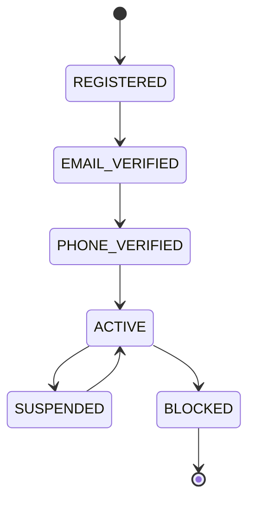
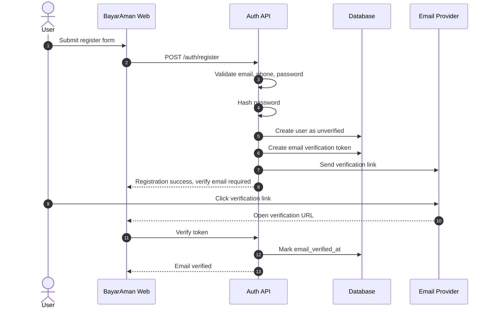
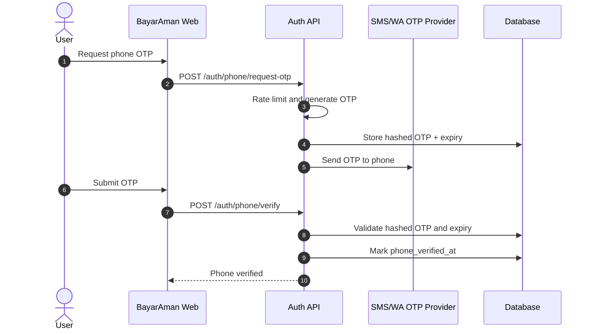
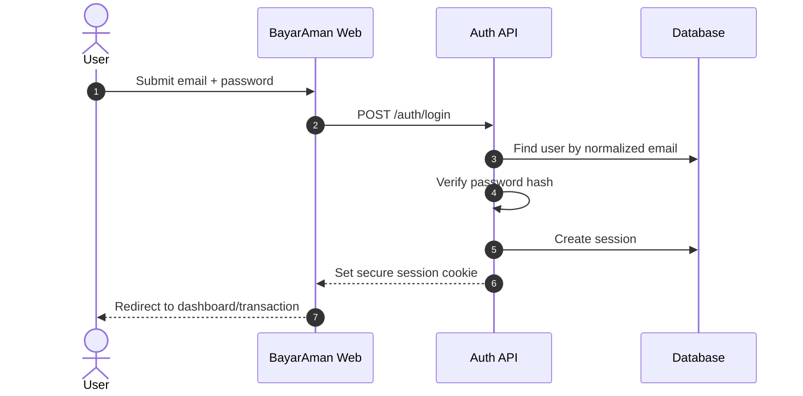
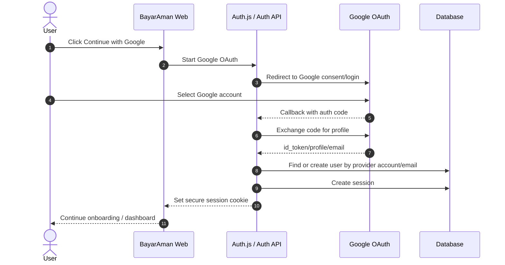

# BayarAman Auth and Role Design

## 1. Goal

Auth BayarAman harus menyelesaikan dua kebutuhan:

1. Identitas user: siapa orangnya, sudah verify email/phone atau belum.
2. Otorisasi per konteks: user ini boleh melakukan apa di transaksi tertentu.

Poin penting: role buyer/seller tidak selalu global. Satu user bisa menjadi seller di transaksi A dan buyer di transaksi B. Karena itu BayarAman perlu memisahkan **global role** dan **transaction role**.

## 2. User Types

### 2.1 Public Visitor

Belum login.

Can:

- Buka landing page.
- Buka transaction link public dengan tampilan terbatas.
- Melihat ringkasan transaksi tertentu jika link valid.

Cannot:

- Membayar sebelum login/verify.
- Membuat transaksi.
- Upload bukti.
- Konfirmasi transaksi.
- Buka dispute.

### 2.2 Verified User

User yang sudah login dan verify email + phone.

Can:

- Membuat transaksi sebagai seller atau buyer.
- Membuka transaksi sebagai buyer atau seller dari link.
- Menjadi seller pada buyer-created flow berdasarkan data seller yang dimasukkan buyer.
- Membayar ke rekening BayarAman dan klik `Sudah Bayar` jika menjadi buyer.
- Mengisi data payout jika menjadi seller.
- Konfirmasi penyelesaian transaksi via confirmation link + OTP jika menjadi buyer.
- Menjadi buyer/seller tergantung transaksi.

### 2.3 Admin

Internal user untuk operasional.

Status: post-MVP auth/login. Kebutuhan admin akan dibahas sebagai fase terpisah karena workflow admin cukup besar.

Can:

- Melihat admin dashboard.
- Review transaksi.
- Review payment manual.
- Membuat/mencatat WhatsApp group.
- Generate buyer confirmation link.
- Record final outcome transaksi.

Cannot:

- Mengubah fee global jika bukan super admin.
- Mengubah role admin lain jika bukan super admin.
- Menandai payout paid tanpa role finance atau permission payout.

### 2.4 Finance

Internal user untuk payment/refund/payout operations.

Status: post-MVP auth/login. MVP database tetap menyiapkan field payout/refund/audit agar workflow finance bisa dimodelkan, tetapi login/dashboard finance dibahas di fase berikutnya.

Can:

- Melihat payment/payout/refund queue.
- Memproses payout manual.
- Mark payout processing/paid/failed.
- Memproses manual refund fallback.

Cannot:

- Resolve dispute final tanpa admin permission.
- Mengubah fee/limit global.

### 2.5 Super Admin

Internal highest privilege.

Status: post-MVP auth/login.

Can:

- Manage admin/finance users.
- Manage fee/limit/policy settings.
- Override/freeze/unfreeze transaksi.
- View audit log.
- Assign Pro tier manually.

## 3. Role Model

### 3.1 Global Role

Global role melekat ke user account.

Suggested enum:

```text
USER
ADMIN
FINANCE
SUPER_ADMIN
```

Default role setelah register adalah `USER`.

### 3.2 Transaction Role

Transaction role melekat ke relasi user dengan transaksi.

Suggested enum:

```text
BUYER
SELLER
```

Contoh:

- User A membuat transaksi sebagai seller.
- User B membuka link dan membayar sebagai buyer.
- User A tetap bisa menjadi buyer di transaksi lain.

### 3.3 Tier

Tier bukan role. Tier adalah aturan bisnis/limit.

Suggested enum:

```text
FREE
PRO
```

MVP:

- Semua user default `FREE`.
- `PRO` bisa di-assign manual oleh super admin.
- Automated subscription billing post-MVP.

## 4. Verification Requirements

### 4.1 Email Verification

Required before:

- Create transaction.
- Join/pay transaction.
- Report issue or confirm final outcome.
- Receive payout.

### 4.2 Phone Verification

Required before:

- Create transaction.
- Join/pay transaction.
- Receive payout.

### 4.3 KYC

Not required by default in MVP.

Manual verification may be requested if:

- Transaction is high-risk.
- Transaction amount is large.
- User has repeated disputes/refunds.
- Admin flags suspicious behavior.

## 5. Permission Matrix

| Action | Visitor | Verified User | Buyer | Seller | Admin | Finance | Super Admin |
| --- | --- | --- | --- | --- | --- | --- | --- |
| View landing page | Yes | Yes | Yes | Yes | Yes | Yes | Yes |
| Open transaction link | Limited | Yes | Yes | Yes | Yes | Yes | Yes |
| Create transaction | No | Yes | Yes | Yes | No* | No* | Yes |
| Pay to BayarAman account + click Sudah Bayar | No | Yes | Yes | No | No | No | No |
| Confirm completion with OTP | No | No | Yes | No | No | No | No |
| Record WA group | No | No | No | No | Yes | No | Yes |
| Review manual payment | No | No | No | No | Yes | Yes | Yes |
| Generate confirmation link | No | No | No | No | Yes | No | Yes |
| Record final outcome | No | No | No | No | Yes | No | Yes |
| Process payout | No | No | No | No | No | Yes | Yes |
| Manage fee/limit | No | No | No | No | No | No | Yes |
| Manage internal roles | No | No | No | No | No | No | Yes |

`No*`: Admin/finance should use separate normal user account if they personally transact.

## 6. Page Access Rules

### 6.1 Public Routes

- `/`
- `/t/[code]` with limited unauthenticated view
- `/login`
- `/register`
- `/verify-email`
- `/verify-phone`

### 6.2 User Routes

Require login + verification:

- `/transactions/new`
- `/dashboard`
- `/t/[code]/pay`
- `/t/[code]/confirm`
- `/t/[code]/seller-accept`

### 6.3 Admin Routes

Require global role `ADMIN` or `SUPER_ADMIN`:

- `/admin`
- `/admin/transactions`
- `/admin/payment-review`
- `/admin/wa-groups`
- `/admin/confirmations`
- `/admin/audit`

### 6.4 Finance Routes

Require global role `FINANCE` or `SUPER_ADMIN`:

- `/finance`
- `/finance/payments`
- `/finance/refunds`
- `/finance/payouts`

## 7. API Authorization Rules

### 7.1 Transaction Creation

Allowed if:

- User is logged in.
- Email verified.
- Phone verified.
- User is not blocked/frozen globally.
- User tier limit allows new transaction.

### 7.2 Manual Payment Claim

Allowed if:

- User is logged in.
- Email and phone verified.
- User is buyer or can claim buyer role for unclaimed transaction link.
- Transaction status is `WAITING_BUYER_PAYMENT`.
- Transaction has not expired.
- Buyer identity is locked before or when `Sudah Bayar` is submitted.

### 7.3 Buyer Confirmation OTP

Allowed if:

- Confirmation link is valid and not expired.
- Buyer email/phone matches transaction buyer snapshot or logged-in buyer.
- OTP is valid, not expired, and attempt limit is not exceeded.
- Transaction status is `WAITING_BUYER_CONFIRMATION`.

### 7.4 Operator Payment Review

Allowed if:

- Actor is approved MVP operator or future `ADMIN`/`FINANCE`/`SUPER_ADMIN`.
- Transaction has a buyer `Sudah Bayar` claim or is being reviewed for expiry/anomaly.
- Admin manually verifies incoming funds in BayarAman's bank account.
- Expected amount validation passes before changing transaction status.
- Non-confirmed result includes an operator note.

### 7.5 WA Group Record

Allowed if:

- Actor is approved MVP operator or future `ADMIN`/`SUPER_ADMIN`.
- Transaction status is `PAYMENT_CONFIRMED`.
- Group name or group URL is provided.

### 7.6 Outcome Recording

Allowed if:

- Actor is approved MVP operator or future `ADMIN`/`SUPER_ADMIN`.
- Issue/outcome is handled outside the system first.
- Outcome is one of release, refund, split, or cancelled.
- Non-release outcome includes a reason/note.

### 7.7 Payout Processing

Allowed if:

- Actor is approved MVP operator or future `FINANCE`/`SUPER_ADMIN`.
- Transaction status is `PAYOUT_PENDING` or `PAYOUT_PROCESSING`.
- Payout status is `PAYOUT_PENDING` or `PAYOUT_PROCESSING`.
- Buyer confirmation exists, or a manual override/outcome note exists.
- Bank account snapshot is present.

## 8. Auth State Machine



## 9. Transaction Role Claiming

Seller role:

- Assigned when verified user creates transaction as seller.
- Assigned from seller data entered by buyer in buyer-created transaction.

Buyer role:

- Assigned when verified user creates transaction as buyer.
- Assigned when verified user opens seller-created transaction link and chooses to continue as buyer.
- Buyer identity should be locked before `Sudah Bayar` is submitted.
- After payment is claimed or reviewed, buyer cannot be swapped without operator action/cancel flow.

Reason:

- Prevent buyer identity ambiguity.
- Prevent payment, confirmation, refund, and payout confusion.

## 10. Suggested Data Model

### 10.1 users

- id
- name
- email
- phone
- password_hash
- global_role
- tier
- email_verified_at
- phone_verified_at
- status
- created_at
- updated_at

### 10.2 transaction_parties

- id
- transaction_id
- user_id
- role: BUYER/SELLER
- joined_at

Unique constraints:

- One seller per transaction.
- One buyer per transaction after buyer is claimed.

### 10.3 admin_role_assignments

Optional if global role is not enough later.

- id
- user_id
- role
- assigned_by
- assigned_at

### 10.4 user_verification_events

- id
- user_id
- type: EMAIL/PHONE/MANUAL_REVIEW
- status
- metadata_json
- created_at

## 11. Audit Requirements

Log these auth/role events:

- User registered.
- Email verified.
- Phone verified.
- User login.
- User role changed.
- User tier changed.
- Buyer role claimed on transaction.
- Admin/finance role assigned or removed.
- User suspended/blocked/unblocked.

## 12. MVP Recommendation

Use a simple but strict model:

- One account table.
- Global roles: `USER`, `ADMIN`, `FINANCE`, `SUPER_ADMIN`.
- Transaction roles: `BUYER`, `SELLER`.
- Tier: `FREE`, `PRO`.
- Email + phone verification required for transaction actions.
- Pro assigned manually by super admin.
- KYC/manual verification only for risky cases.

Do not combine buyer/seller/admin into one role field. Buyer/seller must be per transaction, while admin/finance/super admin are global internal roles.

## 13. Auth Technology Stack

Recommended MVP stack:

- Auth framework: Auth.js / NextAuth.js if using Next.js.
- Database adapter: Prisma Adapter or Drizzle-compatible adapter.
- Password hashing: Argon2id preferred, bcrypt acceptable.
- Session strategy: database session preferred for admin/finance control.
- Email delivery: Resend, SendGrid, Postmark, or SMTP provider.
- Phone OTP: Twilio, Vonage, Fonnte/WhatsApp gateway, or local SMS/WA provider.
- OAuth provider: Google OAuth 2.0.
- Secrets storage: environment variables in deployment provider.
- Rate limiting: Redis-based rate limiter or managed edge rate limit.
- Audit logging: database audit log table.

Decision for MVP:

- Support manual email/password registration.
- Support Google login/register.
- Require phone verification before transaction actions.
- Skip admin/finance/super admin login for now; design as next phase.
- Keep admin/finance/super admin roles as reserved database values for future backoffice.

## 14. Manual Register: Email and Password

### 14.1 Required Fields

Registration form:

- name
- email
- phone
- password
- password confirmation
- terms/policy acceptance

Optional later:

- referral/community code
- intended usage: buyer/seller/both

### 14.2 Validation Rules

Email:

- Must be valid email format.
- Must be unique.
- Normalize to lowercase.

Phone:

- Must be valid Indonesian phone number format.
- Must be unique if used for verification and risk control.
- Normalize to E.164 format where possible.

Password:

- Minimum 12 characters recommended.
- Allow password managers.
- Do not force weird composition rules if length is strong.
- Check against common password list if available.
- Do not store plaintext password.

### 14.3 Password Storage

Preferred:

- Argon2id.

Acceptable:

- bcrypt with cost factor appropriate for infrastructure.

Requirements:

- Store only password hash.
- Never log password.
- Never return password hash through API.
- Rehash password when algorithm/cost is upgraded.

### 14.4 Email Verification Flow



### 14.5 Phone Verification Flow



### 14.6 Login Flow: Email and Password



### 14.7 Manual Auth Security Requirements

- Rate limit register, login, forgot password, and OTP endpoints.
- Use CSRF protection for cookie-based sessions.
- Use secure, httpOnly, sameSite cookies.
- Use HTTPS in production.
- Lock or slow down repeated failed login attempts.
- Do not reveal whether email exists in forgot-password response.
- Expire email verification and reset password tokens.
- Store verification/reset tokens hashed.
- Invalidate old sessions on password change.
- Log suspicious login attempts.

## 15. Google OAuth Login and Register

### 15.1 Goal

Google OAuth should let users register/login faster without password. It should still map to the same BayarAman user model and still require phone verification before transaction actions.

### 15.2 Google Cloud Console Setup

Setup steps:

1. Create/select Google Cloud project.
2. Configure OAuth consent screen.
3. Add app name, support email, and authorized domain.
4. Create OAuth Client ID.
5. Application type: Web application.
6. Add authorized JavaScript origins:
   - local: `http://localhost:3000`
   - production: `https://your-domain`
7. Add authorized redirect URIs:
   - local: `http://localhost:3000/api/auth/callback/google`
   - production: `https://your-domain/api/auth/callback/google`
8. Copy `GOOGLE_CLIENT_ID`.
9. Copy `GOOGLE_CLIENT_SECRET`.
10. Store secrets in environment variables.

### 15.3 Required OAuth Scopes

MVP scopes:

```text
openid
email
profile
```

Do not request unnecessary Google scopes.

### 15.4 Google Auth Flow



### 15.5 Account Linking Rules

Rules:

- If Google email matches existing verified email user, link Google account after safe confirmation.
- If Google email is new, create user with `email_verified_at` set if Google marks email verified.
- Phone remains unverified until user verifies phone.
- Do not allow two users with the same email.
- Do not allow OAuth login to bypass suspended/blocked status.

### 15.6 Google Auth Security Requirements

- Validate OAuth state parameter.
- Use PKCE where supported by auth library/provider.
- Store OAuth client secret only on backend.
- Do not expose Google client secret to browser.
- Use allowlisted redirect URIs only.
- Check email_verified from Google profile if available.
- Continue enforcing BayarAman phone verification for transaction actions.

## 16. Session Strategy

Recommended MVP:

- Database session for better revocation.
- Secure httpOnly cookie.
- Session max age: 7-30 days depending risk appetite.
- Admin/finance session policy will be defined in the admin auth phase.

Why database session:

- Easier force logout.
- Easier session audit.
- Better for admin access revocation.

JWT session can be used, but revocation and role changes need extra care.

## 17. Environment Variables for Auth

```env
AUTH_SECRET=
AUTH_URL=
GOOGLE_CLIENT_ID=
GOOGLE_CLIENT_SECRET=
EMAIL_FROM=
EMAIL_PROVIDER_API_KEY=
OTP_PROVIDER_API_KEY=
PASSWORD_HASH_PEPPER=
```

Notes:

- `PASSWORD_HASH_PEPPER` is optional but useful if implemented carefully.
- Rotate secrets carefully.
- Never commit env values.

## 18. Auth API Surface Draft

Manual auth:

- `POST /api/auth/register`
- `POST /api/auth/login`
- `POST /api/auth/logout`
- `POST /api/auth/email/resend`
- `GET /api/auth/email/verify`
- `POST /api/auth/phone/request-otp`
- `POST /api/auth/phone/verify`
- `POST /api/auth/password/forgot`
- `POST /api/auth/password/reset`

Google OAuth:

- `GET /api/auth/signin/google`
- `GET /api/auth/callback/google`

Auth.js route may consolidate these under:

- `/api/auth/[...nextauth]`

## 19. Auth Acceptance Criteria

- User can register with email, phone, and password.
- Password is stored as secure hash, never plaintext.
- User cannot create/pay transaction before email and phone verification.
- User can verify email using expiring token.
- User can verify phone using expiring OTP.
- User can login with email/password.
- User can login/register with Google OAuth.
- Google login still requires phone verification before transaction actions.
- Global role values `ADMIN`, `FINANCE`, and `SUPER_ADMIN` exist as reserved future roles.
- Buyer/seller role is assigned per transaction, not globally.
- Suspended/blocked user cannot transact.
- Admin/finance login and access control are post-MVP auth scope.
- Auth events are written to audit log.
