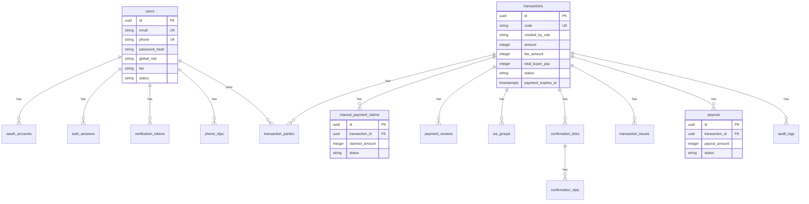

# BayarAman Database Design

## 1. Scope

This document defines the PostgreSQL database design for BayarAman MVP with manual payment collection and manual seller payout/pencairan.

MVP model:

- Buyer/seller auth with email/password and Google OAuth.
- Seller-created and buyer-created transactions.
- Manual buyer payment to BayarAman bank account.
- Buyer `Sudah Bayar` payment claim.
- Admin manual payment review.
- 1x24 hour payment expiry for unpaid transactions.
- WhatsApp group tracking.
- Buyer confirmation link + OTP.
- Manual payout to seller.
- Minimal issue/outcome recording.

## 2. Design Principles

- PostgreSQL with UUID primary keys.
- Use `created_at` and `updated_at` on mutable entities.
- Financial records are never hard deleted.
- Buyer/seller are transaction-specific roles.
- Store manual payment claims/reviews separately from transactions.
- Store snapshots for seller bank and payout data.
- Use append-only audit logs for status, payment, confirmation, payout, and outcome changes.

## 3. High-Level ERD



## 4. Enum Draft

```text
global_role:
  USER
  ADMIN        -- reserved Phase 2
  FINANCE      -- reserved Phase 2
  SUPER_ADMIN  -- reserved Phase 2

tier:
  FREE
  PRO

transaction_role:
  BUYER
  SELLER

transaction_creator_role:
  BUYER
  SELLER

transaction_status:
  DRAFT
  WAITING_SELLER_ACCEPTANCE
  WAITING_BUYER_PAYMENT
  PAYMENT_UNDER_REVIEW
  PAYMENT_CONFIRMED
  PAYMENT_NOT_FOUND
  PAYMENT_INVALID
  PAYMENT_EXPIRED
  WA_GROUP_CREATED
  IN_FULFILLMENT
  ISSUE_REPORTED
  MANUAL_REVIEW
  WAITING_BUYER_CONFIRMATION
  BUYER_CONFIRMED
  PAYOUT_PENDING
  PAYOUT_PROCESSING
  PAYOUT_FAILED
  PAID_OUT
  REFUND_PENDING
  REFUNDED
  SPLIT_SETTLEMENT
  CANCELLED

manual_payment_claim_status:
  CLAIMED
  REVIEWED
  CANCELLED

payment_review_result:
  CONFIRMED
  NOT_FOUND
  INVALID
  NEEDS_MANUAL_REVIEW
  EXPIRED

outcome_type:
  RELEASE_TO_SELLER
  REFUND_TO_BUYER
  SPLIT_SETTLEMENT
  CANCELLED

payout_status:
  PENDING
  PROCESSING
  PAID
  FAILED
  CANCELLED

otp_channel:
  EMAIL
  WHATSAPP
```

## 5. Auth Tables

### 5.1 users

| Column | Type | Notes |
| --- | --- | --- |
| id | uuid PK | |
| name | text | required |
| email | citext unique | required for MVP |
| phone | text unique nullable | required before transaction action |
| password_hash | text nullable | null for Google-only account |
| global_role | text | default `USER` |
| tier | text | default `FREE` |
| status | text | `REGISTERED`, `ACTIVE`, `SUSPENDED`, `BLOCKED` |
| email_verified_at | timestamptz nullable | |
| phone_verified_at | timestamptz nullable | |
| last_login_at | timestamptz nullable | |
| created_at | timestamptz | |
| updated_at | timestamptz | |

### 5.2 oauth_accounts

| Column | Type | Notes |
| --- | --- | --- |
| id | uuid PK | |
| user_id | uuid FK users.id | |
| provider | text | `google` |
| provider_account_id | text | Google `sub` |
| access_token | text encrypted nullable | only if needed |
| refresh_token | text encrypted nullable | avoid storing if not needed |
| expires_at | timestamptz nullable | |
| created_at | timestamptz | |

Unique:

- `(provider, provider_account_id)`

### 5.3 auth_sessions

| Column | Type | Notes |
| --- | --- | --- |
| id | uuid PK | |
| user_id | uuid FK users.id | |
| session_token_hash | text unique | do not store raw token |
| expires_at | timestamptz | |
| revoked_at | timestamptz nullable | |
| ip_address | inet nullable | |
| user_agent | text nullable | |
| created_at | timestamptz | |

### 5.4 verification_tokens and phone_otps

Used for email verification, phone verification, and sensitive action verification.

Store hashes only:

- token_hash / otp_hash
- purpose
- channel
- expires_at
- consumed_at
- attempts
- created_at

## 6. Transaction Tables

### 6.1 transactions

| Column | Type | Notes |
| --- | --- | --- |
| id | uuid PK | |
| code | text unique | public transaction code |
| created_by_user_id | uuid FK users.id | |
| created_by_role | text | `BUYER` or `SELLER` |
| title | text | |
| category | text nullable | |
| description | text nullable | agreement/deal terms |
| amount | integer | item/service amount |
| fee_amount | integer | BayarAman fee |
| total_buyer_pay | integer | amount + buyer-paid fee |
| seller_net_amount | integer | amount - seller-paid fee |
| fee_payer | text | `BUYER`, `SELLER`, `SPLIT` |
| status | text | transaction status enum |
| payment_expires_at | timestamptz nullable | 1x24 hours after transaction becomes payable |
| seller_accepted_at | timestamptz nullable | required for buyer-created transaction |
| payment_claimed_at | timestamptz nullable | buyer clicked `Sudah Bayar` |
| payment_confirmed_at | timestamptz nullable | admin-confirmed payment |
| buyer_confirmed_at | timestamptz nullable | OTP-confirmed completion |
| completed_at | timestamptz nullable | final completed timestamp |
| created_at | timestamptz | |
| updated_at | timestamptz | |

### 6.2 transaction_parties

| Column | Type | Notes |
| --- | --- | --- |
| id | uuid PK | |
| transaction_id | uuid FK transactions.id | |
| user_id | uuid FK users.id nullable | nullable until invited user registers |
| role | text | `BUYER` or `SELLER` |
| display_name_snapshot | text nullable | |
| email_snapshot | text nullable | |
| phone_snapshot | text nullable | |
| bank_name_snapshot | text nullable | seller payout bank |
| bank_account_number_snapshot | text nullable | encrypted/masked where needed |
| bank_account_holder_snapshot | text nullable | |
| accepted_at | timestamptz nullable | seller acceptance for buyer-created flow |
| created_at | timestamptz | |

Unique:

- `(transaction_id, role)`

## 7. Manual Payment Tables

### 7.1 manual_payment_claims

Created when buyer clicks `Sudah Bayar`.

| Column | Type | Notes |
| --- | --- | --- |
| id | uuid PK | |
| transaction_id | uuid FK transactions.id | |
| buyer_user_id | uuid FK users.id nullable | |
| claimed_amount | integer nullable | optional buyer-entered amount |
| claimed_bank_name | text nullable | optional source bank |
| claimed_account_holder | text nullable | optional source account holder |
| status | text | `CLAIMED`, `REVIEWED`, `CANCELLED` |
| note | text nullable | buyer/admin note |
| claimed_at | timestamptz | |
| created_at | timestamptz | |

Indexes:

- `transaction_id`
- `claimed_at`

### 7.2 payment_reviews

Created when admin checks incoming payment.

| Column | Type | Notes |
| --- | --- | --- |
| id | uuid PK | |
| transaction_id | uuid FK transactions.id | |
| payment_claim_id | uuid FK manual_payment_claims.id nullable | |
| reviewed_by_label | text | operator/admin label for MVP |
| result | text | `CONFIRMED`, `NOT_FOUND`, `INVALID`, `NEEDS_MANUAL_REVIEW`, `EXPIRED` |
| expected_amount | integer | |
| received_amount | integer nullable | |
| bank_reference | text nullable | transfer/reference note |
| received_at | timestamptz nullable | when funds were seen |
| note | text nullable | required for non-confirmed result |
| reviewed_at | timestamptz | |
| created_at | timestamptz | |

Indexes:

- `transaction_id`
- `result`
- `reviewed_at`

## 8. WhatsApp Operations

### 8.1 wa_groups

| Column | Type | Notes |
| --- | --- | --- |
| id | uuid PK | |
| transaction_id | uuid FK transactions.id | |
| group_name | text nullable | |
| group_url | text nullable | invite link if stored |
| created_by_label | text | operator name/identifier |
| payment_announced_at | timestamptz nullable | operator announced payment received |
| created_at | timestamptz | |
| note | text nullable | |

## 9. Buyer Confirmation Tables

### 9.1 confirmation_links

| Column | Type | Notes |
| --- | --- | --- |
| id | uuid PK | |
| transaction_id | uuid FK transactions.id | |
| token_hash | text unique | raw token never stored |
| buyer_user_id | uuid FK users.id nullable | expected buyer if registered |
| channel | text | preferred OTP channel |
| sent_to_email | text nullable | snapshot |
| sent_to_phone | text nullable | snapshot |
| expires_at | timestamptz | |
| opened_at | timestamptz nullable | |
| confirmed_at | timestamptz nullable | |
| revoked_at | timestamptz nullable | |
| created_by_label | text | operator name/identifier |
| created_at | timestamptz | |

### 9.2 confirmation_otps

| Column | Type | Notes |
| --- | --- | --- |
| id | uuid PK | |
| confirmation_link_id | uuid FK confirmation_links.id | |
| otp_hash | text | raw OTP never stored |
| channel | text | `EMAIL` or `WHATSAPP` |
| sent_to | text | email or phone snapshot |
| attempts | integer | default 0 |
| expires_at | timestamptz | |
| consumed_at | timestamptz nullable | |
| created_at | timestamptz | |

## 10. Issue, Outcome, and Payout

### 10.1 transaction_issues

MVP does not resolve disputes in-app. This table records that an issue happened and stores final manual outcome.

| Column | Type | Notes |
| --- | --- | --- |
| id | uuid PK | |
| transaction_id | uuid FK transactions.id | |
| reported_by_role | text nullable | buyer/seller/operator |
| summary | text | short issue summary |
| outcome_type | text nullable | release/refund/split/cancel |
| outcome_note | text nullable | required if outcome not release |
| resolved_by_label | text nullable | operator |
| resolved_at | timestamptz nullable | |
| created_at | timestamptz | |

### 10.2 payouts

| Column | Type | Notes |
| --- | --- | --- |
| id | uuid PK | |
| transaction_id | uuid FK transactions.id | |
| seller_user_id | uuid FK users.id nullable | |
| payout_amount | integer | net amount transferred |
| bank_name_snapshot | text | |
| bank_account_number_snapshot | text | |
| bank_account_holder_snapshot | text | |
| status | text | payout status |
| bank_reference | text nullable | transfer reference |
| processed_by_label | text nullable | operator |
| processing_at | timestamptz nullable | |
| paid_at | timestamptz nullable | |
| failed_reason | text nullable | |
| created_at | timestamptz | |
| updated_at | timestamptz | |

## 11. Audit Logs

### 11.1 audit_logs

| Column | Type | Notes |
| --- | --- | --- |
| id | uuid PK | |
| transaction_id | uuid FK transactions.id nullable | |
| actor_user_id | uuid FK users.id nullable | |
| actor_label | text nullable | operator label for MVP |
| actor_type | text | `USER`, `OPERATOR`, `SYSTEM`, `PROVIDER` |
| action | text | e.g. `PAYMENT_CLAIMED`, `PAYMENT_CONFIRMED`, `PAYOUT_RECORDED` |
| old_value | jsonb nullable | |
| new_value | jsonb nullable | |
| metadata | jsonb nullable | safe metadata only |
| created_at | timestamptz | |

## 12. Refund Note

Refund decision belongs to BayarAman policy/operator. Refund execution is manual in MVP unless a future payment provider integration supports automated refund.
