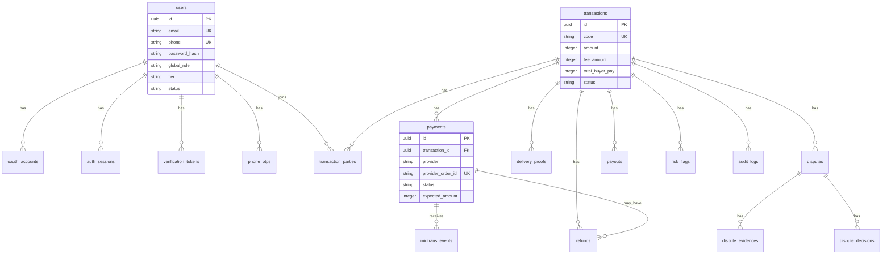

# BayarAman Database Design

## 1. Scope

This document defines the MVP database design based on:

- `PRD.md`
- `TRD.md`
- `AUTH.md`
- Midtrans Snap payment flow

MVP auth scope:

- Buyer/seller user registration.
- Email/password login.
- Google OAuth login/register.
- Email verification.
- Phone verification.
- Buyer/seller transaction roles.

Admin/finance login is post-MVP. The database still includes operational fields for disputes, refunds, payouts, audit logs, and future admin decisions so the model does not need to be redesigned later.

## 2. Design Principles

- Use PostgreSQL.
- Use UUID primary keys.
- Use `created_at` and `updated_at` on mutable core tables.
- Use append-only event/audit tables for important changes.
- Separate global user role from transaction role.
- Keep buyer/seller as transaction-specific roles.
- Keep tier separate from role.
- Store Midtrans payment attempts separately from transactions.
- Treat Midtrans webhook as event input, not as the only payment record.
- Make payment webhook processing idempotent.
- Avoid hard deleting financial records.

## 3. High-Level ERD



## 4. Enum Draft

### 4.1 User

```text
global_role:
  USER
  ADMIN       -- reserved post-MVP
  FINANCE     -- reserved post-MVP
  SUPER_ADMIN -- reserved post-MVP

tier:
  FREE
  PRO

user_status:
  REGISTERED
  ACTIVE
  SUSPENDED
  BLOCKED
```

### 4.2 Transaction

```text
transaction_status:
  DRAFT
  WAITING_BUYER_PAYMENT
  PAYMENT_PENDING
  PAYMENT_FAILED
  FUNDS_SECURED
  DELIVERED
  DISPUTED
  UNDER_REVIEW
  EVIDENCE_REQUESTED
  RELEASE_PENDING
  REFUND_PENDING
  SPLIT_SETTLEMENT
  COMPLETED
  EXPIRED
  CANCELLED
  REFUNDED
  PARTIALLY_REFUNDED
  PAYOUT_PENDING
  PAYOUT_PROCESSING
  PAID_OUT
  PAYOUT_FAILED

transaction_role:
  BUYER
  SELLER

fee_payer:
  BUYER
  SELLER
  SPLIT
```

### 4.3 Payment

```text
payment_provider:
  MIDTRANS

payment_status:
  CREATED
  PENDING
  PAID
  FAILED
  EXPIRED
  CANCELLED
  REFUNDED
  PARTIALLY_REFUNDED

midtrans_transaction_status:
  pending
  settlement
  capture
  deny
  expire
  cancel
  refund
  partial_refund

midtrans_fraud_status:
  accept
  challenge
  deny
  none
```

### 4.4 Operations

```text
dispute_status:
  OPEN
  WAITING_SELLER_RESPONSE
  UNDER_REVIEW
  EVIDENCE_REQUESTED
  RESOLVED
  CANCELLED

dispute_decision:
  REFUND
  RELEASE
  SPLIT
  REQUEST_MORE_EVIDENCE
  EXTEND_REVIEW
  FREEZE

refund_status:
  PENDING
  PROCESSING
  REFUNDED
  FAILED
  CANCELLED

payout_status:
  PENDING
  PROCESSING
  PAID
  FAILED
  CANCELLED

risk_flag_status:
  OPEN
  RESOLVED
  DISMISSED
```

## 5. Auth Tables

### 5.1 users

Purpose:

- Main identity table for buyer/seller users.
- Admin/finance roles are reserved but login implementation is post-MVP.

Columns:

| Column | Type | Notes |
| --- | --- | --- |
| id | uuid PK | |
| name | text | Required |
| email | citext unique | Nullable only if OAuth provider does not return email; practically required |
| phone | text unique | Required before transaction actions |
| password_hash | text nullable | Null for Google-only account |
| global_role | enum/text | Default `USER` |
| tier | enum/text | Default `FREE` |
| status | enum/text | Default `REGISTERED` |
| email_verified_at | timestamptz nullable | |
| phone_verified_at | timestamptz nullable | |
| last_login_at | timestamptz nullable | |
| created_at | timestamptz | |
| updated_at | timestamptz | |

Indexes:

- unique lower(email)
- unique phone
- index status
- index tier

### 5.2 oauth_accounts

Purpose:

- Link Google account to BayarAman user.

Columns:

| Column | Type | Notes |
| --- | --- | --- |
| id | uuid PK | |
| user_id | uuid FK users.id | |
| provider | text | `google` |
| provider_account_id | text | Google subject/sub |
| provider_email | citext | |
| email_verified | boolean | From Google profile |
| access_token_encrypted | text nullable | Avoid storing if not needed |
| refresh_token_encrypted | text nullable | Avoid storing if not needed |
| created_at | timestamptz | |
| updated_at | timestamptz | |

Constraints:

- unique(provider, provider_account_id)
- unique(user_id, provider)

### 5.3 auth_sessions

Purpose:

- Database-backed sessions for revocation and audit.

Columns:

| Column | Type | Notes |
| --- | --- | --- |
| id | uuid PK | |
| user_id | uuid FK users.id | |
| session_token_hash | text unique | Store hash, not raw token |
| expires_at | timestamptz | |
| ip_address | inet nullable | |
| user_agent | text nullable | |
| revoked_at | timestamptz nullable | |
| created_at | timestamptz | |

Indexes:

- index user_id
- index expires_at
- index revoked_at

### 5.4 verification_tokens

Purpose:

- Email verification and password reset token storage.

Columns:

| Column | Type | Notes |
| --- | --- | --- |
| id | uuid PK | |
| user_id | uuid FK users.id | |
| type | text | `EMAIL_VERIFY`, `PASSWORD_RESET` |
| token_hash | text unique | Never store raw token |
| expires_at | timestamptz | |
| used_at | timestamptz nullable | |
| created_at | timestamptz | |

### 5.5 phone_otps

Purpose:

- Phone verification OTP.

Columns:

| Column | Type | Notes |
| --- | --- | --- |
| id | uuid PK | |
| user_id | uuid FK users.id | |
| phone | text | |
| otp_hash | text | |
| purpose | text | `PHONE_VERIFY` |
| attempts | integer | Default 0 |
| expires_at | timestamptz | |
| verified_at | timestamptz nullable | |
| created_at | timestamptz | |

Indexes:

- index user_id
- index phone
- index expires_at

## 6. Transaction Tables

### 6.1 transactions

Purpose:

- Core transaction agreement and state.

Columns:

| Column | Type | Notes |
| --- | --- | --- |
| id | uuid PK | |
| code | text unique | Public transaction code, e.g. `BA-8H2K91` |
| title | text | |
| category | text | physical_goods, digital_product, digital_service, etc |
| agreement | text | Deal description |
| amount | integer | Base transaction amount in IDR |
| fee_amount | integer | BayarAman fee |
| total_buyer_pay | integer | Amount sent to payment gateway |
| seller_net_amount | integer | Amount seller receives before payout transfer fee |
| fee_payer | enum/text | BUYER/SELLER/SPLIT |
| status | enum/text | transaction_status |
| delivery_deadline_at | timestamptz nullable | |
| review_deadline_at | timestamptz nullable | Starts after delivery proof |
| auto_release_eligible | boolean | Default false |
| is_frozen | boolean | Default false |
| risk_level | text | LOW/MEDIUM/HIGH |
| created_by_user_id | uuid FK users.id | Seller creator |
| created_at | timestamptz | |
| updated_at | timestamptz | |

Indexes:

- unique code
- index status
- index created_by_user_id
- index review_deadline_at
- index is_frozen
- index risk_level

### 6.2 transaction_parties

Purpose:

- Assign buyer/seller per transaction.

Columns:

| Column | Type | Notes |
| --- | --- | --- |
| id | uuid PK | |
| transaction_id | uuid FK transactions.id | |
| user_id | uuid FK users.id | |
| role | enum/text | BUYER/SELLER |
| joined_at | timestamptz | |

Constraints:

- unique(transaction_id, role)
- unique(transaction_id, user_id, role)

Notes:

- Seller is assigned at transaction creation.
- Buyer is assigned before payment session is created.

## 7. Payment and Midtrans Tables

### 7.1 payments

Purpose:

- Store each payment attempt/session.

Columns:

| Column | Type | Notes |
| --- | --- | --- |
| id | uuid PK | |
| transaction_id | uuid FK transactions.id | |
| provider | enum/text | MIDTRANS |
| provider_order_id | text unique | Sent as Midtrans `order_id` |
| expected_amount | integer | Must match Midtrans gross_amount |
| currency | text | Default `IDR` |
| status | enum/text | payment_status |
| snap_token | text nullable | Midtrans Snap token |
| redirect_url | text nullable | Midtrans redirect URL |
| payment_method | text nullable | VA/QRIS/e-wallet/card if known |
| paid_at | timestamptz nullable | |
| expired_at | timestamptz nullable | |
| cancelled_at | timestamptz nullable | |
| created_at | timestamptz | |
| updated_at | timestamptz | |

Constraints:

- unique provider_order_id
- only one active payment per transaction where status in CREATED/PENDING

Indexes:

- index transaction_id
- index status
- index provider_order_id

### 7.2 midtrans_events

Purpose:

- Store Midtrans webhook/status events idempotently.

Columns:

| Column | Type | Notes |
| --- | --- | --- |
| id | uuid PK | |
| payment_id | uuid FK payments.id nullable | Nullable if unmatched/quarantined |
| provider_order_id | text | Midtrans order_id |
| transaction_status | text | Midtrans transaction_status |
| fraud_status | text nullable | Midtrans fraud_status |
| status_code | text nullable | |
| gross_amount | integer | Parsed amount |
| signature_valid | boolean | |
| event_hash | text unique | Hash of important event fields/payload |
| payload_json | jsonb | Safe raw payload copy |
| processed_at | timestamptz nullable | |
| rejected_reason | text nullable | |
| created_at | timestamptz | |

Indexes:

- unique event_hash
- index provider_order_id
- index transaction_status
- index signature_valid

Notes:

- Use this table to dedupe repeated webhook delivery.
- If signature invalid, store limited/quarantined event and do not update payment.

## 8. Delivery and Evidence Tables

### 8.1 delivery_proofs

Purpose:

- Store seller delivery proof metadata.

Columns:

| Column | Type | Notes |
| --- | --- | --- |
| id | uuid PK | |
| transaction_id | uuid FK transactions.id | |
| submitted_by_user_id | uuid FK users.id | Seller |
| proof_type | text | tracking_number, photo, file, link, note |
| notes | text nullable | |
| file_url | text nullable | Object storage URL/key |
| external_url | text nullable | Link delivery |
| metadata_json | jsonb | Tracking number, courier, file metadata |
| created_at | timestamptz | |

Indexes:

- index transaction_id
- index submitted_by_user_id

## 9. Dispute Tables

### 9.1 disputes

Purpose:

- Store dispute case.

Columns:

| Column | Type | Notes |
| --- | --- | --- |
| id | uuid PK | |
| transaction_id | uuid FK transactions.id | |
| opened_by_user_id | uuid FK users.id | Buyer |
| reason | text | |
| chronology | text | |
| requested_resolution | text | refund, partial_refund, repair, resend, other |
| status | enum/text | dispute_status |
| seller_response | text nullable | |
| seller_responded_at | timestamptz nullable | |
| opened_at | timestamptz | |
| resolved_at | timestamptz nullable | |
| created_at | timestamptz | |
| updated_at | timestamptz | |

Indexes:

- index transaction_id
- index status
- index opened_by_user_id

### 9.2 dispute_evidences

Purpose:

- Store buyer/seller dispute evidence.

Columns:

| Column | Type | Notes |
| --- | --- | --- |
| id | uuid PK | |
| dispute_id | uuid FK disputes.id | |
| submitted_by_user_id | uuid FK users.id | Buyer or seller |
| evidence_type | text | screenshot, photo, video, file, link, note |
| notes | text nullable | |
| file_url | text nullable | |
| external_url | text nullable | |
| metadata_json | jsonb | |
| created_at | timestamptz | |

### 9.3 dispute_decisions

Purpose:

- Store decision history.
- Admin login is post-MVP, so actor can be nullable or system/manual operator for now.

Columns:

| Column | Type | Notes |
| --- | --- | --- |
| id | uuid PK | |
| dispute_id | uuid FK disputes.id | |
| transaction_id | uuid FK transactions.id | |
| decision | enum/text | REFUND/RELEASE/SPLIT/REQUEST_MORE_EVIDENCE/EXTEND_REVIEW/FREEZE |
| reason | text | Required |
| decided_by_user_id | uuid nullable FK users.id | Future admin user |
| decided_by_label | text nullable | Temporary manual operator label |
| refund_amount | integer nullable | |
| release_amount | integer nullable | |
| created_at | timestamptz | |

## 10. Refund and Payout Tables

### 10.1 refunds

Purpose:

- Track refund operation after admin/business decision.

Columns:

| Column | Type | Notes |
| --- | --- | --- |
| id | uuid PK | |
| transaction_id | uuid FK transactions.id | |
| payment_id | uuid FK payments.id | |
| amount | integer | |
| cancel_fee_amount | integer | Default 0 |
| method | text | PROVIDER/MANUAL |
| provider | text nullable | MIDTRANS |
| provider_ref | text nullable | |
| status | enum/text | refund_status |
| reason | text | |
| processed_by_user_id | uuid nullable FK users.id | Future finance/admin |
| processed_by_label | text nullable | Temporary manual operator label |
| processed_at | timestamptz nullable | |
| created_at | timestamptz | |
| updated_at | timestamptz | |

### 10.2 payouts

Purpose:

- Track seller payout after transaction completion.

Columns:

| Column | Type | Notes |
| --- | --- | --- |
| id | uuid PK | |
| transaction_id | uuid FK transactions.id | |
| seller_user_id | uuid FK users.id | |
| amount | integer | |
| bank_name | text | |
| bank_account_number | text | Consider encryption/tokenization |
| bank_account_name | text | |
| status | enum/text | payout_status |
| maker_user_id | uuid nullable FK users.id | Future finance |
| checker_user_id | uuid nullable FK users.id | Future checker |
| processed_by_label | text nullable | Temporary manual operator label |
| paid_at | timestamptz nullable | |
| failed_reason | text nullable | |
| created_at | timestamptz | |
| updated_at | timestamptz | |

Indexes:

- index transaction_id
- index seller_user_id
- index status

## 11. Risk, Audit, Notification

### 11.1 risk_flags

Columns:

| Column | Type | Notes |
| --- | --- | --- |
| id | uuid PK | |
| transaction_id | uuid nullable FK transactions.id | |
| user_id | uuid nullable FK users.id | |
| type | text | high_amount, high_risk_category, suspicious_payment, repeated_dispute |
| severity | text | LOW/MEDIUM/HIGH |
| status | enum/text | OPEN/RESOLVED/DISMISSED |
| notes | text nullable | |
| created_by_user_id | uuid nullable FK users.id | Future admin |
| created_by_label | text nullable | Temporary manual operator label |
| created_at | timestamptz | |
| resolved_at | timestamptz nullable | |

### 11.2 audit_logs

Columns:

| Column | Type | Notes |
| --- | --- | --- |
| id | uuid PK | |
| actor_user_id | uuid nullable FK users.id | |
| actor_type | text | USER/SYSTEM/MIDTRANS/MANUAL_OPERATOR |
| actor_label | text nullable | |
| action | text | |
| target_type | text | |
| target_id | uuid nullable | |
| transaction_id | uuid nullable FK transactions.id | |
| old_status | text nullable | |
| new_status | text nullable | |
| amount | integer nullable | |
| notes | text nullable | |
| ip_address | inet nullable | |
| user_agent | text nullable | |
| metadata_json | jsonb | |
| created_at | timestamptz | |

Indexes:

- index transaction_id
- index actor_user_id
- index target_type, target_id
- index action
- index created_at

### 11.3 notifications

Columns:

| Column | Type | Notes |
| --- | --- | --- |
| id | uuid PK | |
| user_id | uuid FK users.id | |
| transaction_id | uuid nullable FK transactions.id | |
| channel | text | EMAIL/WA/IN_APP |
| type | text | payment_success, delivery_uploaded, dispute_opened, payout_paid, etc |
| payload_json | jsonb | |
| status | text | PENDING/SENT/FAILED |
| sent_at | timestamptz nullable | |
| created_at | timestamptz | |

## 12. Key Constraints

- `users.email` unique.
- `users.phone` unique.
- `transactions.code` unique.
- `transaction_parties` unique per transaction + role.
- `payments.provider_order_id` unique.
- One active payment per transaction.
- `midtrans_events.event_hash` unique.
- Payout should be unique per transaction unless partial payout is intentionally supported later.
- Refund can be multiple per payment only if partial refund is supported; otherwise enforce one refund per payment.

## 13. Important Indexes

Recommended indexes:

- `transactions(status)`
- `transactions(code)`
- `transactions(created_by_user_id)`
- `transactions(review_deadline_at)`
- `transaction_parties(user_id, role)`
- `payments(provider_order_id)`
- `payments(transaction_id, status)`
- `midtrans_events(provider_order_id)`
- `disputes(transaction_id, status)`
- `payouts(status)`
- `refunds(status)`
- `audit_logs(transaction_id, created_at)`
- `notifications(user_id, status)`

## 14. MVP Migration Order

1. Enums or check constraints.
2. `users`
3. `oauth_accounts`
4. `auth_sessions`
5. `verification_tokens`
6. `phone_otps`
7. `transactions`
8. `transaction_parties`
9. `payments`
10. `midtrans_events`
11. `delivery_proofs`
12. `disputes`
13. `dispute_evidences`
14. `dispute_decisions`
15. `refunds`
16. `payouts`
17. `risk_flags`
18. `audit_logs`
19. `notifications`

## 15. Notes for Implementation

- If using Auth.js, table names can follow Auth.js adapter conventions (`accounts`, `sessions`, `verification_tokens`) or be mapped carefully.
- If using Prisma, use enums for statuses.
- If using Drizzle, use PostgreSQL enums or checked text columns.
- Use integer IDR amounts, not floating point.
- Store all monetary values in smallest IDR unit as integer.
- Use database transactions when updating payment + transaction + audit log.
- Use row lock or idempotency key for webhook and payout processing.
- Keep admin login out of MVP auth implementation, but do not remove admin-ready columns from operations tables.
