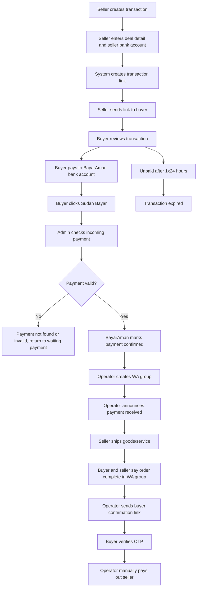
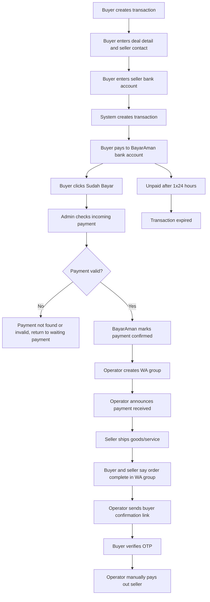
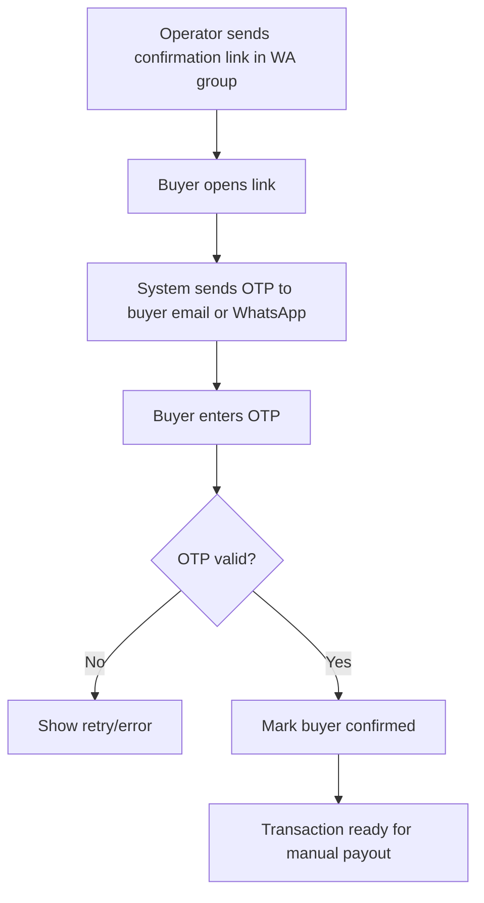

# Product Requirements Document (PRD)

# BayarAman Rekber MVP with Manual Payment Review

## 1. Document Control

- Product: BayarAman
- Version: PRD v4.0
- Status: Draft aligned to manual payment + WhatsApp operations + manual payout model
- Last updated: 2026-07-14

## 2. Executive Summary

BayarAman MVP is a rekber service for transactions outside marketplaces. Buyer or seller can create a transaction, buyer pays to a BayarAman-owned bank account, buyer clicks `Sudah Bayar`, admin manually checks the incoming payment, then BayarAman coordinates fulfillment through a WhatsApp group and manually releases/pays out funds to seller after buyer confirmation.

Important direction:

- Payment collection is manual in MVP.
- Buyer payment is not confirmed by user claim alone; admin must verify incoming funds.
- Manual part includes payment checking, WhatsApp coordination, seller fund release/pencairan/payout, and outcome recording.
- Complaints between buyer and seller are handled outside the system during MVP, mainly via WhatsApp group/operator mediation.
- Transactions that have not been paid expire in 1x24 hours.

## 3. Product Positioning

BayarAman is not a marketplace, wallet, or standalone payment gateway.

BayarAman is a trust layer:

- Buyer pays to BayarAman's account.
- BayarAman admin checks whether payment has arrived.
- BayarAman owns transaction status, trust workflow, WhatsApp coordination, buyer confirmation, outcome decision, and manual payout to seller.
- Seller receives money only after completion is confirmed or an operator decision is made.

## 4. MVP Scope

### 4.1 Included

| Area | Decision |
| --- | --- |
| Seller-created transaction | Included |
| Buyer-created transaction | Included with seller contact and seller bank account input |
| Manual buyer payment to BayarAman account | Included |
| Buyer `Sudah Bayar` action | Included |
| Admin manual payment checking | Included |
| 1x24 hour payment expiry | Included |
| WhatsApp group creation by operator | Included as operating process |
| Operator payment announcement in WA group | Included |
| Seller delivery outside system | Included |
| Buyer confirmation link | Included |
| OTP to buyer email/WhatsApp for confirmation | Included |
| Manual payout/pencairan to seller | Included |
| Complaint discussion outside system | Included as MVP policy |
| Record final outcome | Included minimal |

### 4.2 Post-MVP

| Area | Decision |
| --- | --- |
| Payment gateway integration such as Midtrans | Phase 2 / Post-MVP |
| Bank mutation automation / virtual account / QRIS | Phase 2 / Post-MVP |
| Full admin dashboard/login | Phase 2 |
| WhatsApp API automation | Phase 2 |
| In-app dispute workflow | Phase 2 |
| Automated payout/disbursement | Post-MVP |
| KYC automation | Post-MVP |
| Marketplace/storefront | Post-MVP |
| Native mobile app | Post-MVP |

## 5. Goals

- Let seller or buyer create a transaction record.
- Let buyer pay to BayarAman's bank account.
- Let buyer mark payment with `Sudah Bayar`.
- Let admin verify incoming payment manually.
- Expire unpaid transactions after 1x24 hours.
- Give seller confidence to ship after payment is confirmed by admin.
- Use WhatsApp group to coordinate buyer, seller, and operator during MVP.
- Require buyer confirmation through secure link + OTP before seller payout.
- Keep seller payout/pencairan manual in MVP.
- Capture transaction, payment, confirmation, and payout audit trail.

## 6. Non-Goals

Out of MVP scope:

- Midtrans/payment gateway integration.
- Automated bank mutation reconciliation.
- Full admin login/dashboard.
- In-app dispute center.
- Automated seller payout/disbursement.
- Wallet/top-up/balance.
- Marketplace listing.
- Subscription billing automation.
- Native mobile app.

## 7. User Roles

### Buyer

- Opens or creates transaction.
- Pays to BayarAman bank account.
- Clicks `Sudah Bayar`.
- Joins WA group created by operator.
- Confirms order completion through confirmation link + OTP.
- Discusses issues with seller/operator outside system during MVP.

### Seller

- Creates or accepts transaction.
- Provides payout bank account.
- Joins WA group created by operator.
- Ships goods/services after payment is confirmed and announced by operator.
- Receives manual payout after buyer confirmation/operator approval.

### Operator/Admin

Operator/admin is a manual operations role in MVP, not necessarily a full admin product yet.

- Checks incoming payment after buyer clicks `Sudah Bayar`.
- Creates WA group for buyer, seller, and BayarAman.
- Announces payment confirmation in group.
- Sends buyer confirmation link when order is reported complete.
- Processes manual payout/pencairan to seller.
- Records final outcome manually in system.

## 8. User Flow App

### 8.1 Seller Creates Transaction



### 8.2 Buyer Creates Transaction



### 8.3 Buyer Confirmation Flow



## 9. Business Model Flow


## 10. Core Business Rules

### Payment

- Buyer pays to BayarAman's bank account.
- Buyer clicks `Sudah Bayar` after paying.
- Buyer claim is not the source of truth.
- Payment is considered confirmed only after admin verifies incoming funds.
- Unpaid transactions expire after 1x24 hours.
- If payment is not found or invalid, transaction returns to `WAITING_BUYER_PAYMENT` with an operator note, unless expired/cancelled by policy.
- Wrong amount, unmatched sender, overpayment, or underpayment require manual handling and audit note.

### WhatsApp Group

- Operator creates group after payment is confirmed.
- Group includes buyer, seller, and BayarAman operator.
- Operator announces payment received.
- Seller should only ship after operator announcement.
- Completion discussion happens in group during MVP.

### Confirmation

- Operator sends confirmation link when buyer/seller says order is complete.
- Buyer must confirm using OTP sent to buyer email or WhatsApp.
- Payout should not happen before buyer confirmation, except manual override policy.

### Pencairan/Payout

- Seller payout is manual in MVP.
- Operator transfers seller net amount outside the system.
- System records payout amount, seller bank snapshot, reference, timestamp, and status.

### Complaint/Issue

- MVP does not provide full in-app dispute handling.
- Buyer-seller issues are discussed outside system, primarily in WA group.
- System records final outcome:
  - released to seller
  - refunded to buyer
  - split settlement
  - cancelled

## 11. Functional Requirements

### Auth

- User can register/login manually with email/password.
- User can login/register with Google OAuth.
- Buyer/seller transaction actions require email and phone verification.
- Admin login is not MVP scope.

### Transaction Creation

- Seller can create transaction.
- Buyer can create transaction.
- Seller-created transaction can be shared directly to buyer.
- Buyer-created transaction stores seller contact and seller bank account before payment.
- System stores title, amount, category, agreement, buyer/seller contact, fee payer, and seller payout bank account.
- Transaction gets a payment expiry timestamp 1x24 hours after it becomes payable.

### Manual Payment

- System shows BayarAman bank payment instructions after transaction is ready to pay.
- System stores expected amount and payment expiry.
- Buyer can click `Sudah Bayar`.
- `Sudah Bayar` moves transaction to `PAYMENT_UNDER_REVIEW`.
- Admin can mark payment as confirmed, not found, invalid, expired, or requiring manual review.
- Successful admin confirmation moves transaction to `PAYMENT_CONFIRMED`.

### WhatsApp Operations

- System stores WA group link/name once created.
- Operator can mark WA group created.
- Operator can mark payment announcement sent.
- System can store manual operation notes.

### Buyer Confirmation

- Operator can generate confirmation link.
- Buyer opens confirmation link.
- System sends OTP to buyer email or WhatsApp.
- Buyer confirms with OTP.
- Successful OTP marks transaction `BUYER_CONFIRMED`.

### Payout

- Payout becomes eligible after buyer confirmation/operator decision.
- Operator records manual payout to seller.
- System stores payout amount, bank account, payout timestamp, reference, and payout status.

## 12. Status Model

```text
DRAFT
-> WAITING_BUYER_PAYMENT
-> PAYMENT_UNDER_REVIEW
-> PAYMENT_CONFIRMED
-> WA_GROUP_CREATED
-> PAYMENT_ANNOUNCED
-> SELLER_SHIPPED
-> WAITING_BUYER_CONFIRMATION
-> BUYER_CONFIRMED
-> PAYOUT_PENDING
-> PAYOUT_PROCESSING
-> PAID_OUT
```

Alternative paths:

```text
WAITING_BUYER_PAYMENT -> PAYMENT_EXPIRED
PAYMENT_UNDER_REVIEW -> WAITING_BUYER_PAYMENT
PAYMENT_UNDER_REVIEW -> PAYMENT_INVALID
PAYMENT_UNDER_REVIEW -> MANUAL_REVIEW
SELLER_SHIPPED -> ISSUE_REPORTED -> MANUAL_REVIEW
MANUAL_REVIEW -> WAITING_BUYER_CONFIRMATION
MANUAL_REVIEW -> REFUND_PENDING -> REFUNDED
MANUAL_REVIEW -> SPLIT_SETTLEMENT
MANUAL_REVIEW -> CANCELLED
```

## 13. Main Screens

User-facing MVP:

- Landing page.
- Register/login.
- Create transaction page.
- Buyer-created transaction page.
- Transaction detail page.
- Manual payment instruction page.
- `Sudah Bayar` action/status page.
- Payment status page.
- Buyer confirmation link page.
- OTP verification page.
- Simple transaction status page.

Internal/operator MVP:

- Full admin login/dashboard is post-MVP.
- Required operator actions: check payment, store WA group link, mark payment announcement, generate confirmation link, record payout/outcome.

## 14. Metrics

- Transactions created.
- Seller-created vs buyer-created transactions.
- Buyer `Sudah Bayar` conversion.
- Payment confirmation success/not-found/invalid/expired rate.
- Average time from `Sudah Bayar` to admin payment confirmation.
- Average time from payment confirmed to WA group created.
- Average time from fulfillment to buyer confirmation.
- Average manual payout time.
- Issue/refund/split/cancel rate.
- Repeat seller/buyer usage.

## 15. Acceptance Criteria

- Seller can create transaction and share link.
- Buyer can create transaction and seller can accept/verify bank account.
- Buyer can view BayarAman bank payment instructions.
- Buyer can click `Sudah Bayar`.
- Admin can check and confirm payment manually.
- Unpaid transaction expires after 1x24 hours.
- System can store WA group link/name.
- Operator can generate buyer confirmation link.
- Buyer can confirm using OTP sent to email or WhatsApp.
- Transaction becomes payout eligible after buyer confirmation.
- Operator can record manual seller payout/pencairan.
- Operator can record final outcome for issue/refund/split/cancel.
