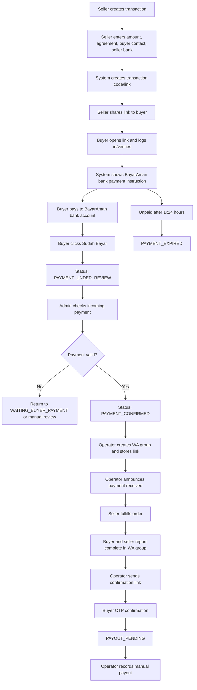
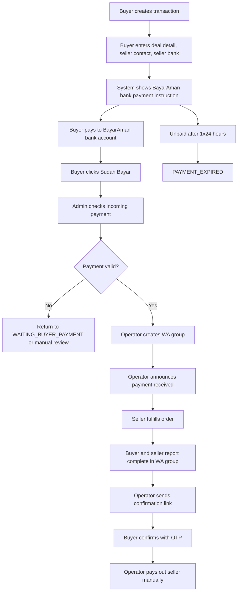
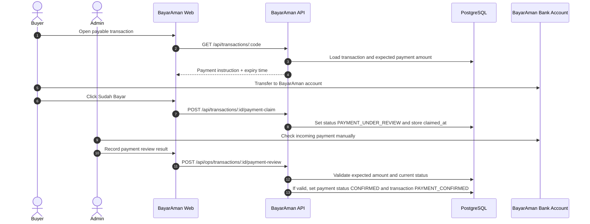
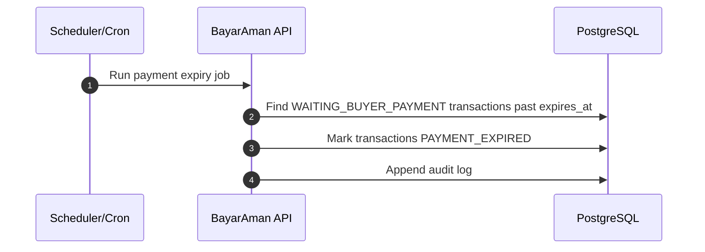
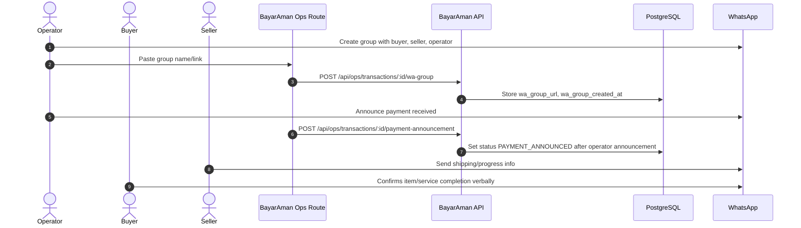
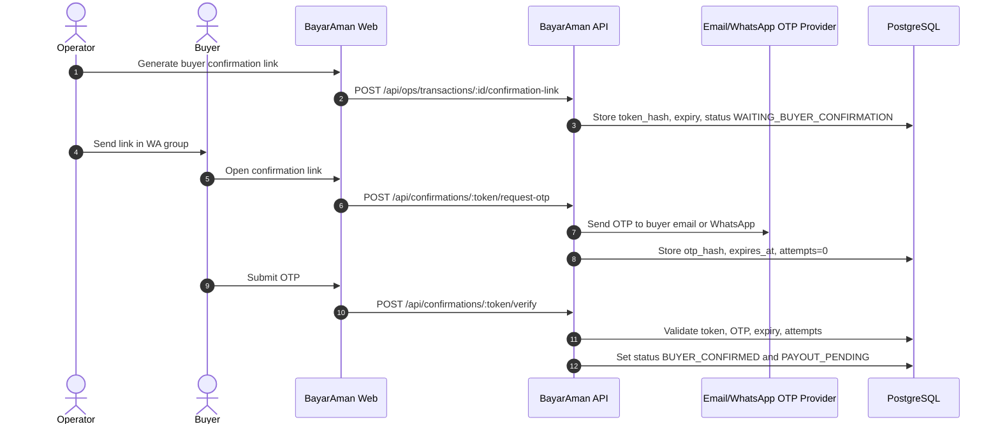
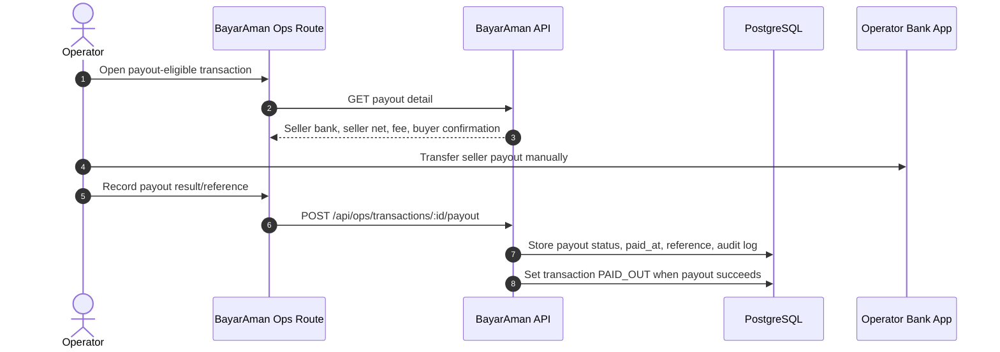
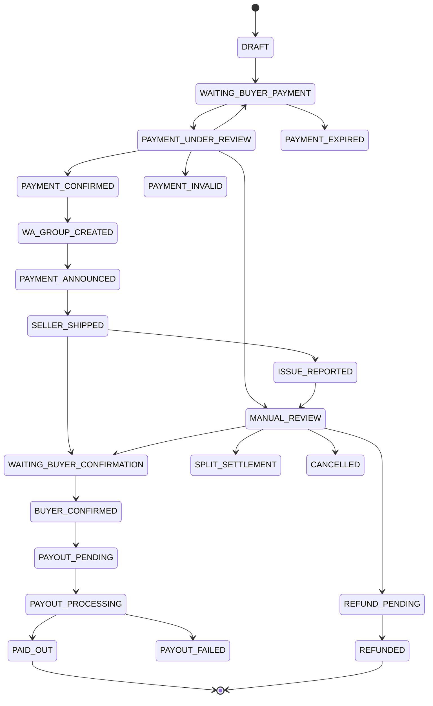

# Technical Requirements Document (TRD)

# BayarAman MVP: Manual Payment Review + Manual Payout

## 1. Document Control

- Product: BayarAman
- Version: TRD v4.0
- Status: Draft aligned with PRD v4.0
- Source PRD: `PRD.md`
- Last updated: 2026-07-14

## 2. Technical Summary

BayarAman MVP uses manual payment collection and manual operations for fulfillment coordination and seller payout/pencairan. The backend creates a transaction and expected payment instruction, buyer clicks `Sudah Bayar`, admin manually checks incoming payment, records the transaction as paid, then operator creates a WhatsApp group, sends buyer confirmation link, verifies OTP, and records manual payout to seller.

Transactions that remain unpaid expire after 1x24 hours.

## 3. Technology Stack

- Frontend/backend: Next.js
- Language: TypeScript
- ORM: Prisma or Drizzle
- Database: PostgreSQL
- Auth: Auth.js/NextAuth.js with email/password credentials and Google OAuth
- Password hashing: Argon2id preferred, bcrypt acceptable
- Manual payment collection: BayarAman bank account
- Email OTP: Resend, SendGrid, Postmark, or equivalent
- WhatsApp OTP: WhatsApp Business API provider later; manual/operator fallback acceptable for MVP
- File storage: optional for payout references/proofs; S3/R2/Supabase Storage
- Queue/cron: useful for payment expiry checks, OTP cleanup, reminders, and operational SLA reminders

## 4. System Architecture

```text
Buyer/Seller Browser
        |
        v
BayarAman Web App
        |
        v
BayarAman Backend/API
   |        |          |
   |        |          +--> Email/OTP provider
   |        +-------------> PostgreSQL
   +----------------------> Optional object storage

Manual ops:
- buyer pays to BayarAman bank account
- buyer clicks Sudah Bayar
- admin checks incoming payment manually
- operator creates WhatsApp group
- operator sends confirmation link
- operator manually transfers/pays out seller
```

## 5. Core Technical Flows

### 5.1 Business Model Flow

```mermaid
flowchart LR
  A[Buyer and seller deal outside marketplace] --> B[One party creates BayarAman transaction]
  B --> C[Buyer pays to BayarAman bank account]
  C --> D[Buyer clicks Sudah Bayar]
  D --> E[Admin verifies incoming payment]
  E --> F[Operator creates WA trust room]
  F --> G[Seller fulfills order]
  G --> H[Buyer confirms with OTP]
  H --> I[BayarAman keeps fee]
  I --> J[Operator manually pays out seller]
```



### 5.2 Seller-Created App Flow



### 5.3 Buyer-Created App Flow



### 5.4 Manual Payment Review Sequence



### 5.5 Payment Expiry Sequence



### 5.6 WA Group and Fulfillment Sequence



### 5.7 Buyer Confirmation OTP Sequence



### 5.8 Manual Payout/Pencairan Sequence



## 6. Transaction State Model



## 7. Core Modules

### Auth and Identity

- Email/password registration.
- Google OAuth registration/login.
- Email verification.
- Phone verification.
- Buyer confirmation OTP.
- Transaction-level buyer/seller role.
- Admin/finance login reserved for Phase 2.

### Transaction

- Create seller-created transaction.
- Create buyer-created transaction.
- Generate transaction code/link.
- Store seller contact and seller payout bank for buyer-created transaction.
- Store seller payout bank account.
- Set payment expiry to 1x24 hours after transaction becomes payable.
- Enforce state transitions.

### Manual Payment

- Store BayarAman payment destination and expected amount.
- Record buyer `Sudah Bayar` claim.
- Store admin payment review result.
- Track payment status: waiting, under review, confirmed, not found, invalid, expired.
- Append audit log for claim and review actions.

### WhatsApp Operations

- Store WA group name/link.
- Store group-created timestamp and operator note.
- Track that payment announcement has been made.
- MVP group creation happens manually outside system.

### Buyer Confirmation

- Generate short-lived confirmation link.
- Send OTP to buyer email or WhatsApp.
- Verify OTP with attempt limit and expiry.
- Move transaction to payout eligibility.

### Manual Outcome and Issue Recording

- Full in-app dispute is out of MVP.
- Buyer/seller complaint is handled outside system, mainly in WA group.
- System records final outcome: release, refund, split, cancelled.
- Non-normal outcome requires operator note.

### Manual Payout

- Calculate seller net payout.
- Store seller bank account snapshot.
- Record payout status/reference/timestamp.
- Append audit log for payout decisions.

## 8. API Surface Draft

User-facing:

- `POST /api/auth/register`
- `POST /api/auth/login`
- `GET /api/transactions/:code`
- `POST /api/transactions`
- `POST /api/transactions/:id/payment-claim`
- `POST /api/confirmations/:token/request-otp`
- `POST /api/confirmations/:token/verify`

Operator MVP routes:

- `POST /api/ops/transactions/:id/payment-review`
- `POST /api/ops/transactions/:id/wa-group`
- `POST /api/ops/transactions/:id/payment-announcement`
- `POST /api/ops/transactions/:id/confirmation-link`
- `POST /api/ops/transactions/:id/outcome`
- `POST /api/ops/transactions/:id/payout`

Scheduled jobs:

- `payment-expiry`: mark unpaid payable transactions as expired after 1x24 hours.

## 9. Manual Payment Implementation Rules

- Store the expected amount before showing payment instruction.
- Payment confirmation must be admin-driven, not buyer-claim-driven.
- Buyer clicking `Sudah Bayar` only moves the transaction to `PAYMENT_UNDER_REVIEW`.
- Admin review should compare expected amount, transaction code/reference if available, timestamp, and any operational notes.
- If payment is not found, return to `WAITING_BUYER_PAYMENT` if still within expiry.
- If payment is invalid or anomalous, move to `PAYMENT_INVALID` or `MANUAL_REVIEW`.
- If payment is not completed in 1x24 hours, move to `PAYMENT_EXPIRED`.
- Every payment claim, review, status change, and override must be audit-logged.

## 10. PRD-to-TRD Traceability

| PRD Need | TRD Implementation |
| --- | --- |
| Seller creates transaction | Transaction module, transaction link |
| Buyer creates transaction | Transaction module, seller contact and bank input |
| Buyer pays to BayarAman account | Manual payment instruction |
| Buyer clicks Sudah Bayar | Payment claim endpoint |
| Admin checks incoming payment | Payment review ops endpoint |
| Unpaid transaction expires 1x24 hours | Payment expiry job |
| WA group created manually | WA operations fields/API |
| Buyer confirms via link + OTP | Confirmation token + OTP module |
| Admin transfers money to seller | Manual payout/pencairan module |
| Complaint outside system | Outcome/issue recording only |
