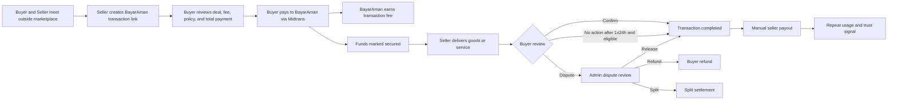
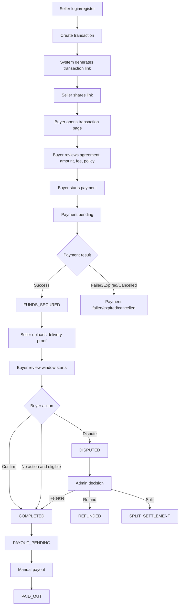
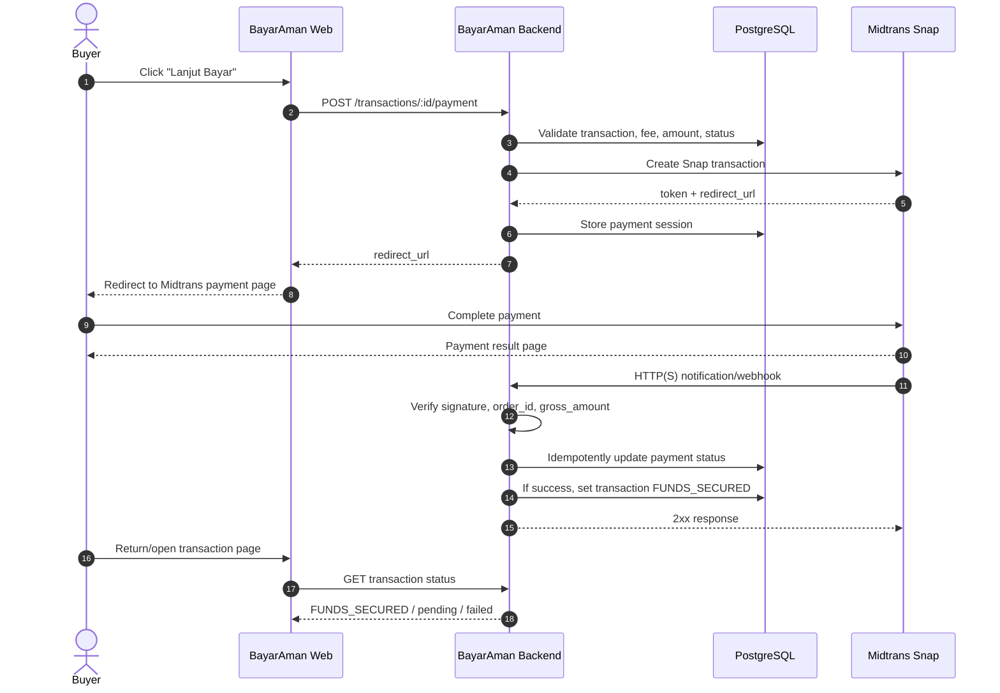
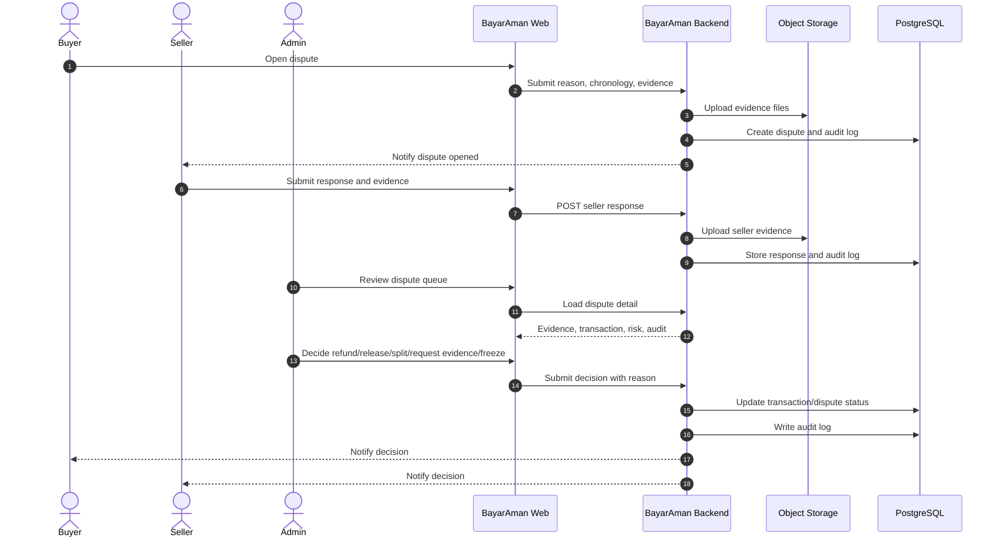
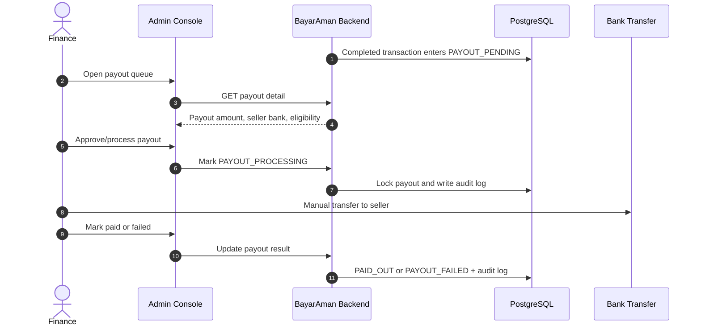
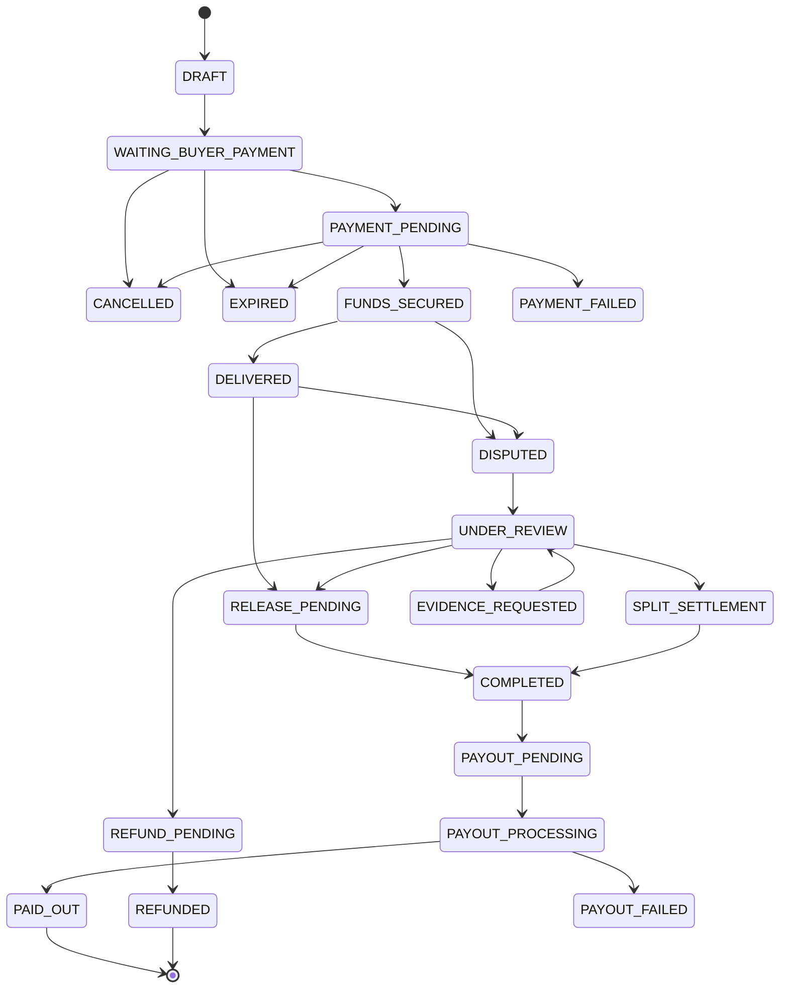

# Technical Requirements Document (TRD)

# BayarAman MVP

## 1. Document Control

- Product: BayarAman
- Version: TRD v1.0
- Status: Draft for MVP engineering
- Source PRD: `PRD.md`
- Last updated: 2026-07-09

## 2. Technical Summary

BayarAman MVP is a web-first escrow-style transaction workflow. The system creates seller-first transaction links, collects buyer payment through Midtrans Snap, receives payment status from Midtrans notifications, tracks delivery proof and dispute state, and allows finance/admin to process seller payout manually.

Payment collection is automated through Midtrans. Escrow logic, dispute workflow, auto-release, refund decision, payout decision, and audit log are implemented inside BayarAman.

## 3. Proposed Technology Stack

### 3.1 Application

- Frontend: Next.js
- Backend/API: Next.js API Routes or server actions
- Language: TypeScript
- Styling: Tailwind CSS or equivalent utility CSS
- ORM: Prisma or Drizzle
- Database: PostgreSQL
- Queue/Cron: Redis-backed queue or managed scheduled jobs
- File storage: S3/R2/Supabase Storage
- Notifications: Email first, WhatsApp later
- Deployment: Vercel/Railway/Fly.io/Render or similar

### 3.2 External Services

- Payment gateway: Midtrans
- Payment product: Midtrans Snap
- Payment status update: Midtrans HTTP(S) Notification/Webhook
- Payment reconciliation fallback: Midtrans Transaction Status API
- Refund: Midtrans Refund API where supported, manual fallback otherwise

## 4. System Architecture

```text
Buyer/Seller Browser
        |
        v
BayarAman Web App
        |
        v
BayarAman Backend/API
   |        |         |
   |        |         +--> Object Storage: evidence files
   |        +------------> PostgreSQL: core data
   +---------------------> Midtrans Snap/API
        ^
        |
Midtrans Webhook
```

Admin and finance use the same web app with protected admin routes.

## 5. Technical Flow Diagrams

These diagrams translate the PRD user flow, business model flow, and payment technology flow into engineering-readable flows.

### 5.1 Business Model Flow



### 5.2 App User Flow



### 5.3 Midtrans Payment Sequence



### 5.4 Dispute Sequence



### 5.5 Payout Sequence



### 5.6 Transaction State Diagram



## 6. Core Modules

### 6.1 Auth and Role Module

Responsibilities:

- Register/login.
- Email/phone verification.
- Role resolution per transaction.
- Admin/finance/super admin access control.
- Manual Pro assignment for MVP.

### 6.2 Transaction Module

Responsibilities:

- Create seller-first transaction.
- Generate transaction code and shareable link.
- Store agreement, amount, category, deadline, fee payer.
- Enforce status transitions.
- Render transaction detail page per role/status.

### 6.3 Fee and Limit Module

Responsibilities:

- Calculate 2% fee, min Rp20.000, max Rp100.000.
- Calculate buyer total and seller net based on fee payer.
- Enforce Free user limits.
- Flag Pro transactions above Rp5.000.000.

### 6.4 Payment Module

Responsibilities:

- Create Midtrans Snap transaction.
- Store Snap token, redirect_url, Midtrans order_id, expected amount, and status.
- Handle payment pending/success/failed/expired/cancelled.
- Provide admin payment sync action.

### 6.5 Midtrans Webhook Module

Responsibilities:

- Receive Midtrans notification.
- Verify signature.
- Validate order_id and amount.
- Process idempotently.
- Store event payload summary.
- Update payment and transaction status.

### 6.6 Delivery Proof Module

Responsibilities:

- Upload delivery proof after funds secured.
- Store evidence metadata.
- Store files in object storage.
- Start buyer review window.

### 6.7 Review and Auto-Release Module

Responsibilities:

- Track buyer review deadline.
- Allow buyer confirmation.
- Run auto-release job.
- Block auto-release when dispute, freeze, risk flag, suspicious proof, or high-risk transaction exists.

### 6.8 Dispute Module

Responsibilities:

- Buyer opens dispute.
- Seller responds.
- Admin reviews evidence.
- Admin decides refund, release, split, request more evidence, extend, or freeze.
- Enforce reason for admin decision.

### 6.9 Refund Module

Responsibilities:

- Calculate refund amount.
- Apply cancel fee where relevant.
- Trigger Midtrans refund when available.
- Support manual refund fallback.
- Track refund status.

### 6.10 Payout Module

Responsibilities:

- Move completed transaction to payout queue.
- Store seller payout bank account.
- Enforce payout eligibility.
- Support maker-checker for payout above Rp1.000.000.
- Mark payout processing, paid, or failed.

### 6.11 Audit Log Module

Responsibilities:

- Log important state changes.
- Log admin/finance decisions.
- Log provider-driven payment updates.
- Make logs append-only from normal UI.

## 7. PRD-to-TRD Traceability

| PRD Area | TRD Implementation Area |
| --- | --- |
| Seller creates transaction link | Transaction Module, API Surface, Transaction data model |
| Buyer reviews and pays | Transaction Module, Payment Module, Midtrans Sequence |
| Payment gateway checkout | Midtrans Integration, Payment Module |
| Payment success marks funds secured | Webhook Module, Payment Status Mapping |
| Seller delivery proof | Delivery Proof Module, Object Storage, DeliveryProof model |
| Buyer confirmation and auto-release | Review and Auto-Release Module, Scheduled Jobs |
| Buyer dispute and seller response | Dispute Module, Dispute Sequence, Dispute model |
| Admin dispute resolution | Admin APIs, Audit Log Module |
| Refund tracking | Refund Module, Refund model, Midtrans Refund API |
| Manual seller payout | Payout Module, Payout Sequence, Payout model |
| Free/Pro rules and fees | Fee and Limit Module |
| Audit log | Audit Log Module, AuditLog model |
| Notifications | Notification jobs and event triggers |

## 8. Midtrans Integration

### 8.1 Midtrans Product Used

Use Midtrans Snap for MVP checkout.

Supported flow:

1. BayarAman backend creates a Snap transaction.
2. Midtrans returns `token` and `redirect_url`.
3. Buyer pays via Midtrans hosted payment page or Snap JS.
4. Midtrans sends HTTP(S) notification/webhook to BayarAman.
5. BayarAman validates notification and updates transaction.

MVP implementation recommendation:

- Use `redirect_url` first for simpler checkout.
- Keep `snap.js` as later UI improvement.

### 8.2 Create Snap Transaction

Endpoint:

```http
POST https://app.sandbox.midtrans.com/snap/v1/transactions
POST https://app.midtrans.com/snap/v1/transactions
```

Minimum payload concept:

```json
{
  "transaction_details": {
    "order_id": "BA-20260709-000001",
    "gross_amount": 520000
  },
  "customer_details": {
    "first_name": "Buyer Name",
    "email": "buyer@example.com",
    "phone": "08123456789"
  }
}
```

Response concept:

```json
{
  "token": "snap-token",
  "redirect_url": "https://app.sandbox.midtrans.com/snap/v2/vtweb/..."
}
```

Technical requirements:

- Generate unique `order_id` per payment attempt.
- Store `order_id`, expected amount, token, redirect_url, status, and expiry.
- Do not create multiple active payment sessions for the same transaction unless prior session is expired/cancelled.
- Use server key only on backend.

### 8.3 Midtrans Webhook

BayarAman endpoint:

```http
POST /api/webhooks/midtrans
```

Requirements:

- Endpoint must be public HTTPS in production.
- Verify Midtrans signature key.
- Validate `order_id` exists.
- Validate `gross_amount` matches expected amount.
- Treat webhook as source of truth, not frontend redirect result.
- Process idempotently using event identity/order status uniqueness.
- Store raw payload summary for audit/debug.
- Return 2xx only after event is safely processed or deduplicated.

### 8.4 Signature Verification

Midtrans notification commonly includes `signature_key`.

Verification concept:

```text
SHA512(order_id + status_code + gross_amount + server_key)
```

Requirement:

- Reject or quarantine webhook if signature does not match.
- Log rejected webhook with limited safe metadata.

### 8.5 Transaction Status API

Use for admin manual sync/reconciliation when:

- Webhook is delayed.
- Webhook delivery failed.
- Buyer claims payment but transaction remains pending.
- Admin needs to investigate status mismatch.

Admin action:

- Button: Sync Payment Status.
- Result updates payment status only after provider response is validated.

### 8.6 Refund API

Use where supported by payment method and business policy.

Rules:

- Refund decision starts from BayarAman admin decision.
- Refund amount is calculated by BayarAman.
- If Midtrans supports refund for the payment method, trigger provider refund.
- If not supported, create manual refund task for finance.
- Store refund provider reference when available.

## 9. Payment Status Mapping

| Midtrans Status | BayarAman Payment Status | BayarAman Transaction Status |
| --- | --- | --- |
| `pending` | `PENDING` | `PAYMENT_PENDING` |
| `settlement` | `PAID` | `FUNDS_SECURED` |
| `capture` | `PAID` | `FUNDS_SECURED` |
| `deny` | `FAILED` | `PAYMENT_FAILED` |
| `expire` | `EXPIRED` | `EXPIRED` |
| `cancel` | `CANCELLED` | `CANCELLED` |
| `refund` | `REFUNDED` | `REFUNDED` |
| `partial_refund` | `PARTIALLY_REFUNDED` | `PARTIALLY_REFUNDED` |

Note:

- For card payments, only successful capture should secure funds.
- Fraud/challenge statuses must be reviewed before securing funds.

## 10. Data Model Draft

### 10.1 User

- id
- name
- email
- phone
- password_hash
- email_verified_at
- phone_verified_at
- tier: free/pro
- created_at
- updated_at

### 10.2 Transaction

- id
- code
- title
- category
- agreement
- amount
- fee_amount
- total_buyer_pay
- seller_net_amount
- fee_payer
- seller_id
- buyer_id
- status
- delivery_deadline_at
- review_deadline_at
- is_frozen
- risk_level
- created_at
- updated_at

### 10.3 Payment

- id
- transaction_id
- provider: midtrans
- provider_order_id
- expected_amount
- status
- snap_token
- redirect_url
- paid_at
- expired_at
- raw_status
- created_at
- updated_at

### 10.4 MidtransEvent

- id
- payment_id
- provider_order_id
- transaction_status
- fraud_status
- status_code
- gross_amount
- signature_valid
- payload_json
- processed_at
- created_at

### 10.5 DeliveryProof

- id
- transaction_id
- submitted_by
- proof_type
- notes
- file_url
- metadata_json
- created_at

### 10.6 Dispute

- id
- transaction_id
- opened_by
- reason
- chronology
- requested_resolution
- status
- seller_response
- admin_decision
- admin_reason
- opened_at
- resolved_at

### 10.7 Refund

- id
- transaction_id
- payment_id
- amount
- cancel_fee_amount
- method: provider/manual
- provider_ref
- status
- reason
- processed_by
- processed_at

### 10.8 Payout

- id
- transaction_id
- seller_id
- amount
- bank_name
- bank_account_number
- bank_account_name
- status
- maker_id
- checker_id
- paid_at
- failed_reason

### 10.9 AuditLog

- id
- actor_id
- actor_type
- actor_role
- action
- target_type
- target_id
- old_status
- new_status
- amount
- notes
- ip_address
- user_agent
- created_at

## 11. API Surface Draft

### Public/User APIs

- `POST /api/auth/register`
- `POST /api/auth/login`
- `POST /api/transactions`
- `GET /api/transactions/:code`
- `POST /api/transactions/:id/payment`
- `POST /api/transactions/:id/delivery-proof`
- `POST /api/transactions/:id/confirm`
- `POST /api/transactions/:id/disputes`
- `POST /api/disputes/:id/respond`

### Provider APIs

- `POST /api/webhooks/midtrans`

### Admin APIs

- `GET /api/admin/transactions`
- `GET /api/admin/disputes`
- `POST /api/admin/disputes/:id/decision`
- `POST /api/admin/transactions/:id/freeze`
- `POST /api/admin/transactions/:id/unfreeze`
- `POST /api/admin/payments/:id/sync`
- `GET /api/admin/payouts`
- `POST /api/admin/payouts/:id/process`
- `POST /api/admin/payouts/:id/mark-paid`
- `POST /api/admin/payouts/:id/mark-failed`

## 12. Jobs and Scheduled Tasks

### Payment Expiry Job

- Finds pending payment sessions past expiry.
- Marks payment expired if provider also confirms expiry or safe timeout policy is reached.

### Auto-Release Job

- Finds delivered transactions past review deadline.
- Checks no dispute, no freeze, no risk flag, no suspicious proof, no high-risk category.
- Moves eligible transaction to completed/payout pending.

### Notification Retry Job

- Retries failed email/WA/in-app notification delivery.

### Payout Reminder Job

- Alerts finance for payout queue older than SLA.

## 13. Security Requirements

- Store Midtrans server key in environment variable only.
- Never expose server key to client.
- Verify webhook signature.
- Use HTTPS for production webhook endpoint.
- Restrict admin APIs by role.
- Store evidence files with private access/signed URL where possible.
- Avoid logging secrets or full sensitive payment payloads in plain logs.
- Implement idempotency for payment webhook and payout processing.

## 14. Reliability Requirements

- Webhook handler must be idempotent.
- Payment status sync must be available from admin.
- Auto-release must prevent duplicate release.
- Payout must prevent double payout.
- Refund processing must be traceable.
- Critical state transitions must use database transaction where possible.

## 15. Environment Variables

```env
MIDTRANS_SERVER_KEY=
MIDTRANS_CLIENT_KEY=
MIDTRANS_IS_PRODUCTION=false
MIDTRANS_WEBHOOK_SECRET=
DATABASE_URL=
REDIS_URL=
STORAGE_BUCKET=
STORAGE_ACCESS_KEY=
STORAGE_SECRET_KEY=
APP_BASE_URL=
```

## 16. Local Development

Recommended local flow:

1. Run app locally.
2. Use Midtrans Sandbox credentials.
3. Expose webhook endpoint with ngrok/cloudflared.
4. Register public webhook URL in Midtrans dashboard.
5. Create test transaction.
6. Pay using Midtrans sandbox payment method.
7. Verify webhook updates transaction to funds secured.

## 17. Test Scenarios

### Payment

- Create Snap transaction successfully.
- Buyer completes payment.
- Webhook settlement marks funds secured.
- Duplicate webhook does not duplicate state changes.
- Expired payment marks transaction expired.
- Invalid signature webhook is rejected/quarantined.
- Wrong amount webhook does not secure funds.
- Manual sync updates stale pending payment.

### Delivery and Review

- Seller cannot upload proof before funds secured.
- Seller uploads proof after funds secured.
- Buyer confirms transaction.
- Auto-release runs after review window.
- Auto-release blocked by dispute/freeze/risk.

### Dispute

- Buyer opens dispute.
- Seller responds.
- Admin requests evidence.
- Admin decides refund.
- Admin decides release.
- Admin decides split settlement.

### Payout

- Completed transaction enters payout queue.
- Payout <= Rp1.000.000 uses single approval.
- Payout > Rp1.000.000 uses maker-checker.
- Failed payout can be marked and retried.

## 18. Open Technical Questions

- Which Midtrans payment methods are enabled first: VA, QRIS, e-wallet, card?
- What is the exact Midtrans refund support per enabled method?
- Will payout stay fully manual or use a payout partner post-MVP?
- Which storage provider is selected for evidence?
- Which notification channel launches first: email, WhatsApp, or both?
- Which deployment target is selected for production?
