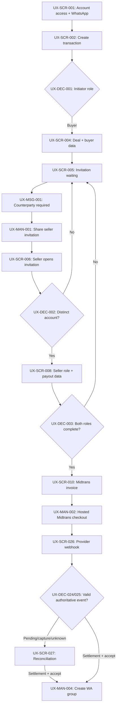
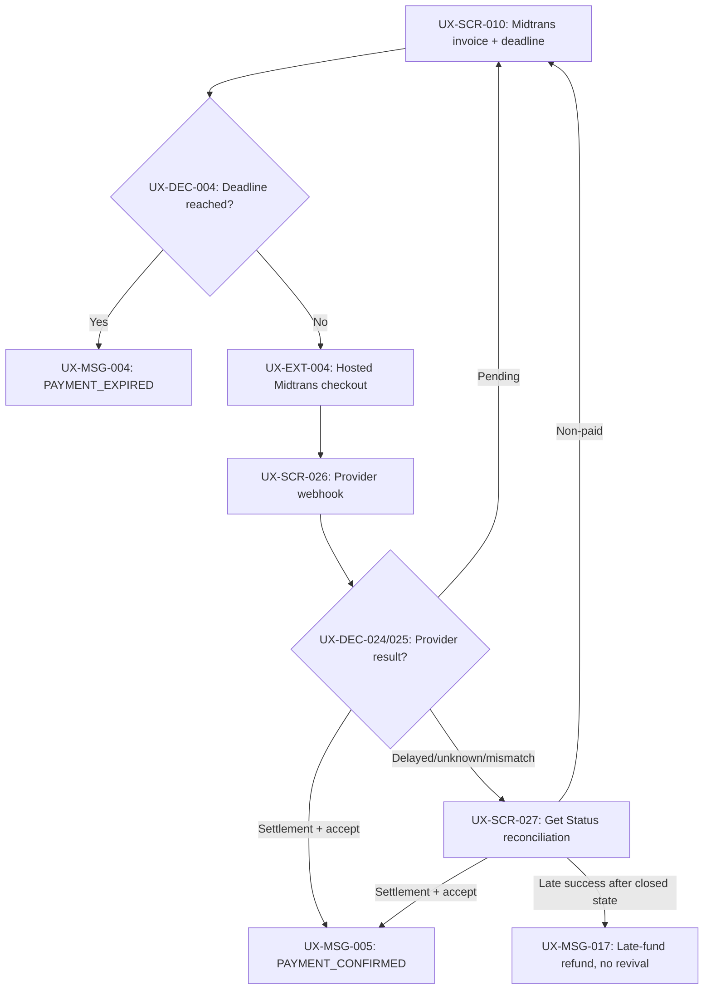
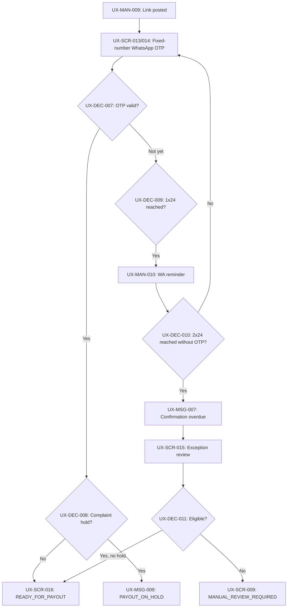
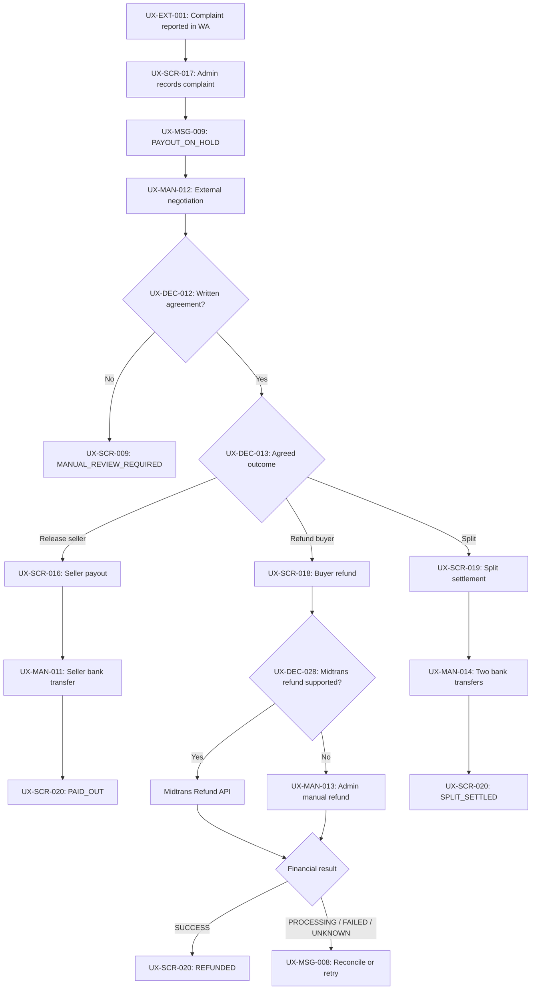
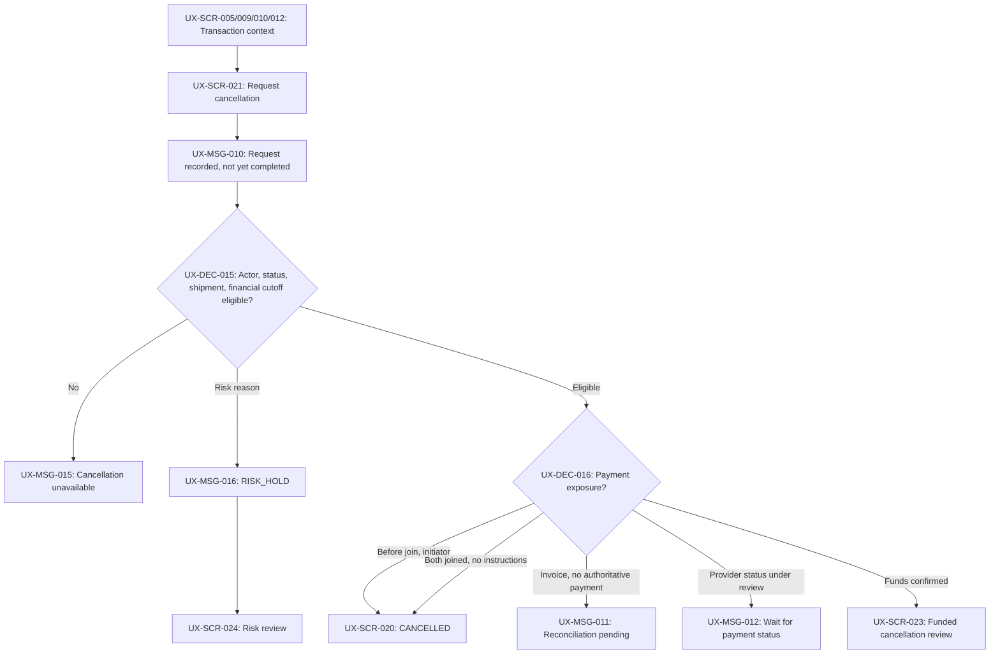
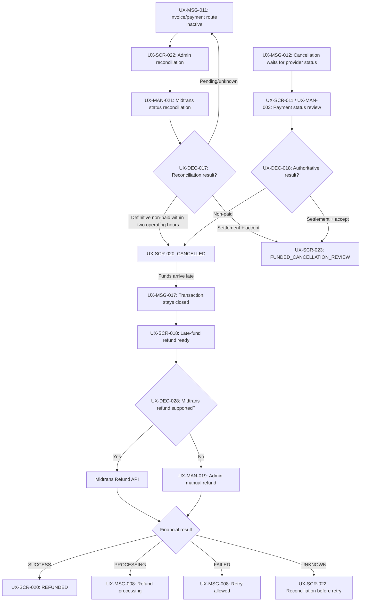
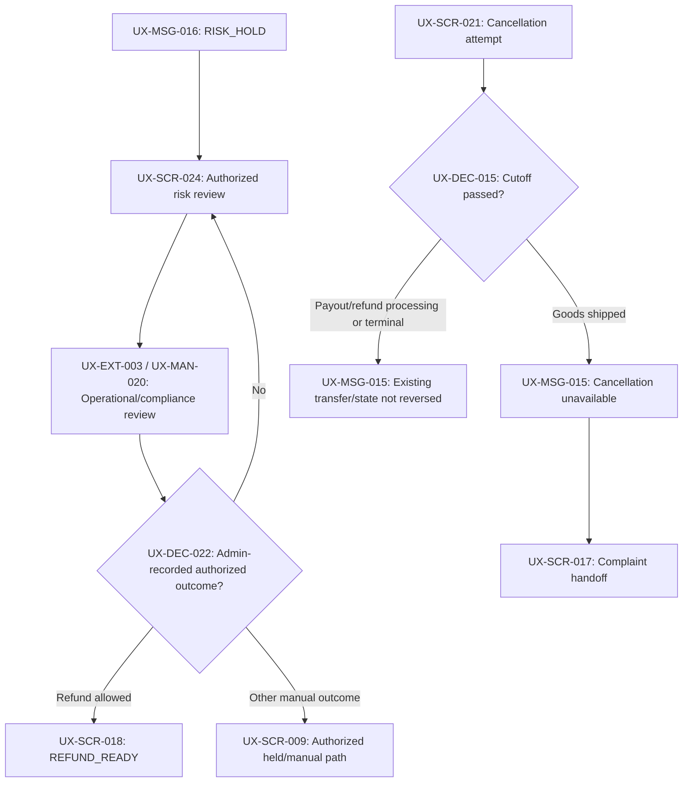

# BayarAman UX Flow

## 1. Document Control

```text
Product/feature: BayarAman MVP physical-goods transaction
Version: 0.3
Status: Approved
Owner: Product Owner BayarAman
Last updated: 2026-07-25
Source Product Brief: docs/product/00-product-brief.md v0.10 (Approved)
Source User Journey: docs/product/01-user-journey.md v0.6 (Approved)
Previous approved version: 0.2 (2026-07-19)
Change request: Replace manual-bank payment flow with Midtrans invoice and webhook flow
Approved by: Product Owner BayarAman
Approved on: 2026-07-25
```

This artifact maps approved behavior into experience nodes and handoffs. Screen names are conceptual flow surfaces, not final information architecture, field specification, layout, copy, or visual design.

## 2. Flow Scope And UX Goals

```text
Included journeys:
- UJ-SELLER
- UJ-BUYER
- UJ-CONFIRMATION-RECOVERY
- UJ-COMPLAINT-HOLD
- UJ-PAYMENT-RECOVERY
- UJ-CANCELLATION

Entry points:
- Authenticated account creates a transaction as seller.
- Authenticated account creates a transaction as buyer.
- Invited counterparty opens a transaction link.
- Admin opens an operation that requires manual review or recording.
- An eligible initiator, buyer, or seller requests cancellation from the transaction context.
- Admin records a prohibited-item, suspected-fraud, or policy concern.

Successful end states:
- PAID_OUT
- PAYMENT_EXPIRED
- REFUNDED
- SPLIT_SETTLED
- CANCELLED

Non-terminal held end state:
- MANUAL_REVIEW_REQUIRED with funds held
- RISK_HOLD with fulfillment and money movement held
- PAYOUT_ON_HOLD after shipment/conflicting evidence hands cancellation to complaint

Experience goals:
- Always show the current trusted status and next responsible actor.
- Keep buyer/seller role ownership and participant identity unambiguous.
- Separate claims, manual observations, verified facts, and money movement.
- Make every Midtrans, WhatsApp, and Admin handoff visible without pretending it is automated.
- Keep invoice expiry, webhook recovery, OTP timeout, complaint hold, and settlement recovery understandable.
- Make cancellation eligibility, pending reconciliation, response deadlines, and cutoff reasons understandable without implying automatic money movement.
- Keep the prior transaction flow visibly closed when late funds require refund after cancellation.

Known constraints:
- WhatsApp group creation, group messages, fulfillment discussion, and complaint negotiation are manual/outside system.
- Midtrans invoice creation and webhook processing are system/provider boundaries; seller payout, unsupported-method refund, and split transfers are manual.
- OTP is WhatsApp-only and bound to the buyer transaction-number snapshot used for the group.
- Unpaid payment uses the approved absolute 1x24-hour deadline from invoice availability; status refresh/retry never resets it.
- Buyer confirmation uses the approved 2x24-hour window and 1x24-hour reminder.
- Cancellation after invoice creation uses a maximum two-operating-hour reconciliation with the invoice/payment route inactive.
- Funded cancellation uses manual WA evidence and a 1x24-hour participant-response window.
- Shipment, payout/refund processing, and terminal financial states prevent cancellation from stopping or reversing money movement.
- Risk cases remain held until an operational/compliance outcome is recorded; no default refund or payout is implied.
- This stage does not define final fields, validation copy, layout, component behavior, or styling.
```

### 2.1 Cancellation Flow Boundaries

| Flow segment | Entry point and actor boundary | Decision/handoff | Exit state | Waiting, failure, or recovery |
| --- | --- | --- | --- | --- |
| Before counterparty joins | Initiator opens cancellation from invitation-waiting transaction; no other actor may cancel | System validates initiator and absence of payment exposure | `CANCELLED` | Unauthorized action is rejected with no state change |
| Both parties joined before instructions | Buyer or seller opens cancellation while role data is joined and payment instructions are unavailable | System validates either participant and absence of payment exposure | `CANCELLED` | Repeated/duplicate action remains blocked and auditable |
| Invoice available, no authoritative payment | Buyer or seller requests cancellation from payment/transaction context | BayarAman disables invoice/payment route; provider status is reconciled for at most two operating hours | `CANCELLED` when definitive non-paid or `FUNDED_CANCELLATION_REVIEW` when settlement is authoritative | Missing webhook is not treated as no payment |
| Provider payment under review | Buyer or seller requests cancellation while provider review owns the next decision | Get Status API/manual reconciliation returns through authoritative/non-paid decision | `CANCELLED` or `FUNDED_CANCELLATION_REVIEW` | Cancellation cannot bypass, reset, or complete before review result |
| Funded before shipment | Buyer, seller, or admin starts/continues cancellation before shipment; request alone cannot move money | BayarAman to transaction WA group for response/not-shipped evidence, then admin records checkpoints and calculation | `REFUNDED`, `MANUAL_REVIEW_REQUIRED`, or complaint `PAYOUT_ON_HOLD` | 1x24-hour timeout, WA/manual failure, conflicting evidence, and refund failure remain visible non-terminal paths |
| Late funds after cancellation | BayarAman receives a Midtrans webhook or obtains a provider result through Get Status API for a `CANCELLED` transaction | Provider event/status reconciliation returns to the authorized Buyer-refund operation | `REFUNDED` | Original transaction never revives; failed/unknown refund remains processing or requires reconciliation |
| Prohibited-item/fraud/policy concern | Admin records risk reason; an Admin with the internal risk/compliance assignment may decide the outcome | BayarAman to internal Admin review assignment and back to the recorded authorized route | `RISK_HOLD`, `REFUND_READY`, or another authorized manual outcome | No response/default outcome; review can remain held indefinitely under later SLA |
| Shipment or financial cutoff | Buyer or seller attempts cancellation after shipment, transfer processing, or terminal financial state | System rejects; shipped-goods issue may hand off to complaint | Existing state or `PAYOUT_ON_HOLD` | No automatic transfer stop/reversal; participant sees cutoff reason |
| Withdrawal or rejection | Requester/admin ends a request before financial operation | System/admin verifies prior state is still valid | Prior valid state or `MANUAL_REVIEW_REQUIRED` | Expired, shipped, risky, or financially changed state is never silently restored |

## 3. Actor And Entry-Point Map

| Actor | Entry point | Goal | Required context/data on entry | Exit condition |
| --- | --- | --- | --- | --- |
| Account acting as seller | Account access, create-transaction action, invitation, or eligible cancellation action | Start or join a deal, respond to or request eligible cancellation, fulfill it, and receive an auditable payout | Authenticated account, mandatory WhatsApp number, assigned transaction role, current cancellation eligibility | Transaction reaches a financial end state or a visible held/manual-review state |
| Account acting as buyer | Account access, create-transaction action, invitation, buyer-confirmation link, or eligible cancellation action | Join or start a deal, pay BayarAman, request/respond to eligible cancellation, and control final receipt confirmation | Authenticated account, mandatory WhatsApp number, assigned transaction role, current cancellation eligibility | Transaction reaches a financial end state or a visible held/manual-review state |
| Invited counterparty | Shareable invitation link | Join as the opposite role with a distinct account and complete owned data | Invitation token and an account different from the initiator | Own role data is complete or join is rejected/recovery is required |
| Admin | Admin operation queue or transaction operation surface | Record Midtrans exceptions/WA facts, reconcile cancellation exposure, review evidence, and perform only currently authorized financial actions | Authenticated admin, transaction status, participant snapshots, payment/cancellation state, provider evidence | Required checkpoint/outcome is recorded and the next actor/status is visible |
| Admin with internal risk/compliance assignment | Admin risk-review queue or handoff | Determine the allowed case-specific outcome for prohibited-item, suspected-fraud, or policy holds | `RISK_HOLD`, authorized case evidence, assigned Admin identity | Hold remains or an explicitly authorized manual outcome is exposed |
| BayarAman system | Approved trigger, timer, or recorded admin/user action | Enforce role, time, hold, and action eligibility rules | Current transaction state and audited event data | Valid next state, rejection, expiry, or manual-review state is produced |

## 4. Experience Node Inventory

### Screens And Status Surfaces

| UX ID | Type | Actor | Purpose | Entry condition | Possible exits |
| --- | --- | --- | --- | --- | --- |
| `UX-SCR-001` | Screen | Buyer or seller account | Sign in/create account and satisfy mandatory WhatsApp contact prerequisite | User needs account access | Create transaction, open invitation, or blocked for missing account data |
| `UX-SCR-002` | Screen | Buyer or seller account | Choose initiator role for a new transaction | Authenticated account starts a transaction | Seller-created form or buyer-created form |
| `UX-SCR-003` | Screen | Seller initiator | Enter shared deal and seller-owned role/payout data | Seller role selected | Invitation ready or input correction |
| `UX-SCR-004` | Screen | Buyer initiator | Enter shared deal and buyer-owned role data | Buyer role selected | Invitation ready or input correction |
| `UX-SCR-005` | Screen | Initiator | Expose invitation and waiting state without payment instructions | Initiator data is complete | External share, counterparty joined, or invitation recovery |
| `UX-SCR-006` | Screen | Invited counterparty | Open invitation, authenticate, and join as opposite role | Invitation opened | Role-completion surface, same-account rejection, or invitation recovery |
| `UX-SCR-007` | Screen | Account acting as buyer | Complete buyer-owned transaction data and bind buyer WhatsApp snapshot | Buyer is the incomplete counterparty role | Waiting state or payable transition |
| `UX-SCR-008` | Screen | Account acting as seller | Complete seller-owned role, payout, and WhatsApp snapshot | Seller is the incomplete counterparty role | Waiting state or payable transition |
| `UX-SCR-009` | Screen | Buyer or seller | Show transaction status, next actor/action, deadlines, holds, and financial outcome | Participant opens an existing transaction | Available participant action or passive waiting |
| `UX-SCR-010` | Screen | Buyer | Show Midtrans invoice/payment link, amount, provider status, and original deadline | Both role datasets are complete and invoice is available | Hosted checkout, status refresh, expiry, or exception |
| `UX-SCR-011` | Screen | Admin | Review Midtrans notification/status exceptions and reconciliation | Signature, amount, status, ordering, or provider state requires review | Authoritative payment, non-paid outcome, expiry, or manual review |
| `UX-SCR-012` | Screen | Admin | Coordinate transaction operations and record WA/checkpoint actions | Admin opens a funded or operational transaction | Group/announcement, completion checkpoint, confirmation link, complaint hold, or payout operation |
| `UX-SCR-013` | Screen | Buyer | Open secure buyer-confirmation link and request fixed-destination WhatsApp OTP | Both completion checkpoints exist and link is valid | OTP entry, link/OTP recovery, or waiting |
| `UX-SCR-014` | Screen | Buyer | Enter WhatsApp OTP and confirm goods received | OTP was requested for the bound buyer number | Ready for payout, payout held, or OTP recovery |
| `UX-SCR-015` | Screen | Admin | Review overdue confirmation and controlled-exception eligibility | Buyer confirmation is overdue | Ready for payout or manual review required |
| `UX-SCR-016` | Screen | Admin | Review and record manual seller payout | Transaction is `READY_FOR_PAYOUT` with no hold | Payout processing, payout failure, or paid out |
| `UX-SCR-017` | Screen | Admin | Record complaint hold, written agreement, and selected settlement outcome | Complaint is reported before payout processing | Manual review, seller release, buyer refund, or split settlement |
| `UX-SCR-018` | Screen | Admin | Review and record an authorized buyer refund through Midtrans when supported or manual fallback when required | Complaint agreement, approved cancellation calculation, late-fund exception, or risk outcome makes refund ready | Refund processing, failure/unknown reconciliation, or refunded |
| `UX-SCR-019` | Screen | Admin | Record agreed manual split settlement | Written agreement selects split | Split processing, failure, or split settled |
| `UX-SCR-020` | Screen | Buyer, seller, or admin | Show terminal transaction/financial result and references allowed for the actor | Transaction is paid out, expired, cancelled, refunded, or split settled | End |
| `UX-SCR-021` | Screen | Eligible initiator, buyer, seller, or admin | Start cancellation and show current actor/status eligibility, consequences, and waiting state | Actor opens cancellation from an eligible transaction state or admin records a risk reason | Eligibility decision, direct cancellation, pending reconciliation, funded review, risk hold, or rejection |
| `UX-SCR-022` | Screen | Admin | Reconcile a possible late/ambiguous Midtrans payment after cancellation or resolve a provider-status review | Cancellation has payment exposure or is waiting for authoritative payment result | Cancelled, funded review, late-fund refund, or continued pending/manual follow-up |
| `UX-SCR-023` | Screen | Admin | Review funded cancellation evidence, participant responses, shipment state, cause, fee treatment, and refund readiness | Funds are confirmed and goods are not yet confirmed shipped | Waiting response, manual review, complaint handoff, refund ready, risk hold, rejection, or prior-flow recovery |
| `UX-SCR-024` | Screen | Admin with internal risk/compliance assignment | Review a prohibited-item, suspected-fraud, or policy hold without implying an outcome | Admin records a risk concern and transaction is `RISK_HOLD` | Remain held or expose only an authorized manual financial outcome |
| `UX-SCR-025` | Screen | Buyer | Open the hosted Midtrans invoice/payment page from BayarAman | Invoice link is available | Midtrans checkout or provider error |
| `UX-SCR-026` | Screen | Admin/system | Show webhook event, provider status, validation result, and processing state | Midtrans sends a notification | Accepted event, duplicate ignored, reconciliation, or failure |
| `UX-SCR-027` | Screen | Admin | Reconcile delayed, out-of-order, unknown, mismatched, or late payment events | Provider result is not authoritative or arrives after expiry/cancellation | Payment confirmation, refund exception, or manual review |

### Messages, Decisions, And Manual/External Nodes

| UX ID | Type | Actor | Purpose | Entry condition | Possible exits |
| --- | --- | --- | --- | --- | --- |
| `UX-MSG-001` | Message | Initiator | Explain that the counterparty must join before payment is available | Invitation exists, opposite role incomplete | Continue waiting or recover invitation |
| `UX-MSG-002` | Message | Buyer and seller | Distinguish provider payment event from BayarAman-authoritative settlement | Midtrans event is pending, capture, or under review | Status reconciliation |
| `UX-MSG-003` | Message | Buyer | Explain a non-authoritative or definitive non-paid Midtrans result and original-deadline consequence | Provider status is pending/unknown or Admin records a definitive non-paid result | Return to valid invoice status, reconciliation, or expire |
| `UX-MSG-004` | Message | Buyer and seller | Explain terminal unpaid expiry | Original deadline expires under approved policy | Terminal summary |
| `UX-MSG-005` | Message | Buyer and seller | Communicate trusted payment confirmation and fulfillment readiness | `settlement + fraud_status=accept` is recorded | Seller fulfillment |
| `UX-MSG-006` | Message | Buyer, seller, and admin | Show which completion checkpoint is still missing | Fulfillment started but fewer than two checkpoints exist | Additional report/checkpoint |
| `UX-MSG-007` | Message | Buyer, seller, and admin | Explain buyer-confirmation overdue state and held payout | 2x24-hour confirmation window ends | Exception review, later OTP, complaint path, or manual review |
| `UX-MSG-008` | Message | Relevant actors | Explain `PROCESSING`, `FAILED`, or `UNKNOWN` without presenting an unverified final result | Payout/refund/split has started or a financial operation result is uncertain | Retry `FAILED`, reconcile `UNKNOWN`, or record terminal success |
| `UX-MSG-009` | Message | Buyer and seller | Explain complaint hold and disabled financial actions | Admin records complaint | External negotiation or settlement recording |
| `UX-MSG-010` | Message | Requester and joined counterparty | Explain that a cancellation request was recorded and that completion depends on current actor/status eligibility | Cancellation is submitted | Direct result, pending reconciliation, payment review, funded review, risk hold, or rejection |
| `UX-MSG-011` | Message | Buyer, seller, and admin | Explain that the Midtrans invoice/payment route is inactive while provider-status reconciliation runs for at most two operating hours | Cancellation occurs after invoice creation and before authoritative payment | Midtrans status reconciliation, cancelled result, or funded review |
| `UX-MSG-012` | Message | Buyer, seller, and admin | Explain that cancellation cannot complete until the Midtrans payment status is authoritative or reconciled | Cancellation is requested during payment-status review | Payment-status result |
| `UX-MSG-013` | Message | Buyer, seller, and admin | Explain funded-cancellation hold, required WA response/evidence, and 1x24-hour deadline | Confirmed funds enter funded cancellation before shipment | Participant WA response, timeout, shipment conflict, or refund review |
| `UX-MSG-014` | Message | Buyer, seller, and admin | Explain that no required response arrived and neither refund nor payout occurred automatically | Funded response deadline passes | Manual follow-up while `MANUAL_REVIEW_REQUIRED` |
| `UX-MSG-015` | Message | Cancellation requester | Explain why cancellation is unavailable after shipment, financial processing, terminal state, or another failed eligibility check | Cancellation is rejected by actor/status/cutoff decision | Complaint handoff where applicable or existing state |
| `UX-MSG-016` | Message | Buyer, seller, and admin | Explain that fulfillment and money movement are held for an internal Admin risk/compliance assignment without promising an outcome | Risk concern is recorded | Admin risk review or continued hold |
| `UX-MSG-017` | Message | Buyer, seller, and admin | Explain that late funds do not revive the cancelled transaction and are handled only through refund | Funds arrive after `CANCELLED` | Authorized refund operation or refund failure/manual follow-up |
| `UX-MSG-018` | Message | Buyer | Explain that an invoice is ready and the 1x24-hour deadline has started | Midtrans invoice is created | Hosted payment page |
| `UX-MSG-019` | Message | Buyer and seller | Explain that provider payment is pending and not yet authoritative | Midtrans status is `pending` or `capture` | Wait or reconciliation |
| `UX-MSG-020` | Message | Admin | Explain webhook validation, amount, ordering, or provider failure requiring reconciliation | Event cannot be accepted as authoritative | Get Status API or manual review |
| `UX-DEC-001` | Decision | Initiator | Route new transaction to seller-created or buyer-created entry | Authenticated user starts transaction | `UX-SCR-003` or `UX-SCR-004` |
| `UX-DEC-002` | Decision | System | Reject same-account counterparty and require a distinct opposite-role account | Invitation account attempts to join | Role completion or invitation waiting/recovery |
| `UX-DEC-003` | Decision | System | Determine whether both role datasets are complete | Either participant completes role data | Midtrans invoice or waiting |
| `UX-DEC-004` | Decision | System | Evaluate invoice timing against original payment deadline | Deadline or provider event occurs | Waiting or expired |
| `UX-DEC-005` | Decision | Admin/system | Branch on authoritative provider result | Webhook or Get Status API result is available | `PAYMENT_CONFIRMED`, non-paid outcome, or reconciliation |
| `UX-DEC-006` | Decision | System/admin | Determine whether both role-specific completion checkpoints exist | Admin records a checkpoint | Wait for other report or allow confirmation link |
| `UX-DEC-007` | Decision | System | Branch on WhatsApp OTP validity | Buyer submits OTP | Buyer confirmed or OTP recovery |
| `UX-DEC-008` | Decision | System | Prevent OTP or exception from bypassing complaint hold | Buyer confirmation or admin exception succeeds | Ready for payout or payout on hold |
| `UX-DEC-009` | Decision | System/admin | Trigger manual reminder when OTP remains incomplete after 1x24 hour | First confirmation threshold reached | Reminder or no action because confirmed |
| `UX-DEC-010` | Decision | System | Mark overdue if OTP remains incomplete after 2x24 hours | Final confirmation threshold reached | Ready for payout or overdue |
| `UX-DEC-011` | Decision | Admin/system | Validate controlled-exception conditions | Admin reviews overdue confirmation | Ready for payout or manual review required |
| `UX-DEC-012` | Decision | Admin/system | Determine whether written complaint agreement exists | Complaint is on hold | Continue hold or settlement ready |
| `UX-DEC-013` | Decision | Admin | Route the recorded agreement to release, refund, or split | Written WA agreement is recorded | Seller payout, buyer refund, or split operation |
| `UX-DEC-014` | Decision | Admin/system | Separate a financial operation attempt from its terminal result | Payout/refund/split is attempted | `PROCESSING`, `SUCCESS`, `FAILED`, `UNKNOWN`, or reconciliation; only `SUCCESS` with evidence is terminal |
| `UX-DEC-015` | Decision | System | Validate cancellation actor, current status, shipment cutoff, and financial-processing cutoff | Cancellation request is submitted | Direct cancellation, payment-exposure branch, funded review, risk hold, or rejection |
| `UX-DEC-016` | Decision | System | Determine whether an invoice, provider review, or authoritative funds create financial exposure | Eligible cancellation passes actor/cutoff checks | Direct `CANCELLED`, reconciliation pending, payment-review waiting, or funded review |
| `UX-DEC-017` | Decision | Admin/system | Branch on provider cancellation-reconciliation result within the approved window | Admin/system records provider status or Get Status result | `CANCELLED` when definitively non-paid, funded review when settled, or continued pending/manual follow-up |
| `UX-DEC-018` | Decision | Admin/system | Apply authoritative/non-paid result to a cancellation waiting on provider review | Provider reconciliation completes | `CANCELLED` or funded review |
| `UX-DEC-019` | Decision | System/admin | Evaluate required funded response, 1x24-hour deadline, and evidence completeness | WA request is sent or response/deadline arrives | Continue review, `MANUAL_REVIEW_REQUIRED`, shipment conflict, or refund calculation |
| `UX-DEC-020` | Decision | Admin/system | Determine whether seller statement or conflicting evidence indicates shipment | Funded-cancellation evidence is recorded | Continue cancellation or hand off to complaint hold |
| `UX-DEC-021` | Decision | Admin/system | Apply the approved cancellation cause to service-fee treatment and refund amount | Required response and not-shipped evidence are sufficient | Full refund including service fee or item/shipping refund retaining service fee |
| `UX-DEC-022` | Decision | Admin with internal risk/compliance assignment | Route a `RISK_HOLD` only to the recorded authorized outcome | Admin risk review decision is recorded | Remain held, refund ready, or another authorized manual outcome |
| `UX-DEC-023` | Decision | System/admin | Verify that a withdrawal/rejection may safely resume the prior transaction state | Cancellation ends before a financial operation | Prior valid state or `MANUAL_REVIEW_REQUIRED` |
| `UX-DEC-024` | Decision | System | Validate Midtrans signature, order ID, amount, and fraud status | Notification arrives | Accept, reject, or reconcile event |
| `UX-DEC-025` | Decision | System/admin | Determine whether provider status is authoritative | Status is `pending`, `capture`, `settlement`, `deny`, `cancel`, `failure`, `expire`, or unknown | Wait, `PAYMENT_CONFIRMED`, non-paid outcome, or review |
| `UX-DEC-026` | Decision | System | Ignore duplicate or stale out-of-order events | Event has known provider reference or older status | Existing state or latest-status reconciliation |
| `UX-DEC-027` | Decision | Admin/system | Determine whether late payment can be applied to a closed transaction | Provider success arrives after expiry/cancellation | Refund exception without revival or manual review |
| `UX-DEC-028` | Decision | Admin/system | Select Midtrans Refund API or manual Admin fallback and interpret the financial operation result | An authorized refund is ready and provider capability is known | `PROCESSING`, `SUCCESS`, `FAILED`, `UNKNOWN`, or reconciliation |
| `UX-MAN-001` | Manual | Initiator | Share transaction invitation outside BayarAman | Invitation is generated | Counterparty opens link or initiator keeps waiting |
| `UX-MAN-002` | Manual | Buyer | Open and complete payment through Midtrans hosted checkout | Invoice link is available | Provider event returns to BayarAman |
| `UX-MAN-003` | Manual | Admin | Review Midtrans exception and use Get Status API when needed | Provider event is delayed, unknown, mismatched, or out-of-order | Admin records authoritative/non-authoritative result |
| `UX-MAN-004` | Manual | Admin | Create WA group with transaction participant-number snapshots | Payment is confirmed | Group-created checkpoint |
| `UX-MAN-005` | Manual | Admin | Announce verified payment in WA group | Group exists | Fulfillment-ready checkpoint |
| `UX-MAN-006` | Manual | Seller | Ship physical goods outside BayarAman | Payment announcement authorizes fulfillment | Completion reporting |
| `UX-MAN-007` | Manual | Buyer or seller | Report order completion in WA group | Party considers order complete | Admin records corresponding checkpoint |
| `UX-MAN-008` | Manual | Admin | Observe WA report and record role-specific completion checkpoint | Completion report exists | Wait for other checkpoint or allow link |
| `UX-MAN-009` | Manual | Admin | Post system-generated confirmation link in WA group | Both completion checkpoints exist | Buyer opens link |
| `UX-MAN-010` | Manual | Admin | Remind buyer in WA after 1x24 hour | Reminder is due and OTP incomplete | Buyer confirms or timer continues |
| `UX-MAN-011` | Manual | Admin | Transfer seller payout through external bank channel | Payout is eligible and not held | Payout result recording |
| `UX-MAN-012` | Manual | Buyer, seller, and admin | Discuss complaint outside system and produce written WA agreement if possible | Complaint hold exists | Continue hold or record agreement |
| `UX-MAN-013` | Manual | Admin | Execute or record an agreed full refund through Midtrans Refund API when supported, otherwise manual fallback | Settlement outcome is refund | Refund result recording and reconciliation |
| `UX-MAN-014` | Manual | Admin | Transfer agreed split portions to buyer and seller | Settlement outcome is split | Split result recording |
| `UX-MAN-015` | Manual | Admin | Reconcile possible payment against Midtrans provider status for cancellation | Invoice existed, provider status is under review, or late funds are detected | Admin records authoritative/non-paid/late-fund result in `UX-SCR-022` |
| `UX-MAN-016` | Manual | Admin | Create or use the transaction WA group, announce funded-cancellation hold, and request required response | Funded cancellation begins before shipment | WA request/deadline checkpoint returns to `UX-SCR-023` |
| `UX-MAN-017` | Manual | Seller and any required participant | State shipment status and provide applicable cancellation response in the transaction WA group | Admin requests funded-cancellation evidence/response | Admin records WA evidence and response |
| `UX-MAN-018` | Manual | Admin | Review WA response and record seller not-shipped, response, evidence, and deadline checkpoints | Participant WA response exists or deadline passes | `UX-DEC-019` and `UX-DEC-020` |
| `UX-MAN-019` | Manual | Admin | Execute or record an approved cancellation/late-fund refund through Midtrans when supported, otherwise use the manual bank fallback | Cancellation refund is `REFUND_READY` | Refund result recording through `UX-SCR-018` and `UX-DEC-014` |
| `UX-MAN-020` | Manual | Admin with internal risk/compliance assignment | Review risk evidence outside normal transaction flow and record the allowed outcome | Transaction is `RISK_HOLD` | `UX-DEC-022` |
| `UX-MAN-021` | Manual | Admin | Reconcile a late, duplicate, unknown, or amount-mismatched Midtrans event | `UX-SCR-027` requires authoritative decision | Provider reference, status lookup, amount comparison, decision, operator/time | `UX-DEC-027` or payment-status decision |
| `UX-EXT-001` | External | Buyer, seller, and admin | Host manual group coordination, reports, reminders, and agreement evidence | Admin creates group | Return to the relevant admin recording action |
| `UX-EXT-002` | External | Admin | Move money through bank channels for payout or unsupported-method refund | Financial operation is due | Return for result recording |
| `UX-EXT-003` | External | Admin with internal risk/compliance assignment | Perform case-specific risk review outside the normal transaction sequence | `RISK_HOLD` exists | Return to `UX-SCR-024` to record the authorized outcome |
| `UX-EXT-004` | External | Buyer | Complete payment on Midtrans hosted page | `UX-SCR-025` opens the provider link | Return to BayarAman via provider notification/status |

## 5. Primary Flow Diagrams

### 5.1 Seller-Created Transaction

```mermaid
flowchart TD
    A["UX-SCR-001: Account access + WhatsApp"] --> A2["UX-SCR-002: Create transaction"]
    A2 --> B{"UX-DEC-001: Initiator role"}
    B -->|Seller| C["UX-SCR-003: Deal + seller data"]
    C --> D["UX-SCR-005: Invitation waiting"]
    D --> D2["UX-MSG-001: Counterparty required"]
    D2 --> E["UX-MAN-001: Share buyer invitation"]
    E --> F["UX-SCR-006: Buyer opens invitation"]
    F --> G{"UX-DEC-002: Distinct account?"}
    G -->|No| D
    G -->|Yes| H["UX-SCR-007: Buyer role data"]
    H --> I{"UX-DEC-003: Both roles complete?"}
    I -->|No| D
    I -->|Yes| J["UX-SCR-010: Midtrans invoice"]
    J --> K["UX-MAN-002: Hosted Midtrans checkout"]
    K --> L["UX-SCR-026: Provider webhook"]
    L --> M{"UX-DEC-024/025: Valid authoritative event?"}
    M -->|Pending/capture/unknown| N["UX-SCR-027: Reconciliation"]
    N -->|Settlement + accept| O["UX-MAN-004: Create WA group"]
    N -->|Non-paid/expired| PR["UX-MSG-003: Non-paid / original deadline"]
    M -->|Settlement + accept| O
    O --> P["UX-MAN-005: Announce payment"]
    P --> Q["UX-MAN-006: Seller ships"]
    Q --> R["UX-MAN-007/008: Reports + checkpoints"]
    R --> S{"UX-DEC-006: Both checkpoints?"}
    S -->|No| R
    S -->|Yes| T["UX-MAN-009: Post confirmation link"]
    T --> U["UX-SCR-013/014: WhatsApp OTP confirmation"]
    U --> V{"UX-DEC-008: Complaint hold?"}
    V -->|Yes| CH["UX-SCR-017: Complaint hold"]
    V -->|No| W["UX-SCR-016: Seller payout"]
    W --> X["UX-MAN-011: Bank transfer"]
    X --> Z{"UX-DEC-014: Transfer success?"}
    Z -->|Yes| Y["UX-SCR-020: PAID_OUT"]
    Z -->|No| Z2["UX-MSG-008: Processing / failure"]
```



### 5.2 Buyer-Created Transaction



The buyer-created flow joins the seller-created flow at `UX-SCR-010`; participant roles and payout ownership remain unchanged.

### 5.3 Payment Expiry And Not-Found Recovery



### 5.4 Buyer-Confirmation Recovery



### 5.5 Complaint Hold And Settlement



### 5.6 Cancellation Eligibility And Entry



### 5.7 Cancellation Reconciliation, Payment Review, And Late Funds



### 5.8 Funded Cancellation Before Shipment

```mermaid
flowchart TD
    A["UX-SCR-023: Funded cancellation review"] --> B["UX-MAN-016: Create/use WA group + request response"]
    B --> C["UX-MSG-013: 1x24 response window"]
    C --> D["UX-MAN-017: Seller/participant WA response"]
    D --> E["UX-MAN-018: Admin records evidence/checkpoints"]
    E --> F{"UX-DEC-019: Response and evidence complete?"}
    F -->|No response after 1x24| G["UX-MSG-014: MANUAL_REVIEW_REQUIRED"]
    F -->|Response recorded| H{"UX-DEC-020: Shipped or conflicting evidence?"}
    H -->|Yes| I["UX-SCR-017: PAYOUT_ON_HOLD / complaint"]
    H -->|No| J{"UX-DEC-021: Cause and service-fee treatment"]
    J -->|Seller inability or BayarAman error| K["UX-SCR-018: Full refund ready"]
    J -->|Buyer change or neutral mutual| L["UX-SCR-018: Item + shipping refund ready"]
    K --> M{"UX-DEC-028: Midtrans refund supported?"}
    L --> M
    M -->|Yes| N["Midtrans Refund API"]
    M -->|No| O["UX-MAN-019: Admin manual refund"]
    N --> P{"Financial result"}
    O --> P
    P -->|SUCCESS| Q["UX-SCR-020: REFUNDED"]
    P -->|PROCESSING| R["UX-MSG-008: Refund processing"]
    P -->|FAILED| S["UX-MSG-008: Retry allowed"]
    P -->|UNKNOWN| T["UX-SCR-022: Reconciliation before retry"]
    A -->|Withdrawn or rejected before financial action| U{"UX-DEC-023: Prior state still valid?"}
    U -->|Yes| V["UX-SCR-009: Prior valid transaction state"]
    U -->|No| W["UX-SCR-009: MANUAL_REVIEW_REQUIRED"]
```

### 5.9 Risk Hold And Cancellation Cutoff



Waiting surfaces above must keep the pending status, responsible actor, deadline or hold reason, and permitted next action visible. A failed or unknown refund operation, whether through Midtrans or the Admin fallback, remains non-terminal through `UX-MSG-008`/`UX-SCR-022`; it never skips to a terminal success state.

## 6. Transition Details

### 6.1 Main Seller/Buyer Flows

| Flow ID | Source Journey step | Actor | From UX ID | Trigger/action | System or manual response | To UX ID | Resulting status | Notes |
| --- | --- | --- | --- | --- | --- | --- | --- | --- |
| `UX-FLOW-001` | `UJ-SELLER-001`, `UJ-BUYER-001` | Account owner | Entry | Sign in/create account and supply mandatory WhatsApp number | Authenticate and enforce contact prerequisite | `UX-SCR-001` | No transaction yet | Verification/change rules remain downstream |
| `UX-FLOW-002` | `UJ-SELLER-002` | Seller initiator | `UX-SCR-001` | Open create transaction and choose seller | Assign seller role to initiator | `UX-SCR-003` | `DRAFT` | Routed through `UX-SCR-002` and `UX-DEC-001` |
| `UX-FLOW-003` | `UJ-SELLER-003` | Seller initiator | `UX-SCR-003` | Submit shared deal and seller-owned data | Store deal, payout, and seller WA snapshots | `UX-SCR-005` | `DRAFT` | Exact fields deferred |
| `UX-FLOW-004` | `UJ-SELLER-004` | Seller initiator | `UX-SCR-005` | Share buyer invitation | Show `UX-MSG-001`, record invitation lifecycle, and hand off sharing | `UX-MAN-001` | `WAITING_COUNTERPARTY` | Payment remains unavailable |
| `UX-FLOW-005` | `UJ-SELLER-005` | Invited buyer | `UX-SCR-006` | Authenticate and join invitation | Enforce distinct-account rule and assign buyer role | `UX-SCR-007` | `WAITING_COUNTERPARTY_DATA` | Same account returns to waiting/recovery |
| `UX-FLOW-006` | `UJ-SELLER-006` | Invited buyer | `UX-SCR-007` | Complete buyer-owned role data | Store buyer role and WA snapshot | `UX-DEC-003` | `WAITING_COUNTERPARTY_DATA` | Snapshot becomes group and OTP destination |
| `UX-FLOW-007` | `UJ-BUYER-002` | Buyer initiator | `UX-SCR-001` | Open create transaction and choose buyer | Assign buyer role to initiator | `UX-SCR-004` | `DRAFT` | Routed through `UX-SCR-002` and `UX-DEC-001` |
| `UX-FLOW-008` | `UJ-BUYER-003` | Buyer initiator | `UX-SCR-004` | Submit shared deal and buyer-owned data | Store deal, buyer role, and buyer WA snapshots | `UX-SCR-005` | `DRAFT` | Buyer does not enter seller payout data |
| `UX-FLOW-009` | `UJ-BUYER-004` | Buyer initiator | `UX-SCR-005` | Share seller invitation | Show `UX-MSG-001`, record invitation lifecycle, and hand off sharing | `UX-MAN-001` | `WAITING_COUNTERPARTY` | Payment remains unavailable |
| `UX-FLOW-010` | `UJ-BUYER-005` | Invited seller | `UX-SCR-006` | Authenticate and join invitation | Enforce distinct-account rule and assign seller role | `UX-SCR-008` | `WAITING_COUNTERPARTY_DATA` | No separate seller acceptance |
| `UX-FLOW-011` | `UJ-BUYER-006` | Invited seller | `UX-SCR-008` | Complete seller-owned role and payout data | Store seller role, payout, and WA snapshots | `UX-DEC-003` | `WAITING_COUNTERPARTY_DATA` | Seller owns payout destination |
| `UX-FLOW-012` | `UJ-SELLER-007`, `UJ-BUYER-007` | System | `UX-DEC-003` | Both role datasets become complete | Freeze terms, create one idempotent Midtrans Invoice API invoice with `payment_type: payment_link`, and start absolute deadline | `UX-SCR-010` | `WAITING_BUYER_PAYMENT` | `PB-MP-001`, `PB-MP-005` |
| `UX-FLOW-013` | `UJ-SELLER-008`, `UJ-BUYER-008` | Buyer | `UX-SCR-010` | Open hosted Midtrans payment link | Hand off to Midtrans checkout; no manual bank instruction | `UX-EXT-004` | `WAITING_BUYER_PAYMENT` | `PB-MP-002` |
| `UX-FLOW-014` | `UJ-SELLER-009`, `UJ-BUYER-009` | Buyer/Midtrans | `UX-EXT-004` | Pay invoice and provider begins processing | Return provider event to BayarAman; no Buyer action confirms payment | `UX-SCR-026` | `WAITING_BUYER_PAYMENT` or `PAYMENT_UNDER_REVIEW` | `PB-MP-002`, `PB-MP-003` |
| `UX-FLOW-015` | `UJ-SELLER-010`, `UJ-BUYER-010` | System | `UX-SCR-026` | Receive webhook | Validate signature, order ID, amount, and fraud status; deduplicate event | `UX-DEC-024` | Existing payment state or `PAYMENT_UNDER_REVIEW` | `PB-MP-003`, `PB-MP-004` |
| `UX-FLOW-016` | `UJ-SELLER-011`, `UJ-BUYER-011` | System/Admin | `UX-DEC-024`, `UX-DEC-025` | Process provider result or reconcile with Get Status API | `settlement + accept` confirms payment; other results wait, expire, or enter review | `UX-SCR-012` or `UX-SCR-027` | `PAYMENT_CONFIRMED`, `PAYMENT_EXPIRED`, or `PAYMENT_UNDER_REVIEW` | `capture` is not settlement-complete; `PB-MP-002..006` |
| `UX-FLOW-017` | `UJ-SELLER-012`, `UJ-BUYER-012` | Admin | `UX-SCR-012` | Create group using participant WA snapshots | Record group-created checkpoint | `UX-MAN-004` | `WA_GROUP_CREATED` | Group is outside system |
| `UX-FLOW-018` | `UJ-SELLER-013`, `UJ-BUYER-013` | Admin | `UX-MAN-004` | Announce verified payment in group | Record announcement checkpoint | `UX-MSG-005` | `READY_FOR_FULFILLMENT` | Seller shipping trigger |
| `UX-FLOW-019` | `UJ-SELLER-014`, `UJ-BUYER-014` | Seller | `UX-EXT-001` | Ship physical goods | System waits for completion reports | `UX-MAN-006` | `WAITING_COMPLETION_REPORTS` | No delivery-proof upload |
| `UX-FLOW-020` | `UJ-SELLER-015`, `UJ-BUYER-015` | First reporting party/admin | `UX-EXT-001` | First party reports complete; admin records role checkpoint | Store report source/operator/time | `UX-MSG-006` | `WAITING_OTHER_COMPLETION_REPORT` | Either role may report first |
| `UX-FLOW-021` | `UJ-SELLER-016`, `UJ-BUYER-016` | Other party/admin | `UX-EXT-001` | Other party reports; admin records second checkpoint | Make confirmation-link operation eligible | `UX-SCR-012` | `READY_FOR_BUYER_CONFIRMATION` | Both role checkpoints required |
| `UX-FLOW-022` | `UJ-SELLER-017`, `UJ-BUYER-017` | Admin | `UX-SCR-012` | Generate and post confirmation link | Start 2x24-hour window and record lifecycle | `UX-MAN-009` | `WAITING_BUYER_CONFIRMATION` | Posting occurs in WA |
| `UX-FLOW-023` | `UJ-SELLER-018`, `UJ-BUYER-018` | Buyer/system | `UX-SCR-013` | Request OTP | Send only to bound buyer WA snapshot | `UX-SCR-014` | `WAITING_BUYER_CONFIRMATION` | No channel/new-number option |
| `UX-FLOW-024` | `UJ-SELLER-019`, `UJ-BUYER-019` | Buyer/system | `UX-SCR-014` | Submit valid OTP and confirm receipt | Record confirmation, then evaluate complaint hold | `UX-DEC-008` | `READY_FOR_PAYOUT` or `PAYOUT_ON_HOLD` | Confirmation never moves money |
| `UX-FLOW-025` | `UJ-SELLER-020`, `UJ-BUYER-020` | Admin | `UX-SCR-016` | Transfer to seller-owned payout snapshot | Record payout attempt and operator | `UX-MAN-011` | `PAYOUT_PROCESSING` | Only available without hold |
| `UX-FLOW-026` | `UJ-SELLER-021`, `UJ-BUYER-021` | Admin | `UX-MAN-011` | Record successful seller transfer/reference | Resolve `UX-DEC-014` and close financial happy path | `UX-SCR-020` | `PAID_OUT` | Failure remains `UX-MSG-008`, not terminal success |

### 6.2 Buyer-Confirmation Recovery

| Flow ID | Source Journey step | Actor | From UX ID | Trigger/action | System or manual response | To UX ID | Resulting status | Notes |
| --- | --- | --- | --- | --- | --- | --- | --- | --- |
| `UX-FLOW-027` | `UJ-CONFIRMATION-RECOVERY-001` | System | `UX-MAN-009` | Confirmation link is created | Bind OTP destination and start 2x24-hour timer | `UX-SCR-013` | `WAITING_BUYER_CONFIRMATION` | Payment-expiry timer is unrelated |
| `UX-FLOW-028` | `UJ-CONFIRMATION-RECOVERY-002` | System/admin | `UX-DEC-009` | OTP remains incomplete after 1x24 hour | Mark reminder due; admin posts and records it | `UX-MAN-010` | `WAITING_BUYER_CONFIRMATION` | WA remains manual |
| `UX-FLOW-029` | `UJ-CONFIRMATION-RECOVERY-003` | System | `UX-DEC-010` | No valid OTP after 2x24 hours | Mark confirmation overdue; keep payout unavailable | `UX-MSG-007` | `BUYER_CONFIRMATION_OVERDUE` | Silence never releases payout |
| `UX-FLOW-030` | `UJ-CONFIRMATION-RECOVERY-004` | Admin | `UX-MSG-007` | Open overdue exception review | Review checkpoint, WA evidence, complaint/hold | `UX-SCR-015` | `BUYER_CONFIRMATION_OVERDUE` | Timeout alone is insufficient |
| `UX-FLOW-031` | `UJ-CONFIRMATION-RECOVERY-005` | Admin/system | `UX-SCR-015` | Record eligible controlled exception | Audit evidence/reason/operator and check no hold | `UX-SCR-016` | `READY_FOR_PAYOUT` | Method is `ADMIN_EXCEPTION` |
| `UX-FLOW-032` | `UJ-CONFIRMATION-RECOVERY-006` | Admin/system | `UX-SCR-015` | Record ineligible exception | Block payout and preserve review evidence | `UX-SCR-009` | `MANUAL_REVIEW_REQUIRED` | Known complaint uses complaint flow |
| `UX-FLOW-033` | `UJ-CONFIRMATION-RECOVERY-007` | Buyer/system | `UX-SCR-014` | Submit later valid WhatsApp OTP before exception finalizes | Record confirmation and check hold | `UX-DEC-008` | `READY_FOR_PAYOUT` or `PAYOUT_ON_HOLD` | Retry stays on same number |

### 6.3 Complaint Hold And Settlement

| Flow ID | Source Journey step | Actor | From UX ID | Trigger/action | System or manual response | To UX ID | Resulting status | Notes |
| --- | --- | --- | --- | --- | --- | --- | --- | --- |
| `UX-FLOW-034` | `UJ-COMPLAINT-HOLD-001` | Buyer or seller | `UX-EXT-001` | Report complaint before payout processing | No automatic WA parsing | `UX-EXT-001` | Current state until admin records it | External report is not yet a system hold |
| `UX-FLOW-035` | `UJ-COMPLAINT-HOLD-002` | Admin | `UX-SCR-017` | Record complaint | Create mandatory hold; disable payout and exception | `UX-MSG-009` | `PAYOUT_ON_HOLD` | Must precede further financial action |
| `UX-FLOW-036` | `UJ-COMPLAINT-HOLD-003` | Buyer and seller | `UX-MSG-009` | Negotiate outside system | Keep hold; BayarAman does not adjudicate | `UX-MAN-012` | `PAYOUT_ON_HOLD` | Written WA agreement may return |
| `UX-FLOW-037` | `UJ-COMPLAINT-HOLD-004` | Admin | `UX-SCR-017` | Record no written agreement yet | Preserve funds and follow-up record | `UX-SCR-009` | `MANUAL_REVIEW_REQUIRED` | No financial outcome is enabled |
| `UX-FLOW-038` | `UJ-COMPLAINT-HOLD-005` | Admin | `UX-SCR-017` | Record written WA agreement and agreed amounts | Store evidence and expose only selected settlement route | `UX-DEC-013` | `SETTLEMENT_READY` | Three approved outcomes only |
| `UX-FLOW-039` | `UJ-COMPLAINT-HOLD-006` | Admin | `UX-DEC-013` | Select agreed full seller release | Clear hold for normal seller payout route | `UX-SCR-016` | `READY_FOR_PAYOUT` | Still requires manual transfer |
| `UX-FLOW-040` | `UJ-COMPLAINT-HOLD-007` | Admin | `UX-SCR-018` | Start agreed full refund | Select Midtrans Refund API when supported, otherwise manual Admin fallback | `UX-MAN-013` or `UX-MAN-019` | `REFUND_PROCESSING` | Result is recorded separately from transaction terminal state |
| `UX-FLOW-041` | `UJ-COMPLAINT-HOLD-008` | Admin | `UX-MAN-013` or `UX-MAN-019` | Record refund operation result/reference | `SUCCESS` closes the refund; `FAILED` may retry; `UNKNOWN` requires reconciliation | `UX-SCR-020` or `UX-SCR-022` | `REFUNDED` only after `SUCCESS` | `PROCESSING`, `FAILED`, and `UNKNOWN` are non-terminal |
| `UX-FLOW-042` | `UJ-COMPLAINT-HOLD-009` | Admin | `UX-SCR-019` | Transfer agreed split portions | Record both attempts/destinations | `UX-MAN-014` | `SPLIT_PROCESSING` | Amount/fee validation deferred |
| `UX-FLOW-043` | `UJ-COMPLAINT-HOLD-010` | Admin | `UX-MAN-014` | Record both successful references | Close split outcome | `UX-SCR-020` | `SPLIT_SETTLED` | Both transfer records required |

### 6.4 Payment Recovery

| Flow ID | Source Journey step | Actor | From UX ID | Trigger/action | System or manual response | To UX ID | Resulting status | Notes |
| --- | --- | --- | --- | --- | --- | --- | --- | --- |
| `UX-FLOW-044` | `UJ-PAYMENT-RECOVERY-001` | System | `UX-DEC-003` | Invoice becomes available | Store absolute deadline and provider due date when supported | `UX-SCR-010` | `WAITING_BUYER_PAYMENT` | `PB-MP-005` |
| `UX-FLOW-045` | `UJ-PAYMENT-RECOVERY-002` | System/Midtrans | `UX-DEC-004` | BayarAman or provider deadline expires | Close unpaid payment route; no revival | `UX-SCR-020` | `PAYMENT_EXPIRED` | `PB-MP-006` |
| `UX-FLOW-046` | `UJ-PAYMENT-RECOVERY-003` | Midtrans | `UX-SCR-026` | Receive `pending` event | Keep invoice waiting and show non-authoritative status | `UX-SCR-010` | `WAITING_BUYER_PAYMENT` | No `Sudah Bayar` action |
| `UX-FLOW-047` | `UJ-PAYMENT-RECOVERY-004` | System | `UX-SCR-026` | Receive `capture`, unknown, delayed, or out-of-order event | Record event and use Get Status API when required | `UX-SCR-027` | `PAYMENT_UNDER_REVIEW` | `PB-MP-003`, `PB-MP-004` |
| `UX-FLOW-048` | `UJ-PAYMENT-RECOVERY-005` | System | `UX-SCR-027` | Get authoritative `settlement + accept` | Confirm payment and resume group handoff | `UX-SCR-012` | `PAYMENT_CONFIRMED` | `capture` alone is insufficient |
| `UX-FLOW-049` | `UJ-PAYMENT-RECOVERY-006` | System | `UX-DEC-025` | Receive `deny`, `cancel`, `failure`, or `expire` | Record non-paid result and close/retain approved non-paid state | `UX-SCR-020` | `PAYMENT_EXPIRED` or existing non-paid state | No payout |
| `UX-FLOW-050` | `UJ-PAYMENT-RECOVERY-007` | Admin | `UX-SCR-027` | Reconcile signature failure, amount mismatch, outage, unknown, or late success | Record decision; late success uses refund exception without revival | `UX-SCR-018` or `UX-SCR-020` | `MANUAL_REVIEW_REQUIRED`, `REFUND_READY`, or `PAYMENT_CONFIRMED` | `PB-MP-004`, `PB-MP-006` |

### 6.5 Controlled Cancellation And Refund

| Flow ID | Source Journey step | Actor | From UX ID | Trigger/action | System or manual response | To UX ID | Resulting status | Notes |
| --- | --- | --- | --- | --- | --- | --- | --- | --- |
| `UX-FLOW-051` | `UJ-CANCELLATION-001` | Eligible initiator, buyer, seller, or admin | `UX-SCR-005`, `UX-SCR-009`, `UX-SCR-010`, `UX-SCR-012`, or admin risk entry | Open cancellation, submit a request, or record a policy/risk reason | Show `UX-MSG-010`, record actor/cause/current state, then evaluate actor and cutoff without treating submission as completion | `UX-SCR-021` and `UX-DEC-015` | `CANCELLATION_REQUESTED` or current held state | Repeated action remains disabled/pending until its result; exact idempotency is downstream |
| `UX-FLOW-052` | `UJ-CANCELLATION-002` | Initiator | `UX-DEC-015` and `UX-DEC-016` | Cancel before counterparty joins | Verify initiator-only access, close invitation, and record terminal result | `UX-SCR-020` | `CANCELLED` | No payment instructions or cancellation fee |
| `UX-FLOW-053` | `UJ-CANCELLATION-003` | Buyer or seller | `UX-DEC-015` and `UX-DEC-016` | Cancel after both join but before payment instructions | Verify either participant and no payment exposure, then close transaction | `UX-SCR-020` | `CANCELLED` | No separate cancellation fee |
| `UX-FLOW-054` | `UJ-CANCELLATION-004` | Buyer or seller | `UX-SCR-010` or `UX-SCR-021` | Request cancellation after invoice and before authoritative payment | Disable invoice/payment route, show owner/deadline, and start maximum two-operating-hour reconciliation | `UX-MSG-011` | `CANCELLATION_PENDING_RECONCILIATION` | Missing webhook is not proof of no payment |
| `UX-FLOW-055` | `UJ-CANCELLATION-005` | System/Admin | `UX-MSG-011` or `UX-SCR-022` | Reconcile Midtrans pending/unknown/delayed status | Use provider event and Get Status API; keep waiting until authoritative result | `UX-MAN-021` and `UX-DEC-017` | `CANCELLATION_PENDING_RECONCILIATION` or `PAYMENT_UNDER_REVIEW` | No auto-cancel from missing event |
| `UX-FLOW-056` | `UJ-CANCELLATION-006` | Admin/system | `UX-DEC-017` | Record no funds by reconciliation deadline | Audit final result, keep instructions inactive, and close unfunded transaction | `UX-SCR-020` | `CANCELLED` | Maximum window remains two operating hours |
| `UX-FLOW-057` | `UJ-CANCELLATION-007` | Admin/system | `UX-DEC-017` | Record funds found during reconciliation | Preserve funds, disable fulfillment/payout, and expose funded review | `UX-SCR-023` | `FUNDED_CANCELLATION_REVIEW` | No automatic refund or payout |
| `UX-FLOW-058` | `UJ-CANCELLATION-008` | Admin | `UX-SCR-020` or `UX-SCR-027` | Detect authoritative payment after `CANCELLED`/expired | Show `UX-MSG-017`, record late-fund exception, and expose only Buyer refund | `UX-SCR-018` | `REFUND_READY` | Cancelled fulfillment never resumes |
| `UX-FLOW-059` | `UJ-CANCELLATION-009` | Admin | `UX-SCR-018` | Start late-fund buyer refund | Use Midtrans Refund API when supported, otherwise manual Admin fallback; show processing instead of completion | `UX-MAN-019` and `UX-MSG-008` | `REFUND_PROCESSING` | Provider capability and destination are evaluated before execution |
| `UX-FLOW-060` | `UJ-CANCELLATION-010` | Admin | `UX-MAN-019` and `UX-DEC-028` | Record late-fund refund result/reference | `SUCCESS` closes refund; `FAILED` may retry; `UNKNOWN` requires reconciliation | `UX-SCR-020` or `UX-SCR-022` | `REFUNDED` only after `SUCCESS` | No transaction revival |
| `UX-FLOW-061` | `UJ-CANCELLATION-011` | Buyer or seller | `UX-MSG-002`, `UX-SCR-009`, or `UX-SCR-021` | Request cancellation while provider status is under review | Record request, preserve payment review as authoritative, and prevent cancellation completion | `UX-MSG-012` | `PAYMENT_UNDER_REVIEW` | Existing provider review cannot be bypassed |
| `UX-FLOW-062` | `UJ-CANCELLATION-012` | Admin/system | `UX-SCR-011`, `UX-MAN-021`, and `UX-DEC-018` | Record definitive non-paid provider outcome for pending cancellation | Apply unfunded cancellation without reopening invoice | `UX-SCR-020` | `CANCELLED` | No separate cancellation fee |
| `UX-FLOW-063` | `UJ-CANCELLATION-013` | Admin/system | `UX-SCR-011`, `UX-MAN-021`, and `UX-DEC-018` | Record `settlement + accept` for pending cancellation | Preserve funds and expose funded review | `UX-SCR-023` | `FUNDED_CANCELLATION_REVIEW` | No fulfillment, refund, or payout occurs automatically |
| `UX-FLOW-064` | `UJ-CANCELLATION-014` | Buyer, seller, or admin | `UX-SCR-009`, `UX-SCR-012`, or `UX-SCR-021` | Request/continue cancellation after payment confirmation and before shipment | Hold fulfillment/payout, record cause and required evidence, and show funded-review owner/state | `UX-SCR-023` | `FUNDED_CANCELLATION_REVIEW` | Request is not unilateral authorization to move money |
| `UX-FLOW-065` | `UJ-CANCELLATION-015` | Admin | `UX-SCR-023` | Create/use WA group, announce hold, and request response | Hand off to WA, record group/message/deadline checkpoint, and show 1x24-hour waiting state | `UX-MAN-016` and `UX-MSG-013` | `FUNDED_CANCELLATION_REVIEW` | If group was absent, approved transaction-number snapshots are used |
| `UX-FLOW-066` | `UJ-CANCELLATION-016` | Seller, required participant, and admin | `UX-MSG-013` and `UX-EXT-001` | Respond in WA; seller states whether goods shipped; admin records checkpoints | Preserve WA evidence, response actor/time, and not-shipped statement for decisions | `UX-MAN-017`, `UX-MAN-018`, and `UX-DEC-019` | `FUNDED_CANCELLATION_REVIEW` | Buyer change of mind requires seller agreement that goods have not shipped |
| `UX-FLOW-067` | `UJ-CANCELLATION-017` | System/admin | `UX-DEC-019` | Required response remains absent after 1x24 hours | Show timeout, keep money/fulfillment held, and require admin follow-up | `UX-MSG-014` and `UX-SCR-009` | `MANUAL_REVIEW_REQUIRED` | No auto-refund or auto-payout |
| `UX-FLOW-068` | `UJ-CANCELLATION-018` | Seller/admin/system | `UX-MAN-018`, `UX-DEC-019`, and `UX-DEC-020` | Shipment is claimed or evidence conflicts | Stop cancellation route, record complaint hold, and expose external-resolution flow | `UX-SCR-017` and `UX-MSG-009` | `PAYOUT_ON_HOLD` | Continue through complaint journey |
| `UX-FLOW-069` | `UJ-CANCELLATION-019` | Admin/system | `UX-SCR-023`, `UX-DEC-020`, and `UX-DEC-021` | Record sufficient evidence/responses and classify cancellation cause | Show auditable calculation and expose only approved refund amount | `UX-SCR-018` | `REFUND_READY` | Seller inability/BayarAman error includes service fee; buyer change/neutral mutual retains it |
| `UX-FLOW-070` | `UJ-CANCELLATION-020` | Admin | `UX-SCR-018` | Start approved funded-cancellation refund | Use Midtrans Refund API when supported, otherwise manual Admin fallback; show processing | `UX-MAN-019` and `UX-MSG-008` | `REFUND_PROCESSING` | Seller payout remains unavailable |
| `UX-FLOW-071` | `UJ-CANCELLATION-021` | Admin | `UX-MAN-019` and `UX-DEC-028` | Record cancellation refund result/reference | `SUCCESS` closes funded cancellation; `FAILED` may retry; `UNKNOWN` requires reconciliation | `UX-SCR-020` or `UX-SCR-022` | `REFUNDED` only after `SUCCESS` | Failed/unknown transfer remains non-terminal |
| `UX-FLOW-072` | `UJ-CANCELLATION-022` | Admin | Admin risk entry or `UX-SCR-021` | Record prohibited-item, suspected-fraud, or policy concern | Immediately hold fulfillment/money, record reason/evidence, and show outcome-neutral message | `UX-MSG-016` and `UX-SCR-024` | `RISK_HOLD` | No fee/refund/payout outcome is inferred |
| `UX-FLOW-073` | `UJ-CANCELLATION-023` | Admin with internal risk/compliance assignment | `UX-SCR-024` | Review evidence and record allowed outcome | Use the internal Admin assignment, then expose only recorded authorized operation or continued hold | `UX-MAN-020`, `UX-EXT-003`, and `UX-DEC-022` | `RISK_HOLD`, `REFUND_READY`, or another authorized manual outcome | Waiting/failure leaves `RISK_HOLD` intact |
| `UX-FLOW-074` | `UJ-CANCELLATION-024` | Buyer or seller | `UX-SCR-009` or `UX-SCR-021` | Attempt cancellation after shipment, financial processing, or terminal state | Reject action and explain cutoff; shipped issue may enter complaint but existing transfer is not reversed | `UX-MSG-015` or `UX-SCR-017` | Existing financial state or `PAYOUT_ON_HOLD` | No automatic stop/reversal |
| `UX-FLOW-075` | `UJ-CANCELLATION-025` | Requester or admin | `UX-SCR-023` | Withdraw or reject before a financial operation | Audit result and evaluate whether prior state remains safe/valid | `UX-DEC-023` and `UX-SCR-009` | Prior valid state or `MANUAL_REVIEW_REQUIRED` | Exact permissions and duplicate-action behavior remain downstream |

## 7. Decisions, Alternate Paths, And Recovery

| Branch ID | Trigger/condition | Actor sees | Available action | Destination UX ID | Resulting status |
| --- | --- | --- | --- | --- | --- |
| `UX-BR-001` | Initiator tries to join their own invitation | Same-account rejection and transaction still waiting | Use a different account for counterparty | `UX-SCR-005` | `WAITING_COUNTERPARTY` |
| `UX-BR-002` | Required role data is incomplete | Payment unavailable and missing owner action | Complete owned role data | `UX-SCR-007` or `UX-SCR-008` | `WAITING_COUNTERPARTY_DATA` |
| `UX-BR-003` | Invitation is wrong-account, invalid, or expired | Join cannot continue | Use invitation recovery once defined | `UX-SCR-005` | Waiting/recovery; exact policy deferred |
| `UX-BR-004` | Buyer makes no claim before original deadline | Expiry explanation | No payment action in expired transaction | `UX-SCR-020` | `PAYMENT_EXPIRED` |
| `UX-BR-005` | Midtrans status is pending or not yet authoritative while deadline remains | Waiting/status explanation and unchanged deadline | Buyer may return to the hosted invoice while valid; Admin reconciles exceptions | `UX-SCR-010` or `UX-SCR-027` | `WAITING_BUYER_PAYMENT` or `PAYMENT_UNDER_REVIEW` |
| `UX-BR-006` | Invoice or BayarAman deadline expires without authoritative payment | Expiry explanation | No new payment window or revival | `UX-SCR-020` | `PAYMENT_EXPIRED` |
| `UX-BR-007` | Only one completion report/checkpoint exists | Missing role checkpoint | Other party reports; admin records it | `UX-MSG-006` | `WAITING_OTHER_COMPLETION_REPORT` |
| `UX-BR-008` | Group buyer number differs from transaction snapshot | Mismatch warning; OTP still bound to snapshot | Admin corrects group membership | `UX-SCR-012` | Current pre-confirmation status |
| `UX-BR-009` | OTP delivery fails, is invalid, or expires | Confirmation unavailable; fixed masked destination | Retry/resend on the same WA number under later limits | `UX-SCR-014` | `WAITING_BUYER_CONFIRMATION` |
| `UX-BR-010` | OTP incomplete after 1x24 hour | Reminder due/posted | Buyer completes same confirmation flow | `UX-MAN-010` | `WAITING_BUYER_CONFIRMATION` |
| `UX-BR-011` | OTP incomplete after 2x24 hours | Confirmation overdue and payout held | Admin reviews exception; buyer may still provide valid OTP if allowed | `UX-SCR-015` | `BUYER_CONFIRMATION_OVERDUE` |
| `UX-BR-012` | Exception has buyer checkpoint/evidence and no known hold | Audited exception eligibility | Record exception, then process payout separately | `UX-SCR-016` | `READY_FOR_PAYOUT` |
| `UX-BR-013` | Exception lacks evidence or a complaint/hold exists | Exception blocked | Continue manual review or complaint flow | `UX-SCR-009` or `UX-SCR-017` | `MANUAL_REVIEW_REQUIRED` or `PAYOUT_ON_HOLD` |
| `UX-BR-014` | Complaint is reported before payout processing | Payout and exception disabled | Admin records hold; parties negotiate externally | `UX-SCR-017` | `PAYOUT_ON_HOLD` |
| `UX-BR-015` | No written complaint agreement exists | Funds remain held | Continue external negotiation and admin follow-up | `UX-SCR-009` | `MANUAL_REVIEW_REQUIRED` |
| `UX-BR-016` | Written agreement selects seller release | Agreed outcome and evidence | Continue manual seller payout | `UX-SCR-016` | `READY_FOR_PAYOUT` |
| `UX-BR-017` | Written agreement selects buyer refund | Agreed amount/evidence | Use Midtrans Refund API when supported, otherwise Admin fallback, and record the result | `UX-SCR-018` | `REFUND_PROCESSING` |
| `UX-BR-018` | Written agreement selects split | Agreed portions/evidence | Perform and record both transfers | `UX-SCR-019` | `SPLIT_PROCESSING` |
| `UX-BR-019` | Payout/refund/split returns `PROCESSING`, `FAILED`, or `UNKNOWN` | Result is not shown as completed | Retry `FAILED`, reconcile `UNKNOWN` before retry, or continue processing | `UX-MSG-008` or `UX-SCR-022` | Non-terminal until `SUCCESS` with evidence |
| `UX-BR-020` | Complaint arrives after payout processing starts | Transfer cannot be automatically stopped/reversed | Handle outside this approved pre-payout hold flow | `UX-SCR-009` | Existing processing/terminal status |
| `UX-BR-021` | Requester is not allowed for the current cancellation state | Cancellation unavailable with actor/status reason | Return to transaction; no state change | `UX-MSG-015` | Existing state |
| `UX-BR-022` | Initiator cancels before counterparty joins | Direct-cancellation consequence and closed invitation | Confirm cancellation | `UX-SCR-020` | `CANCELLED` |
| `UX-BR-023` | Either participant cancels after join but before payment instructions | No payment exposure and no separate cancellation fee | Confirm cancellation | `UX-SCR-020` | `CANCELLED` |
| `UX-BR-024` | Cancellation occurs after invoice creation and before authoritative payment result | Invoice route inactive, responsible admin, and maximum two-operating-hour wait | Wait for Midtrans reconciliation result | `UX-MSG-011` | `CANCELLATION_PENDING_RECONCILIATION` |
| `UX-BR-025` | Reconciliation records no funds by deadline | Cancellation completed without funds | View terminal result | `UX-SCR-020` | `CANCELLED` |
| `UX-BR-026` | Reconciliation records authoritative Midtrans settlement | Funded hold and required response/evidence | Continue funded review | `UX-SCR-023` | `FUNDED_CANCELLATION_REVIEW` |
| `UX-BR-027` | Funds arrive after `CANCELLED` | Transaction remains closed; refund only | Admin records exception and processes buyer refund | `UX-SCR-018` | `REFUND_READY` |
| `UX-BR-028` | Cancellation is requested during `PAYMENT_UNDER_REVIEW` | Cancellation waiting on authoritative Midtrans result | Wait for Admin/provider reconciliation | `UX-MSG-012` | `PAYMENT_UNDER_REVIEW` |
| `UX-BR-029` | Funded response is requested but WA group/message/checkpoint is not yet complete | Waiting owner/deadline and no financial release | Admin creates/uses group, retries manual message, or records checkpoint when available | `UX-MSG-013` | `FUNDED_CANCELLATION_REVIEW` |
| `UX-BR-030` | Required funded response is absent after 1x24 hours | Manual-review hold and no automatic outcome | Admin performs manual follow-up | `UX-SCR-009` | `MANUAL_REVIEW_REQUIRED` |
| `UX-BR-031` | Seller reports shipment or evidence conflicts | Cancellation unavailable; complaint handoff | Admin records complaint hold and parties resolve externally | `UX-SCR-017` | `PAYOUT_ON_HOLD` |
| `UX-BR-032` | Cause is seller inability or BayarAman operational/system error | Full refund calculation including service fee | Admin reviews and performs authorized refund | `UX-SCR-018` | `REFUND_READY` |
| `UX-BR-033` | Cause is buyer change of mind without seller fault or neutral mutual cancellation | Item/shipping refund with service fee retained; no separate cancellation fee | Admin reviews and performs authorized refund | `UX-SCR-018` | `REFUND_READY` |
| `UX-BR-034` | Prohibited-item, suspected-fraud, or policy concern is recorded | Outcome-neutral risk hold and responsible Admin assignment | Wait for internal Admin risk/compliance review | `UX-SCR-024` | `RISK_HOLD` |
| `UX-BR-035` | Cancellation is attempted after shipment, payout/refund processing, or terminal financial state | Cutoff explanation; no automatic reversal | Use complaint only for shipped-goods issue or remain in existing financial state | `UX-MSG-015` or `UX-SCR-017` | Existing state or `PAYOUT_ON_HOLD` |
| `UX-BR-036` | Request is withdrawn/rejected but prior state is no longer valid | Recovery cannot silently restore expired, shipped, risky, or financially changed state | Continue manual review | `UX-SCR-009` | `MANUAL_REVIEW_REQUIRED` |
| `UX-BR-037` | Cancellation refund is processing, failed, unknown, or a duplicate/repeated action is attempted | Processing/failure/unknown or already-pending result, never false success | Retry `FAILED`, reconcile `UNKNOWN` before retry, and keep repeated action blocked/audited | `UX-MSG-008` or `UX-SCR-022` | `REFUND_PROCESSING`, held, or existing result |

## 8. Manual And Outside-System Handoffs

| UX ID | Owner | Trigger | Work performed outside system | What the product records/displays | Return path |
| --- | --- | --- | --- | --- | --- |
| `UX-MAN-001` | Initiator | Invitation generated | Share link through an external channel | Invitation status and waiting counterparty | Counterparty opens `UX-SCR-006` |
| `UX-MAN-002` | Buyer | Midtrans invoice link is available | Open and complete payment through the Midtrans hosted page | Provider checkout reference, amount, payment method, and return path; no inferred BayarAman receipt | Buyer returns to `UX-SCR-010` or provider status screen |
| `UX-MAN-003` | Admin | Midtrans event is delayed, unknown, mismatched, or out of order | Use Midtrans Get Status API and reconcile the provider event | Provider status, lookup reference, operator/note, and original deadline consequence | `UX-SCR-011` or `UX-SCR-027` to payment branch |
| `UX-MAN-004` | Admin | Payment confirmed | Create WA group with participant snapshots | Group-created checkpoint, intended participant numbers, operator/time | Admin continues at `UX-SCR-012` |
| `UX-MAN-005` | Admin | Group created | Announce payment received in WA | Announcement checkpoint and fulfillment-ready status | Seller continues in WA/fulfillment |
| `UX-MAN-006` | Seller | Payment announcement exists | Ship physical goods | Waiting-completion status; no delivery proof | Parties report through `UX-EXT-001` |
| `UX-MAN-007` | Buyer or seller | Party considers order complete | Report completion in WA | Nothing until admin records checkpoint | Admin uses `UX-MAN-008` |
| `UX-MAN-008` | Admin | Completion report observed | Interpret WA report and select reporting role | Separate seller/buyer checkpoint, source, operator/time | `UX-DEC-006` |
| `UX-MAN-009` | Admin | Both checkpoints recorded | Post generated confirmation link in WA | Link lifecycle and 2x24-hour deadline | Buyer opens `UX-SCR-013` |
| `UX-MAN-010` | Admin | Reminder due after 1x24 hour | Post reminder in WA | Reminder checkpoint and operator/time | Buyer returns to confirmation flow |
| `UX-MAN-011` | Admin | Seller payout eligible and not held | Transfer to seller-owned payout snapshot | Attempt, amount, destination snapshot, result/reference | `UX-SCR-016` or terminal summary |
| `UX-MAN-012` | Buyer, seller, and admin | Complaint hold recorded | Negotiate externally and create written agreement | Hold, evidence reference, agreed outcome, or no-agreement follow-up | `UX-SCR-017` |
| `UX-MAN-013` | Admin | Agreed full refund selected | Transfer refund to buyer | Attempt, destination, result/reference | `UX-SCR-018` or terminal summary |
| `UX-MAN-014` | Admin | Agreed split selected | Transfer agreed portions to buyer and seller | Both attempts, amounts, destinations, results/references | `UX-SCR-019` or terminal summary |
| `UX-MAN-015` | Admin | Cancellation has payment exposure or a late provider event is detected | Reconcile Midtrans notification/status and, when required, use Get Status API | Authoritative/non-authoritative/late-fund result, operator, check time, amount/reference, pending deadline | `UX-SCR-022`, `UX-DEC-017`, or `UX-DEC-018` |
| `UX-MAN-016` | Admin | Funded cancellation begins before shipment | Create/use transaction WA group, announce fulfillment/payout hold, and request response | Group/message reference, intended snapshots, requested responder, 1x24-hour deadline, operator | `UX-SCR-023` and `UX-MSG-013` |
| `UX-MAN-017` | Seller and required participant | Funded-cancellation response is requested | State shipment status and applicable agreement/response in transaction WA group | Nothing authoritative until admin records evidence | `UX-MAN-018` |
| `UX-MAN-018` | Admin | WA response exists, deadline passes, or evidence conflicts | Review WA context and record response, seller not-shipped statement, deadline, or conflict checkpoint | Evidence reference, responder, shipment statement, result, operator/time | `UX-DEC-019` and `UX-DEC-020` |
| `UX-MAN-019` | Admin | Cancellation or late-fund refund is authorized | Execute through Midtrans when supported, otherwise use the external bank fallback | Attempt, frozen destination snapshot, amount, operator, result/reference | `UX-SCR-018`, `UX-DEC-014`, or terminal summary |
| `UX-MAN-020` | Admin with internal risk/compliance assignment | Prohibited-item, suspected-fraud, or policy hold exists | Review case evidence within the internal Admin assignment and determine an allowed outcome | Admin assignment, evidence, decision, allowed outcome/amount, operator/timestamps | `UX-SCR-024` and `UX-DEC-022` |
| `UX-EXT-003` | Admin with internal risk/compliance assignment | `RISK_HOLD` is active | Perform case-specific review within the authorized Admin assignment | Product shows hold and records only the resulting authorized decision | `UX-SCR-024` |

## 9. Data And Visibility At Flow Level

| Moment/UX ID | Data needed | Entered by | Visible to | Sensitive/masked? | Notes |
| --- | --- | --- | --- | --- | --- |
| `UX-SCR-001` | Account identity, mandatory WhatsApp number, contact state | Account owner/system | Account owner; authorized admin as later permitted | Yes | Exact identity/contact fields and verification deferred |
| `UX-SCR-003` | Shared deal, seller role, seller payout, seller WA snapshot | Seller | Buyer, seller, authorized admin according to later visibility rules | Yes | Payout data requires masking rules later |
| `UX-SCR-004` | Shared deal, buyer role, buyer WA snapshot | Buyer | Buyer, seller, authorized admin according to later visibility rules | Yes | Buyer WA snapshot becomes OTP destination |
| `UX-SCR-005/006` | Invitation token/lifecycle, initiator role, invited opposite role | System and joining account | Initiator and invitation visitor | Yes | Token security/expiry deferred |
| `UX-SCR-010` | Midtrans invoice ID/link, frozen amount, provider status, BayarAman deadline, supported due date | System/Midtrans | Buyer sees checkout/status; seller sees payment status and deadline | Yes | Provider secrets and raw webhook evidence are never exposed |
| `UX-SCR-011` | Webhook event reference, signature/order/amount/fraud validation result, provider status, Get Status result | System/admin | Authorized admin; participants see trusted status/result | Yes | Raw provider payload and signature material are not exposed by default |
| `UX-SCR-012` | Participant WA snapshots, group/announcement checkpoints, completion checkpoints | Admin/system | Authorized admin; participants see resulting status | Yes | No automatic WA parsing |
| `UX-SCR-013/014` | Buyer account, masked fixed WA destination, link/OTP lifecycle, deadlines, attempts | System/buyer | Buyer; authorized admin sees lifecycle/result, not raw OTP | Yes | Raw OTP storage/visibility belongs to technical design |
| `UX-SCR-015` | Buyer checkpoint, WA evidence, complaint/hold state, reason/operator | Admin | Authorized admin; participants see resulting status | Yes | Exception is fully audited |
| `UX-SCR-016` | Seller payout snapshot, amount, operator, bank reference/result | Seller/admin/system | Seller and authorized admin; buyer sees outcome status | Yes | Eligibility and transfer remain separate |
| `UX-SCR-017` | Complaint source, hold, written WA evidence, agreed outcome/amounts | Buyer/seller/admin | Participants and authorized admin according to later privacy rules | Yes | Product records agreement, not adjudication |
| `UX-SCR-018/019` | Buyer refund destination, seller payout destination, agreed amounts, transfer references | Admin/system | Relevant recipient(s) and authorized admin | Yes | Exact visibility and validation deferred |
| `UX-SCR-020` | Terminal status, allowed amount summary, transfer references/timestamps | System/admin | Buyer, seller, and authorized admin according to outcome | Yes | Final visibility rules belong downstream |
| `UX-SCR-021` | Requester/role, current transaction/payment/shipment state, cancellation cause, eligibility result, request time | Requester, admin, and system | Requester, joined counterparty, and authorized admin according to later privacy rules | Yes | Exact reason taxonomy, confirmation control, and permissions belong in User Requirements |
| `UX-SCR-022` | Invoice/provider state, reconciliation deadline, Midtrans event/status result, operator/time | Admin/system | Authorized admin; participants see status, deadline/hold, and trusted result rather than raw provider evidence | Yes | Definition of operating hours and reconciliation details remain downstream |
| `UX-SCR-023` | Funded amount, WA group/message reference, requested responder/deadline, seller shipment statement, evidence, cause, service-fee treatment, refund amount | Seller/required participant through WA, then admin/system | Buyer, seller, and authorized admin according to later evidence-visibility rules | Yes | Raw/sensitive evidence visibility and exact calculation presentation remain downstream |
| `UX-SCR-024` | Risk reason/evidence, Admin assignment, review state, allowed outcome/amount, decision timestamps | Admin | Participants see only an outcome-neutral hold; assigned Admin may access permitted evidence | Yes | Internal assignment, evidence retention, and disclosure belong downstream |
| `UX-MSG-017/UX-SCR-018` | Cancelled transaction reference, late incoming amount/reference, buyer refund destination snapshot, refund status | Admin/system | Buyer and authorized admin; seller sees closed/no-fulfillment state and allowed outcome status | Yes | Late funds never reactivate participant fulfillment actions |

## 10. Notifications And Channel Changes

| Trigger | From channel | To channel | Recipient | Message intent | Return UX ID |
| --- | --- | --- | --- | --- | --- |
| Invitation created | BayarAman | External share channel | Counterparty | Join in opposite role with a distinct account | `UX-SCR-006` |
| Cancellation request submitted | BayarAman | BayarAman | Requester and joined counterparty | Confirm request receipt without presenting it as completed; show current owner/status branch | `UX-SCR-021` or `UX-SCR-009` |
| Eligible direct cancellation completes before payment exposure | BayarAman | BayarAman | Buyer and seller who have joined | Confirm `CANCELLED`, inactive invitation/instructions, and no separate cancellation fee | `UX-SCR-020` |
| Cancellation enters reconciliation | BayarAman | BayarAman/admin operation | Buyer, seller, and admin | Explain payment instructions are inactive and admin must reconcile within maximum two operating hours | `UX-SCR-022` |
| Cancellation waits for active payment review | BayarAman | BayarAman/admin operation | Buyer, seller, and admin | Explain cancellation cannot complete before an authoritative, definitive non-paid, or `UNKNOWN` reconciliation result is recorded | `UX-SCR-011` or `UX-SCR-022` |
| Funds found for pending cancellation | Admin/BayarAman | BayarAman and manual WA operation | Buyer, seller, and admin | Explain funded hold; no fulfillment, refund, or payout is automatic | `UX-SCR-023` |
| Funded response/evidence requested | BayarAman/admin | Transaction WhatsApp group | Required participant | Request applicable response and seller not-shipped statement within 1x24 hours | `UX-SCR-023` |
| Funded response recorded | WhatsApp group | BayarAman admin operation | Admin | Record responder, seller shipment statement, WA evidence, and checkpoint | `UX-SCR-023` |
| Funded response overdue | BayarAman timer/admin | BayarAman plus manual WA follow-up | Buyer, seller, and admin | Explain `MANUAL_REVIEW_REQUIRED`; no automatic refund or payout | `UX-SCR-009` |
| Shipment/conflicting evidence blocks cancellation | Admin/BayarAman | BayarAman and WhatsApp operation | Buyer and seller | Explain cancellation cutoff and complaint/payout-hold handoff | `UX-SCR-017` |
| Cancellation refund becomes ready | Admin/BayarAman | BayarAman or agreed operational channel | Buyer and seller | Explain approved refund scope and whether service fee is included/retained without implying transfer success | `UX-SCR-018` |
| Late funds detected after cancellation | Admin/BayarAman | BayarAman or agreed operational channel | Buyer, seller, and admin | Explain transaction remains closed and late funds are refund-only | `UX-SCR-018` |
| Risk hold recorded | Admin/BayarAman | BayarAman and internal Admin risk/compliance channel | Buyer, seller, and Admin as permitted | Explain outcome-neutral hold and responsible Admin assignment | `UX-SCR-024` |
| Both role datasets complete | BayarAman | Midtrans | Buyer | Invoice available; original deadline started | `UX-SCR-010` |
| Buyer opens or refreshes payment status | BayarAman/Midtrans | BayarAman | Buyer and seller | Provider status is shown; only settlement plus accept is authoritative | `UX-SCR-010` or `UX-SCR-027` |
| Provider status is non-authoritative or unavailable | Midtrans/Admin | BayarAman | Buyer, seller, and admin | Waiting/reconciliation is shown; no payment confirmation | `UX-SCR-011` or `UX-SCR-027` |
| Settlement plus accept is validated | Midtrans/BayarAman | WhatsApp group | Buyer and seller | Payment is authoritative; seller may fulfill | `UX-EXT-001` |
| Completion report | WhatsApp group | BayarAman admin operation | Admin | Record the correct role checkpoint | `UX-SCR-012` |
| Both checkpoints recorded | BayarAman | WhatsApp group | Buyer | Open secure confirmation link | `UX-SCR-013` |
| OTP requested | BayarAman | WhatsApp OTP | Buyer snapshot | Deliver OTP to the same buyer number used for group | `UX-SCR-014` |
| OTP incomplete after 1x24 hour | BayarAman timer/admin | WhatsApp group | Buyer | Complete existing confirmation flow | `UX-SCR-013` |
| OTP incomplete after 2x24 hours | BayarAman | BayarAman/manual follow-up | Buyer, seller, and admin | Confirmation overdue; payout remains unavailable | `UX-SCR-015` |
| Complaint recorded | Admin/BayarAman | BayarAman and WhatsApp operation | Buyer and seller | Payout and exception are held during external resolution | `UX-SCR-017` |
| Written agreement recorded | Admin/BayarAman | Agreed operational channel | Buyer and seller | Confirm selected release/refund/split route | Relevant financial screen |
| Financial attempt starts | Admin/BayarAman | BayarAman or agreed channel | Relevant recipient(s) | Processing is not completion | Relevant financial screen |
| Financial transfer recorded successful | Admin/BayarAman | BayarAman or agreed channel | Buyer and/or seller | Communicate terminal outcome and allowed reference | `UX-SCR-020` |

## 11. Flow-Level Constraints

- The same sequence and action eligibility must remain understandable on supported small and large viewports; final responsive navigation belongs in UI/UX Design.
- Status, deadline, hold, and next-responsible-actor information must not rely on color alone; final accessible presentation belongs in UI/UX Design.
- Payment and confirmation deadlines must be shown unambiguously wherever their action is available; display format and timezone copy belong downstream.
- A Buyer status refresh or provider event must never be presented as confirmed receipt before BayarAman validates Midtrans settlement plus accept.
- Midtrans invoice creation and webhook processing must be idempotent; duplicate, delayed, or out-of-order events cannot create conflicting visible outcomes.
- `pending`, `capture`, `deny`, `cancel`, `failure`, and `expire` must not authorize fulfillment or Seller payout; ambiguous results require reconciliation.
- The BayarAman 1x24-hour deadline starts when the invoice is available and cannot be reset by invoice retry, webhook retry, or status refresh.
- Provider secrets and raw Midtrans webhook/signature data must remain server-side; participant views expose only the minimum trusted status and reference.
- A valid OTP or controlled exception must never be presented as transferred seller funds before admin records payout success.
- WhatsApp OTP destination is fixed to the buyer transaction snapshot used for group creation; no channel or destination switch exists in this MVP flow.
- WhatsApp activity is not automatically parsed. Every trusted checkpoint from WA requires an explicit admin recording action.
- Manual payout, refund, and split attempts must remain visibly non-terminal until their successful references are recorded.
- Complaint hold disables normal payout and controlled confirmation exception until an approved written-WA outcome is recorded.
- Cancellation entry and actions must reflect the approved actor/status matrix; an unauthorized or cutoff request must not mutate transaction state.
- Submitting cancellation must not look like completed cancellation before eligibility and any required reconciliation/review finish.
- Once cancellation enters `CANCELLATION_PENDING_RECONCILIATION`, payment instructions remain inactive and the responsible admin plus maximum two-operating-hour boundary are visible.
- A cancellation waiting on `PAYMENT_UNDER_REVIEW` must preserve that review as the authoritative next decision.
- Funded cancellation must show fulfillment/payout hold, required WA responder/evidence, and the 1x24-hour deadline without implying consent or automatic money movement.
- `MANUAL_REVIEW_REQUIRED`, `PAYOUT_ON_HOLD`, and `RISK_HOLD` must expose the hold reason and responsible next actor without promising resolution timing or outcome.
- Late funds after `CANCELLED` must never restore payment, fulfillment, or seller-payout actions; only the authorized buyer-refund path is exposed.
- Cancellation refund processing remains non-terminal until a successful bank reference is recorded, and repeated actions must not create duplicate visible outcomes.
- Shipment, payout/refund processing, and terminal financial states must make cancellation unavailable; the flow must not suggest an automatic stop or reversal.
- Link session, OTP lifetime/resend/attempt limits, invitation expiry, and contact-recovery mechanics remain downstream decisions and must not be invented in UI design.

## 12. Traceability

### 12.1 Main Seller/Buyer Journeys

| Journey step ID | UX Flow IDs | Coverage | Notes |
| --- | --- | --- | --- |
| `UJ-SELLER-001`, `UJ-BUYER-001` | `UX-FLOW-001`, `UX-SCR-001` | Covered | Shared account prerequisite |
| `UJ-SELLER-002` | `UX-FLOW-002`, `UX-SCR-002`, `UX-DEC-001`, `UX-SCR-003` | Covered | Seller initiator route |
| `UJ-SELLER-003` | `UX-FLOW-003`, `UX-SCR-003` | Covered | Seller-owned data |
| `UJ-SELLER-004` | `UX-FLOW-004`, `UX-SCR-005`, `UX-MSG-001`, `UX-MAN-001`, `UX-SCR-021`, `UX-DEC-015` | Manual | External invitation share; initiator-only pre-join cancellation branch |
| `UJ-SELLER-005` | `UX-FLOW-005`, `UX-SCR-006`, `UX-DEC-002` | Covered | Distinct buyer account |
| `UJ-SELLER-006` | `UX-FLOW-006`, `UX-SCR-007`, `UX-SCR-021`, `UX-DEC-015` | Covered | Buyer-owned data; either-participant cancellation branch before instructions |
| `UJ-BUYER-002` | `UX-FLOW-007`, `UX-SCR-002`, `UX-DEC-001`, `UX-SCR-004` | Covered | Buyer initiator route |
| `UJ-BUYER-003` | `UX-FLOW-008`, `UX-SCR-004` | Covered | Buyer-owned data |
| `UJ-BUYER-004` | `UX-FLOW-009`, `UX-SCR-005`, `UX-MSG-001`, `UX-MAN-001`, `UX-SCR-021`, `UX-DEC-015` | Manual | External invitation share; initiator-only pre-join cancellation branch |
| `UJ-BUYER-005` | `UX-FLOW-010`, `UX-SCR-006`, `UX-DEC-002` | Covered | Distinct seller account |
| `UJ-BUYER-006` | `UX-FLOW-011`, `UX-SCR-008`, `UX-SCR-021`, `UX-DEC-015` | Covered | Seller-owned payout data; either-participant cancellation branch before instructions |
| `UJ-SELLER-007`, `UJ-BUYER-007` | `UX-FLOW-012`, `UX-DEC-003`, `UX-SCR-010`, `UX-SCR-021`, `UX-DEC-016` | Non-UI | Freeze terms, create Midtrans invoice, start deadline, and expose cancellation entry |
| `UJ-SELLER-008`, `UJ-BUYER-008` | `UX-FLOW-013`, `UX-MAN-002`, `UX-EXT-004`, `UX-SCR-025` | Manual | Hosted Midtrans checkout handoff |
| `UJ-SELLER-009`, `UJ-BUYER-009` | `UX-FLOW-014`, `UX-SCR-026`, `UX-MSG-019` | Covered | Provider payment event is not automatically authoritative |
| `UJ-SELLER-010`, `UJ-BUYER-010` | `UX-FLOW-015`, `UX-SCR-026`, `UX-DEC-024` | Covered | Signature/order/amount/fraud validation |
| `UJ-SELLER-011`, `UJ-BUYER-011` | `UX-FLOW-016`, `UX-FLOW-047..050`, `UX-SCR-027`, `UX-DEC-025`, `UX-DEC-026` | Covered | Settlement authority, status recovery, late events, and Admin reconciliation |
| `UJ-SELLER-012`, `UJ-BUYER-012` | `UX-FLOW-017`, `UX-MAN-004`, `UX-EXT-001` | Manual | Group creation with snapshots |
| `UJ-SELLER-013`, `UJ-BUYER-013` | `UX-FLOW-018`, `UX-MAN-005`, `UX-MSG-005` | Manual | Payment announcement |
| `UJ-SELLER-014`, `UJ-BUYER-014` | `UX-FLOW-019`, `UX-MAN-006`, `UX-DEC-015`, `UX-MSG-015` | Manual | Physical fulfillment establishes cancellation cutoff |
| `UJ-SELLER-015`, `UJ-BUYER-015` | `UX-FLOW-020`, `UX-MAN-007`, `UX-MAN-008` | Manual | First report and checkpoint |
| `UJ-SELLER-016`, `UJ-BUYER-016` | `UX-FLOW-021`, `UX-MAN-007`, `UX-MAN-008`, `UX-DEC-006` | Manual | Second report and link eligibility |
| `UJ-SELLER-017`, `UJ-BUYER-017` | `UX-FLOW-022`, `UX-MAN-009`, `UX-SCR-013` | Manual | Link generated in system, posted in WA |
| `UJ-SELLER-018`, `UJ-BUYER-018` | `UX-FLOW-023`, `UX-SCR-013`, `UX-SCR-014` | Covered | Fixed WhatsApp OTP destination |
| `UJ-SELLER-019`, `UJ-BUYER-019` | `UX-FLOW-024`, `UX-DEC-007`, `UX-DEC-008` | Covered | Confirmation plus hold check |
| `UJ-SELLER-020`, `UJ-BUYER-020` | `UX-FLOW-025`, `UX-SCR-016`, `UX-MAN-011` | Manual | Seller bank transfer |
| `UJ-SELLER-021`, `UJ-BUYER-021` | `UX-FLOW-026`, `UX-DEC-014`, `UX-MSG-008`, `UX-SCR-020` | Covered | Paid-out terminal record or visible failure |

### 12.2 Recovery And Complaint Journeys

| Journey step ID | UX Flow IDs | Coverage | Notes |
| --- | --- | --- | --- |
| `UJ-CONFIRMATION-RECOVERY-001` | `UX-FLOW-027`, `UX-SCR-013` | Non-UI | Timer and fixed destination binding |
| `UJ-CONFIRMATION-RECOVERY-002` | `UX-FLOW-028`, `UX-DEC-009`, `UX-MAN-010` | Manual | Reminder posted in WA |
| `UJ-CONFIRMATION-RECOVERY-003` | `UX-FLOW-029`, `UX-DEC-010`, `UX-MSG-007` | Non-UI | System overdue transition |
| `UJ-CONFIRMATION-RECOVERY-004` | `UX-FLOW-030`, `UX-SCR-015` | Manual | Admin reviews evidence/hold |
| `UJ-CONFIRMATION-RECOVERY-005` | `UX-FLOW-031`, `UX-DEC-011`, `UX-SCR-016` | Covered | Eligible audited exception |
| `UJ-CONFIRMATION-RECOVERY-006` | `UX-FLOW-032`, `UX-SCR-009` | Covered | Exception blocked/manual review |
| `UJ-CONFIRMATION-RECOVERY-007` | `UX-FLOW-033`, `UX-SCR-014`, `UX-DEC-008` | Covered | Later OTP with hold check |
| `UJ-COMPLAINT-HOLD-001` | `UX-FLOW-034`, `UX-EXT-001` | Manual | Complaint report in WA |
| `UJ-COMPLAINT-HOLD-002` | `UX-FLOW-035`, `UX-SCR-017`, `UX-MSG-009` | Covered | Mandatory system hold |
| `UJ-COMPLAINT-HOLD-003` | `UX-FLOW-036`, `UX-MAN-012` | Manual | External negotiation |
| `UJ-COMPLAINT-HOLD-004` | `UX-FLOW-037`, `UX-SCR-009` | Covered | Unresolved hold |
| `UJ-COMPLAINT-HOLD-005` | `UX-FLOW-038`, `UX-SCR-017`, `UX-DEC-013` | Manual | Written agreement recorded |
| `UJ-COMPLAINT-HOLD-006` | `UX-FLOW-039`, `UX-SCR-016` | Covered | Seller release branch |
| `UJ-COMPLAINT-HOLD-007` | `UX-FLOW-040`, `UX-SCR-018`, `UX-MAN-013` | Manual | Buyer refund transfer |
| `UJ-COMPLAINT-HOLD-008` | `UX-FLOW-041`, `UX-SCR-020` | Covered | Refunded terminal record |
| `UJ-COMPLAINT-HOLD-009` | `UX-FLOW-042`, `UX-SCR-019`, `UX-MAN-014` | Manual | Split transfers |
| `UJ-COMPLAINT-HOLD-010` | `UX-FLOW-043`, `UX-SCR-020` | Covered | Split-settled terminal record |
| `UJ-PAYMENT-RECOVERY-001` | `UX-FLOW-044`, `UX-SCR-010`, `UX-MSG-018` | Non-UI | Invoice availability starts absolute deadline |
| `UJ-PAYMENT-RECOVERY-002` | `UX-FLOW-045`, `UX-MSG-004`, `UX-SCR-020` | Non-UI | BayarAman/provider expiry closes unpaid route |
| `UJ-PAYMENT-RECOVERY-003` | `UX-FLOW-046`, `UX-SCR-026`, `UX-MSG-019` | Covered | Pending provider event keeps payment waiting |
| `UJ-PAYMENT-RECOVERY-004` | `UX-FLOW-047`, `UX-SCR-027`, `UX-DEC-026` | Manual | Capture/unknown/out-of-order reconciliation |
| `UJ-PAYMENT-RECOVERY-005` | `UX-FLOW-048`, `UX-MSG-005`, `UX-SCR-012` | Covered | Settlement + accept confirms payment |
| `UJ-PAYMENT-RECOVERY-006` | `UX-FLOW-049`, `UX-MSG-004`, `UX-SCR-020` | Non-UI | Non-paid provider outcome |
| `UJ-PAYMENT-RECOVERY-007` | `UX-FLOW-050`, `UX-SCR-027`, `UX-MAN-021` | Manual | Webhook/status exception and late-fund reconciliation |

### 12.3 Controlled Cancellation And Refund

| Journey step ID | UX Flow IDs | Coverage | Notes |
| --- | --- | --- | --- |
| `UJ-CANCELLATION-001` | `UX-FLOW-051`, `UX-SCR-021`, `UX-MSG-010`, `UX-DEC-015` | Covered | Request receipt remains distinct from eligibility/result |
| `UJ-CANCELLATION-002` | `UX-FLOW-052`, `UX-DEC-015`, `UX-DEC-016`, `UX-SCR-020` | Covered | Initiator-only cancellation before join |
| `UJ-CANCELLATION-003` | `UX-FLOW-053`, `UX-DEC-015`, `UX-DEC-016`, `UX-SCR-020` | Covered | Either participant before payment instructions |
| `UJ-CANCELLATION-004` | `UX-FLOW-054`, `UX-SCR-021`, `UX-MSG-011` | Covered | Instructions inactive; reconciliation waiting state |
| `UJ-CANCELLATION-005` | `UX-FLOW-055`, `UX-SCR-022`, `UX-MAN-021`, `UX-DEC-017` | Manual | Midtrans status reconciliation |
| `UJ-CANCELLATION-006` | `UX-FLOW-056`, `UX-DEC-017`, `UX-SCR-020` | Manual | No-funds terminal cancellation |
| `UJ-CANCELLATION-007` | `UX-FLOW-057`, `UX-DEC-017`, `UX-SCR-023` | Manual | Funds found enters funded review |
| `UJ-CANCELLATION-008` | `UX-FLOW-058`, `UX-MSG-017`, `UX-SCR-018` | Manual | Late-fund exception never revives fulfillment |
| `UJ-CANCELLATION-009` | `UX-FLOW-059`, `UX-SCR-018`, `UX-MAN-019` | Manual | External late-fund refund attempt |
| `UJ-CANCELLATION-010` | `UX-FLOW-060`, `UX-DEC-014`, `UX-SCR-020` | Covered | Successful late-fund refund terminal record |
| `UJ-CANCELLATION-011` | `UX-FLOW-061`, `UX-MSG-012`, `UX-SCR-011` | Covered | Cancellation waits for authoritative provider status |
| `UJ-CANCELLATION-012` | `UX-FLOW-062`, `UX-DEC-018`, `UX-SCR-020` | Manual | Definitive non-paid result closes cancellation |
| `UJ-CANCELLATION-013` | `UX-FLOW-063`, `UX-DEC-018`, `UX-SCR-023` | Manual | Settlement + accept enters funded review |
| `UJ-CANCELLATION-014` | `UX-FLOW-064`, `UX-SCR-021`, `UX-SCR-023` | Covered | Funded request holds fulfillment/payout |
| `UJ-CANCELLATION-015` | `UX-FLOW-065`, `UX-MAN-016`, `UX-MSG-013` | Manual | WA group handoff and 1x24-hour request |
| `UJ-CANCELLATION-016` | `UX-FLOW-066`, `UX-MAN-017`, `UX-MAN-018`, `UX-DEC-019` | Manual | WA response and seller shipment statement checkpoint |
| `UJ-CANCELLATION-017` | `UX-FLOW-067`, `UX-MSG-014`, `UX-SCR-009` | Manual | No response becomes manual review, never auto-money movement |
| `UJ-CANCELLATION-018` | `UX-FLOW-068`, `UX-DEC-020`, `UX-SCR-017` | Manual | Shipment/conflict hands off to complaint hold |
| `UJ-CANCELLATION-019` | `UX-FLOW-069`, `UX-DEC-021`, `UX-SCR-018` | Manual | Cause-based fee treatment and refund readiness |
| `UJ-CANCELLATION-020` | `UX-FLOW-070`, `UX-MAN-019`, `UX-MSG-008` | Manual | External cancellation refund attempt |
| `UJ-CANCELLATION-021` | `UX-FLOW-071`, `UX-DEC-014`, `UX-SCR-020` | Covered | Successful cancellation refund terminal record |
| `UJ-CANCELLATION-022` | `UX-FLOW-072`, `UX-MSG-016`, `UX-SCR-024` | Manual | Outcome-neutral risk hold |
| `UJ-CANCELLATION-023` | `UX-FLOW-073`, `UX-MAN-020`, `UX-EXT-003`, `UX-DEC-022` | Manual | Operational/compliance handoff and authorized result |
| `UJ-CANCELLATION-024` | `UX-FLOW-074`, `UX-DEC-015`, `UX-MSG-015` | Covered | Shipment/financial cutoff and no automatic reversal |
| `UJ-CANCELLATION-025` | `UX-FLOW-075`, `UX-DEC-023`, `UX-SCR-009` | Covered | Withdraw/reject resumes only a still-valid prior state |

### 12.4 Midtrans Product Decision Traceability

| Product Brief ID | UX Flow / node IDs | Coverage | Notes |
| --- | --- | --- | --- |
| `PB-MP-001` | `UX-FLOW-012`, `UX-SCR-010`, `UX-DEC-003` | Covered | One idempotent Invoice API invoice with `payment_type: payment_link` from frozen terms. |
| `PB-MP-002` | `UX-FLOW-013`, `UX-MAN-002`, `UX-EXT-004`, `UX-SCR-025` | Covered | Buyer uses the hosted Midtrans payment page; provider secrets remain server-side. |
| `PB-MP-003` | `UX-FLOW-015`, `UX-FLOW-016`, `UX-DEC-024`, `UX-DEC-025`, `UX-SCR-026` | Covered | Only `settlement + accept` is authoritative; `capture` is not payout settlement. |
| `PB-MP-004` | `UX-FLOW-015`, `UX-FLOW-047`, `UX-FLOW-050`, `UX-DEC-024`, `UX-DEC-026`, `UX-MAN-003`, `UX-MAN-021` | Covered | Signature/order/amount/fraud validation, idempotency, ordering, and reconciliation. |
| `PB-MP-005` | `UX-FLOW-012`, `UX-FLOW-044`, `UX-FLOW-045`, `UX-DEC-004`, `UX-MSG-018` | Covered | Absolute 1x24-hour deadline from invoice availability; due date follows when supported. |
| `PB-MP-006` | `UX-FLOW-045`, `UX-FLOW-050`, `UX-FLOW-058`, `UX-DEC-027`, `UX-MSG-017` | Covered | Expired invoices and late funds never revive the transaction. |
| `PB-MP-007` | `UX-FLOW-038`, `UX-MAN-011`, `UX-DEC-014` | Covered | Seller payout remains a separate BayarAman operation. |
| `PB-MP-008` | `UX-FLOW-040`, `UX-FLOW-041`, `UX-FLOW-058`, `UX-FLOW-059`, `UX-FLOW-060`, `UX-FLOW-063`, `UX-FLOW-070`, `UX-FLOW-071`, `UX-MAN-013`, `UX-MAN-019`, `UX-DEC-014`, `UX-DEC-028` | Covered | Midtrans Refund API when supported; otherwise Admin manual refund, with `PROCESSING`, `SUCCESS`, `FAILED`, and `UNKNOWN` recovery. |
| `PB-MP-009` | `UX-FLOW-012`, `UX-FLOW-015`, `UX-MAN-021`, `UX-EXT-004` | Non-UI | Production launch gate for merchant settlement/custody, legal/compliance, credentials, and webhook deployment. |
| `PB-MP-OD-001` | `UX-FLOW-012`, `UX-DEC-003`, `UX-SCR-010` | Covered | Invoice API is canonical; Payment Link API is not the primary path. |
| `PB-MP-OD-002` | `UX-FLOW-016`, `UX-DEC-025`, `UX-MSG-005` | Covered | `settlement + accept` authority and non-settled `capture` behavior. |
| `PB-MP-OD-003` | `UX-FLOW-044`, `UX-FLOW-045`, `UX-FLOW-058`, `UX-DEC-004`, `UX-DEC-027` | Covered | BayarAman owns the deadline; late events enter reconciliation without revival. |
| `PB-MP-OD-004` | `UX-FLOW-015`, `UX-FLOW-047`, `UX-FLOW-050`, `UX-DEC-024`, `UX-DEC-026`, `UX-MAN-003` | Covered | Validated, idempotent, order-aware webhook handling with Get Status recovery. |
| `PB-MP-OD-005` | `UX-FLOW-012`, `UX-MAN-021`, `UX-SCR-027` | Non-UI | Launch remains blocked until the approved production gate is satisfied. |

## 13. Open Decisions

These decisions were intentionally deferred by the approved Product Brief/User Journey. They do not change the flow sequence above but are required by the named downstream stage.

| Decision | Why it matters | Owner | Needed before |
| --- | --- | --- | --- |
| Remaining account, deal, buyer-role, seller-role, payout, and buyer-refund fields | Determines exact forms and data visibility | Product owner | User Requirements |
| WhatsApp verification, number change, lost-number recovery, and active-transaction snapshot recovery | Determines whether/how a participant can recover without violating fixed OTP destination | Product owner/security | User Requirements |
| Invitation expiry, wrong-account recovery, and link reissue rules | Determines alternate invitation routes | Product owner | User Requirements |
| Shared-deal revision and re-confirmation ownership | Determines whether data can change after counterparty join | Product owner | User Requirements |
| Base service-fee payer, amount, precision/rounding, transaction limits, and allowed physical-goods categories | Determines displayed totals and settlement math; approved cancellation inclusion/retention by cause remains unchanged | Product owner/business | User Requirements |
| Midtrans wrong/partial/excess/duplicate/late-payment handling and provider-status reconciliation details beyond the approved authority/late-fund path | Determines Admin review branches beyond authoritative/non-authoritative outcomes and the known cancellation refund exception | Product owner/operations | User Requirements |
| OTP lifetime, resend limits, attempt limits, and same-number delivery-failure handling | Determines detailed confirmation recovery | Product owner/security | User Requirements and QA |
| Cancellation reason taxonomy, exact request/response/withdraw/reject permissions by state, confirmation mechanics, and duplicate-action idempotency | Determines which controls appear and prevents conflicting cancellation operations without changing the approved actor/status matrix | Product owner/operations | User Requirements |
| Operating-hours calendar/timezone and display calculation for the maximum two-hour reconciliation | Determines the exact deadline shown to participants and admin | Product owner/operations | User Requirements |
| Funded-cancellation WA request delivery/failure handling, evidence visibility/retention, and not-shipped checkpoint detail | Determines recovery and privacy around manual WA evidence | Product owner/operations/security | User Requirements |
| Buyer refund destination collection/validation/freeze and exact refund calculation presentation | Determines cancellation, complaint, and late-fund refund operations while preserving approved service-fee treatment | Product owner/operations | User Requirements |
| Split amount/fee validation and transfer ordering | Prevents incomplete or inconsistent settlement | Product owner/operations | User Requirements |
| Admin and operational/compliance permissions for reconciliation, cancellation evidence, risk hold/outcome, exception, release, refund, split, and transfer recording | Controls sensitive status and money actions | Product owner/security | User Requirements |
| Cancellation reconciliation, response, risk review, payout/refund/split failure, retry, escalation, and broader operational SLA | Determines manual-operation recovery beyond the approved time boundaries | Product owner/operations | User Requirements and QA |
| Final navigation, information architecture, content, responsive behavior, and visual states | Determines the actual interface | Product owner/design | UI/UX Design |

## 14. Approval Checklist

- [x] Every meaningful approved Journey step is represented in traceability.
- [x] Seller-created and buyer-created entry points are distinct and converge without changing role ownership.
- [x] Payment, confirmation, complaint, expiry, and manual financial branches have explicit end/held states.
- [x] Midtrans hosted checkout, webhook validation, reconciliation, WhatsApp, fulfillment, and complaint work is visible.
- [x] Buyer status refresh remains separate from authoritative Midtrans payment confirmation.
- [x] OTP/exception eligibility remains separate from successful seller payout.
- [x] All `UJ-CANCELLATION-001` through `UJ-CANCELLATION-025` steps have explicit UX Flow traceability.
- [x] Cancellation entry, actor/status eligibility, reconciliation, payment-review waiting, and cutoff decisions are explicit.
- [x] Funded WA response/evidence, 1x24-hour timeout, complaint handoff, cause-based refund, and transfer failure paths are explicit.
- [x] Late funds cannot revive a cancelled transaction, and risk hold remains outcome-neutral until authorized review is recorded.
- [x] No final UI layout, field contract, styling, wireframe, or prototype was created.
- [x] No product behavior was inferred from prototype or archive.
- [x] Product owner reviews UX Flow v0.3 and approves the documented Midtrans, cancellation, refund, payout, and manual-operation boundaries.

UX Flow v0.3 is Approved and is now the approved source for a revised User Requirements artifact. This approval does not synchronize downstream artifacts; each later artifact changes only when its own workflow stage is explicitly requested.
