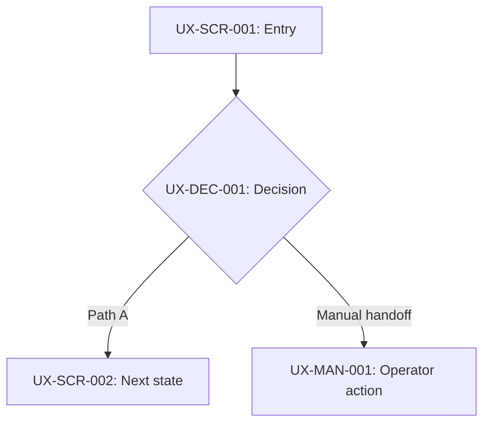

# UX Flow Template

Use this template after the Product Brief and User Journey are approved. This stage maps behavior into an experience flow; it does not define final visual styling or technical implementation.

## 1. Document Control

```text
Product/feature:
Version:
Status: Draft / Review / Approved
Owner:
Last updated:
Source Product Brief:
Source User Journey:
```

## 2. Flow Scope And UX Goals

```text
Included journeys:
Entry points:
Successful end states:
Experience goals:
Known constraints:
```

## 3. Actor And Entry-Point Map

| Actor | Entry point | Goal | Required context/data on entry | Exit condition |
| --- | --- | --- | --- | --- |
| | | | | |

## 4. Experience Node Inventory

Use stable IDs such as `UX-SCR-001`, `UX-MSG-001`, and `UX-MAN-001`.

| UX ID | Type | Actor | Purpose | Entry condition | Possible exits |
| --- | --- | --- | --- | --- | --- |
| | Screen/Message/Manual/External/Decision | | | | |

## 5. Primary Flow Diagrams

Create one Mermaid diagram per primary journey. Use UX IDs as node labels and show manual or outside-system handoffs explicitly.



## 6. Transition Details

Use stable flow-step IDs such as `UX-FLOW-001`.

| Flow ID | Source Journey step | Actor | From UX ID | Trigger/action | System or manual response | To UX ID | Resulting status | Notes |
| --- | --- | --- | --- | --- | --- | --- | --- | --- |
| | | | | | | | | |

## 7. Decisions, Alternate Paths, And Recovery

| Branch ID | Trigger/condition | Actor sees | Available action | Destination UX ID | Resulting status |
| --- | --- | --- | --- | --- | --- |
| | | | | | |

Cover where relevant:

- Invalid or missing input.
- Unauthorized or wrong-role access.
- Duplicate or repeated action.
- Waiting and manual-review states.
- Expiry and time boundaries.
- Verification or external-channel failure.
- Retry, correction, and terminal states.

## 8. Manual And Outside-System Handoffs

| UX ID | Owner | Trigger | Work performed outside system | What the product records/displays | Return path |
| --- | --- | --- | --- | --- | --- |
| | | | | | |

## 9. Data And Visibility At Flow Level

Keep this high level; exact fields and validation belong in User Requirements and UI/UX Design.

| Moment/UX ID | Data needed | Entered by | Visible to | Sensitive/masked? | Notes |
| --- | --- | --- | --- | --- | --- |
| | | | | Yes/No | |

## 10. Notifications And Channel Changes

| Trigger | From channel | To channel | Recipient | Message intent | Return UX ID |
| --- | --- | --- | --- | --- | --- |
| | | | | | |

## 11. Flow-Level Constraints

- Responsive or device constraints that change navigation or sequence.
- Accessibility constraints that affect completion of the flow.
- Session, link, or time constraints already approved upstream.

## 12. Traceability

| Journey step ID | UX Flow IDs | Coverage | Notes |
| --- | --- | --- | --- |
| | | Covered/Manual/Non-UI/Gap | |

## 13. Open Decisions

| Decision | Why it matters | Owner | Needed before |
| --- | --- | --- | --- |
| | | | User Requirements/UI-UX Design |

## 14. Approval Checklist

- Every meaningful Journey step is represented in traceability.
- Entry points, decisions, alternate paths, and end states are clear.
- Manual and outside-system work is visible.
- No product rule was inferred from a prototype or invented by this document.
- Flow IDs are stable enough for downstream references.
- Owner reviewed the diagrams and changed status to `Approved`.
